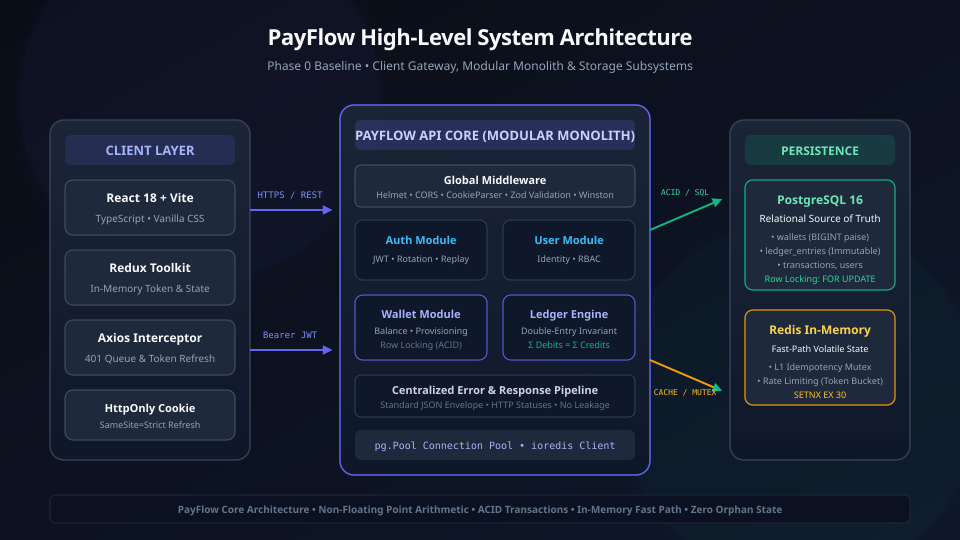
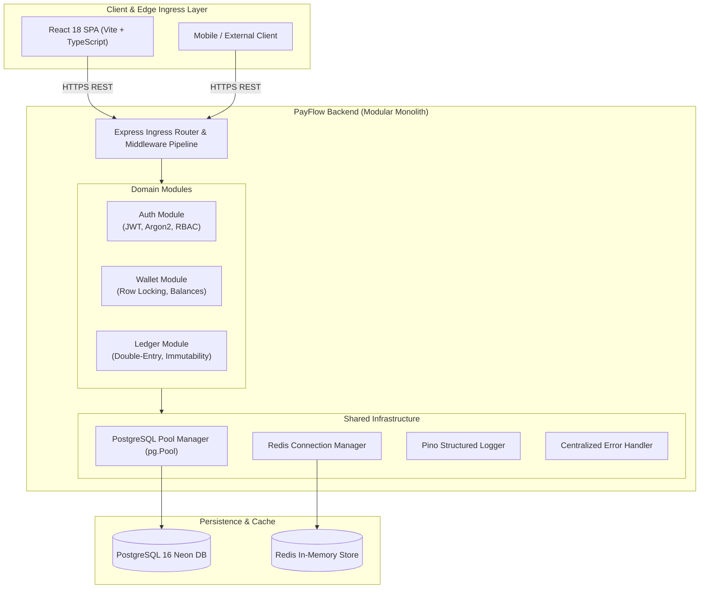
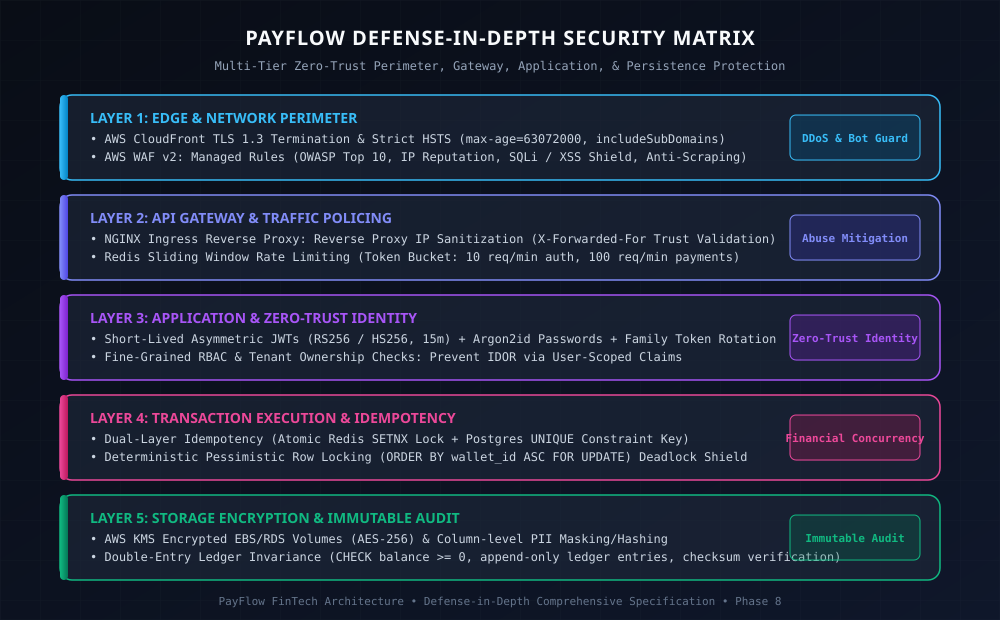
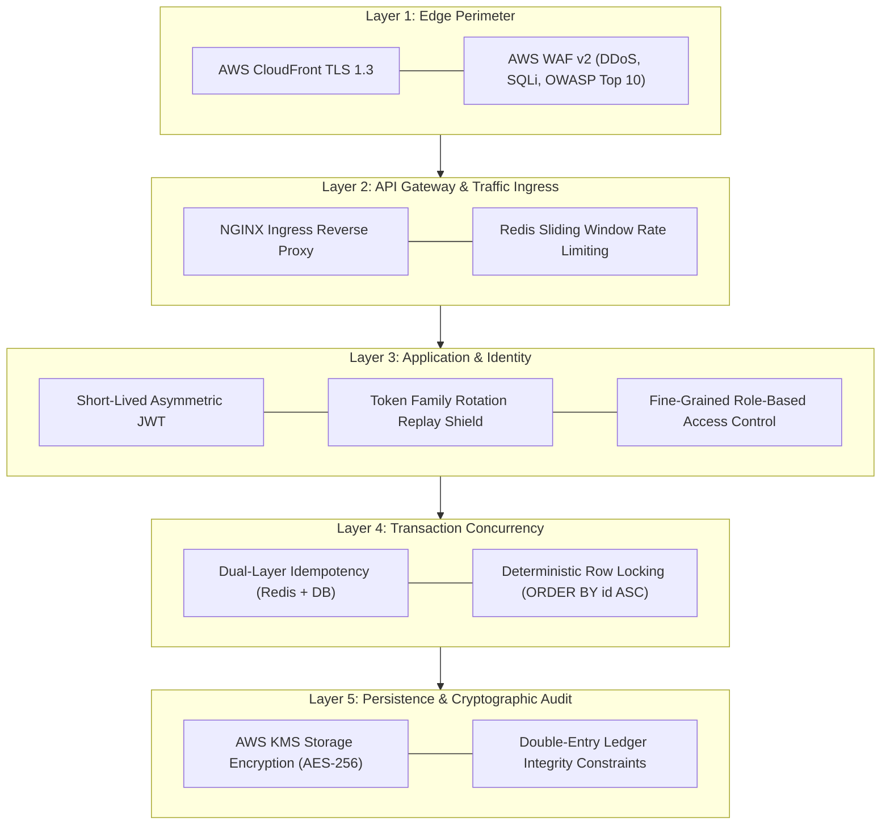
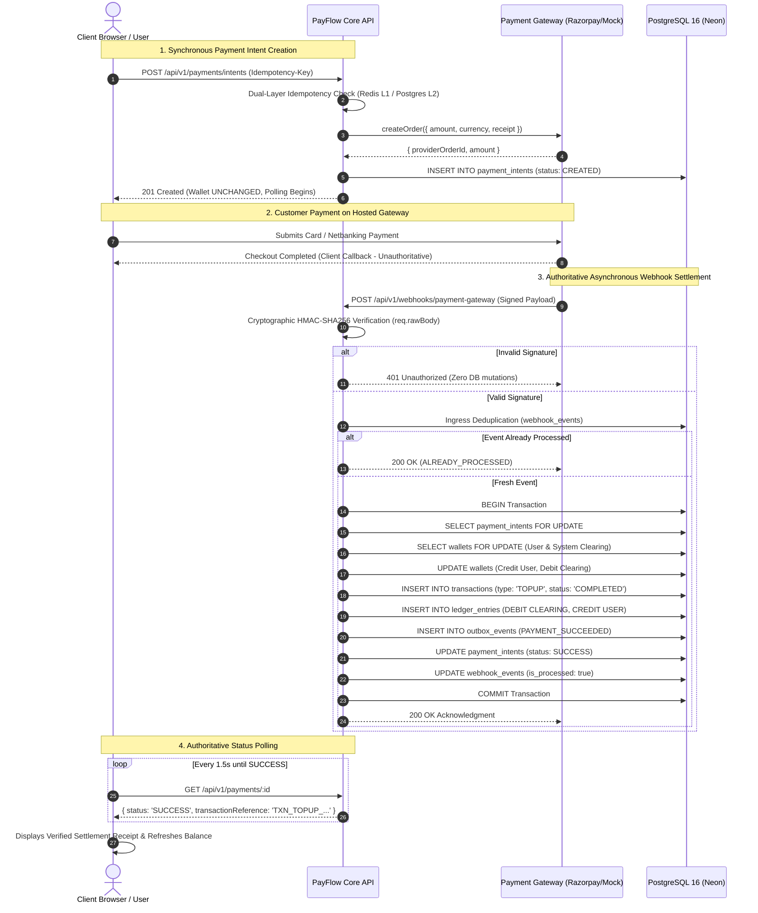

# PayFlow Architecture & System Design Document

## 1. System Overview
PayFlow is an enterprise-grade digital wallet and payment processing platform designed to simulate high-reliability fintech core systems. The platform implements double-entry bookkeeping, ACID transaction safety with pessimistic row locking, deterministic distributed idempotency, the transactional outbox pattern with AWS SQS asynchronous message handling, and automated transaction reconciliation.

---

## 2. High-Level Architectural Diagram



<details>
<summary>View High-Level Architecture Mermaid Diagram</summary>


</details>

---

## 3. Defense-in-Depth Security Matrix



<details>
<summary>View Defense-in-Depth Mermaid Diagram</summary>


</details>

---

## 4. Phase-by-Phase Architecture Blueprint Index

PayFlow's architecture is structured across 9 evolutionary phases. Detailed technical specifications, failure mode analyses, and interview deep dives are cataloged below:

| Phase | Title | Status | Primary Architectural Invariants & Patterns |
| :---: | :--- | :---: | :--- |
| **00** | [Phase 0: Foundation](phases/phase-0-foundation.md) | `[VERIFIED]` | Modular Monolith layout, Zod environment parsing, `pg.Pool` tuning, RFC envelope |
| **01** | [Phase 1: Identity & RBAC](phases/phase-1-auth-users.md) | `[VERIFIED]` | Argon2id hashing, short-lived JWT, HttpOnly cookies, Token Family Rotation |
| **02** | [Phase 2: Wallet & Ledger](phases/phase-2-wallet-ledger.md) | `[VERIFIED]` | Integer cents, dual-balance model, append-only double-entry ledger, `FOR UPDATE` |
| **03** | [Phase 3: Transfers & Idempotency](phases/phase-3-transfer-idempotency.md) | `[VERIFIED]` | Deterministic lock ordering (`ORDER BY id ASC`), Dual-Layer Idempotency |
| **04** | [Phase 4: Gateways & Webhooks](phases/phase-4-payment-gateway-webhooks.md) | `[PLANNED]` | Pluggable gateway adapter, raw body HMAC-SHA256, event deduplication |
| **05** | [Phase 5: Distributed Systems & SQS](phases/phase-5-redis-sqs-async.md) | `[PLANNED]` | Transactional Outbox Pattern, AWS SQS FIFO, Redis Lua sliding window rate limiting |
| **06** | [Phase 6: Fraud & Reconciliation](phases/phase-6-fraud-reconciliation.md) | `[PLANNED]` | Sub-15ms velocity heuristic rules, automated nightly three-way audit |
| **07** | [Phase 7: Cloud & CI/CD](phases/phase-7-aws-docker-cicd.md) | `[PLANNED]` | Multi-stage Dockerfile (<120MB), AWS Multi-AZ VPC, zero-downtime migrations |
| **08** | [Phase 8: Production Hardening](phases/phase-8-production-hardening.md) | `[PLANNED]` | Read-Write split routing, horizontal Citus sharding, OpenTelemetry Golden Signals |

---

## 5. Core Architectural Decisions & Invariants

### 5.1 Integer Money Representation
Floating-point numbers in computer systems (IEEE 754) cannot accurately represent base-10 decimals, resulting in rounding errors (e.g. `0.1 + 0.2 = 0.30000000000000004`). In PayFlow, **every monetary amount is strictly represented as an unsigned 64-bit integer in the lowest denomination (cents/paise)**. A balance of $1,250.50 is stored as `125050`.

### 5.2 Double-Entry Bookkeeping
In financial systems, money can never be created or destroyed from nothing; it is always transferred between accounts. Every transaction creates at least two immutable `ledger_entries` records:
- One **DEBIT** entry
- One **CREDIT** entry
- **Constraint:** $\sum \text{Debits} = \sum \text{Credits}$.

The `wallets.available_balance` and `locked_balance` columns are treated as read-optimized projections of the ledger, continuously verified by our reconciliation workers.

### 5.3 Concurrency Control: Pessimistic Row-Level Locking
When multiple transactions attempt to debit or credit the same wallet simultaneously, optimistic locking (`WHERE version = 1`) leads to severe retry storms under high contention. PayFlow uses **pessimistic row-level locking**:
```sql
SELECT * FROM wallets WHERE id IN ($1, $2) ORDER BY id ASC FOR UPDATE;
```
**Deadlock Prevention:** By always locking wallet rows in ascending alphabetical order of their UUID (`ORDER BY id ASC`), circular wait conditions are mathematically impossible.

### 5.4 Distributed Idempotency (Defense-in-Depth)
All state-mutating requests (`POST /transfers`, `POST /deposit`) require an `Idempotency-Key` header:
1. **L1 (Redis):** Uses `SET idempotency:{userId}:{key} "IN_PROGRESS" NX EX 30`. If the key exists, subsequent duplicate concurrent requests are rejected immediately.
2. **L2 (PostgreSQL):** A unique constraint on `key` in `idempotency_keys` stores the SHA-256 hash of the request payload and the resulting HTTP response. If a retried request arrives with the exact same payload, the cached response is replayed without re-executing business logic.

### 5.5 Transactional Outbox Pattern
Publishing to a message broker (AWS SQS) directly inside a database transaction is an anti-pattern:
- If SQS fails after DB commits $\rightarrow$ Lost message.
- If SQS succeeds but DB rollback occurs $\rightarrow$ Phantom message.

PayFlow writes domain events to an `outbox_events` table **inside the exact same ACID transaction** as the financial mutation. An autonomous outbox relay worker polls pending events using `SELECT ... FOR UPDATE SKIP LOCKED` and publishes them to AWS SQS FIFO.

---

## 6. Engineering & Architectural Rationale

### 6.1 Why PostgreSQL Was Selected
Financial systems demand **strict ACID guarantees, strong serializability, and mathematical referential integrity**. PostgreSQL provides:
1. **Proven Concurrency Primitives:** Native pessimistic row locking (`SELECT ... FOR UPDATE`), partial indexes, and advisory locks.
2. **Deterministic Constraint Enforcement:** Unique compound keys, `CHECK (available_balance >= 0)` constraints, and triggers that enforce ledger immutability at the engine level.
3. **Transactional Isolation:** Prevents dirty reads, non-repeatable reads, and phantom writes during concurrent multi-wallet ledger insertions.
4. **Relational Consistency:** Foreign key relationships between users, refresh token families, and ledger entries prevent orphaned financial state.

### 6.2 Why Redis Is Being Used
While PostgreSQL is the single source of truth for durable financial state, Redis serves as our high-performance memory tier:
1. **L1 Distributed Mutex:** High-frequency `SET key val NX EX 30` operations allow us to reject concurrent duplicate in-flight requests in sub-millisecond time without creating database transaction contention.
2. **Sliding-Window / Token Bucket Rate Limiting:** Tracking IP and user request velocity in memory without writing audit noise to PostgreSQL.
3. **Session Invalidation & Caching:** Instant blacklisting or cache eviction without querying disks.

### 6.3 Why PayFlow Is Architected as a Modular Monolith
In early and growth stages of fintech platforms, premature microservice decomposition introduces severe distributed hazards:
1. **Distributed Transactions (Two-Phase Commit):** Splitting users, wallets, and ledgers across microservices requires distributed sagas or 2PC protocols, which suffer from partial failures, network partitions, and eventual consistency lag.
2. **Network Overhead & Latency:** In-process function calls run in nanoseconds, whereas cross-service HTTP/gRPC calls add milliseconds of tail latency to financial requests.
3. **Clean Module Boundaries:** PayFlow enforces strict modular boundaries (`modules/auth`, `modules/wallet`, `modules/ledger`, `modules/transfer`). Each module encapsulates its own repositories, business logic, and validation. If throughput requires it in the future, any module can be extracted into an independent microservice with zero changes to business domain logic.

### 6.4 Why Centralized Error Handling Is Mandatory
1. **Security & Information Leakage Prevention:** Raw database errors or unhandled exceptions may contain SQL syntax, internal IPs, or stack frames that malicious actors can exploit. Centralized error handling sanitizes all runtime exceptions into a uniform structure: `{ success: false, error: { code: "...", message: "..." } }`.
2. **Operational Observability:** Operational errors are logged at `warn` level with metadata (request path, user ID), while unexpected programming errors trigger `error` level logs with full stack traces in Pino/Winston for alerting.
3. **Consistent Client Contracts:** Guarantees that the frontend and external API consumers always receive predictable error structures regardless of which layer failed.

### 6.5 Why Zod Schema Validation Was Chosen
1. **Runtime Type Safety & Type Inference:** TypeScript types disappear at runtime. Zod validates untrusted incoming HTTP payloads at runtime while automatically inferring strict TypeScript compile-time types (`z.infer<typeof schema>`), eliminating boilerplate and duplicate interfaces.
2. **Early Boundary Rejection:** Malformed requests, missing fields, or invalid emails are rejected at the routing layer before database connections or business services are invoked.
3. **Input Sanitization:** Strips unexpected keys and validates password complexity requirements before passwords ever reach the hashing engine.

---

## 7. Phase 4: External Payment Gateway & Webhook Architecture



