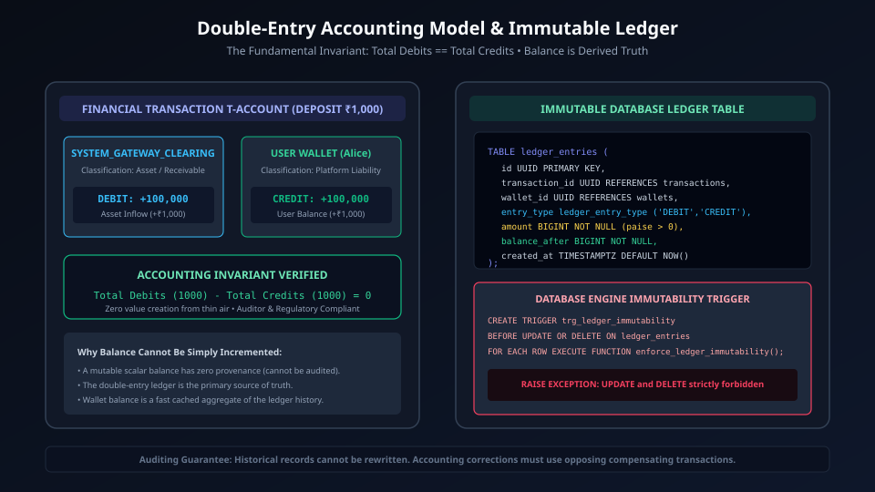
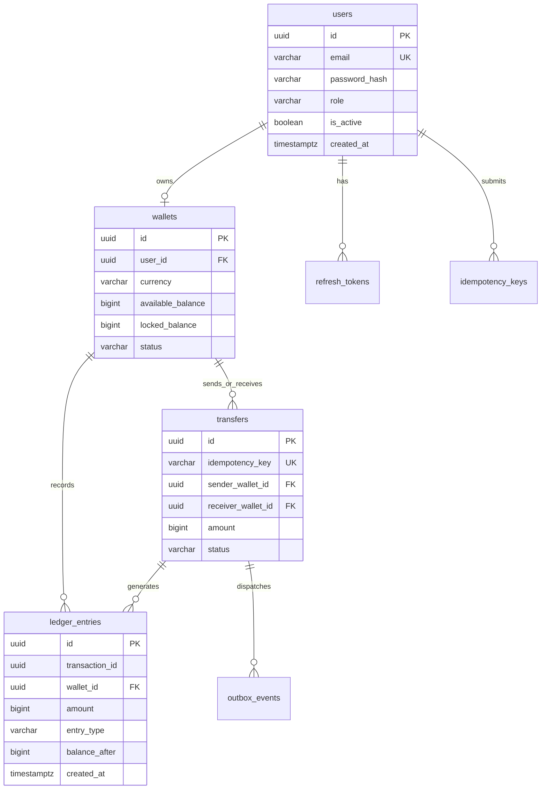
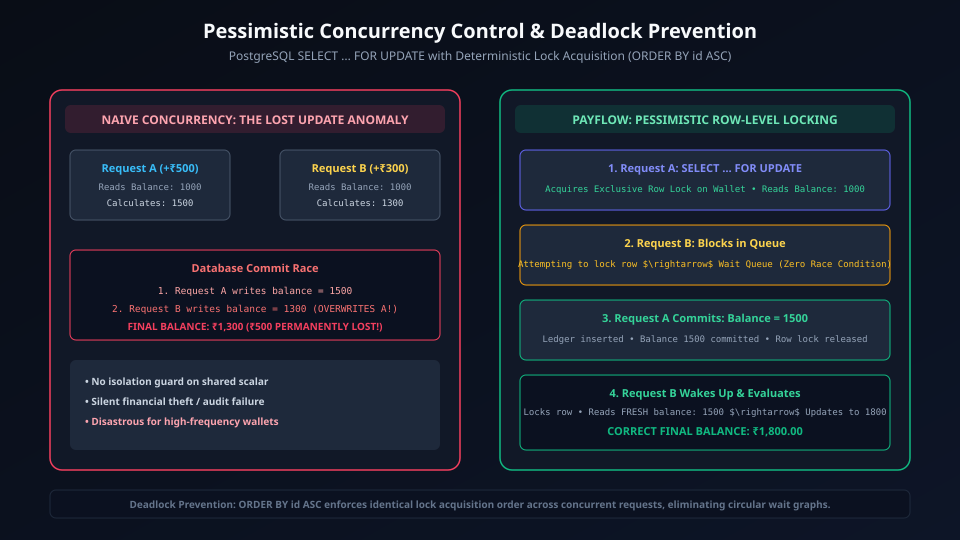

# PayFlow Database Design & Schema Specification

## 1. Relational Entity Overview
PostgreSQL 16 serves as the primary relational data store for PayFlow, enforcing ACID transaction boundaries, financial constraints, and double-entry consistency.



<details>
<summary>View Entity-Relationship Mermaid Diagram</summary>


</details>

---

## 2. Table Specifications & Indexes

### 2.1 `users`
- **Purpose:** Manages core user identity, credentials, role-based authorization, and account state.
- **Columns:**
  - `id` (UUID, PK): Auto-generated v4 UUID (`uuid_generate_v4()`).
  - `email` (VARCHAR(255), UNIQUE, NOT NULL): Canonical user email address.
  - `password_hash` (VARCHAR(255), NOT NULL): Memory-hard hash generated via Argon2id.
  - `name` (VARCHAR(150), NOT NULL).
  - `role` (VARCHAR(50), NOT NULL, DEFAULT `'USER'`).
  - `is_active` (BOOLEAN, DEFAULT true).
  - `created_at`, `updated_at` (TIMESTAMPTZ).
- **Indexes:**
  - `idx_users_email` on `email`.

### 2.2 `refresh_tokens`
- **Purpose:** Supports JWT refresh token rotation with token family replay detection.
- **Columns:**
  - `id` (UUID, PK).
  - `user_id` (UUID, FK -> `users.id` ON DELETE CASCADE).
  - `token` (VARCHAR(500), UNIQUE, NOT NULL).
  - `family_id` (UUID, NOT NULL): Identifier tying generations of rotated refresh tokens together.
  - `is_revoked` (BOOLEAN, DEFAULT false).
  - `expires_at` (TIMESTAMPTZ, NOT NULL).
  - `created_at` (TIMESTAMPTZ, DEFAULT CURRENT_TIMESTAMP).
- **Indexes:**
  - `idx_refresh_tokens_user` on `user_id`.
  - `idx_refresh_tokens_token` on `token`.
  - `idx_refresh_tokens_family` on `family_id`.

### 2.3 `wallets`
- **Purpose:** Represents user balances and platform clearing accounts with non-negative constraints.
- **Columns:**
  - `id` (UUID, PK).
  - `user_id` (UUID, FK -> `users.id`, NOT NULL).
  - `currency` (VARCHAR(3), NOT NULL, DEFAULT `'USD'`).
  - `available_balance` (BIGINT, NOT NULL, DEFAULT 0, CHECK: `available_balance >= 0`).
  - `locked_balance` (BIGINT, NOT NULL, DEFAULT 0, CHECK: `locked_balance >= 0`).
  - `status` (VARCHAR(50), NOT NULL, DEFAULT `'ACTIVE'`).
  - `created_at`, `updated_at` (TIMESTAMPTZ).
- **Constraints & Indexes:**
  - Unique compound constraint: `UNIQUE (user_id, currency)`.
  - `chk_positive_available`: `CHECK (available_balance >= 0)`.
  - `chk_positive_locked`: `CHECK (locked_balance >= 0)`.
  - `idx_wallets_user_id` on `user_id`.

### 2.4 `transfers`
- **Purpose:** Business transactions encapsulating peer-to-peer transfers, deposits, and settlements.
- **Columns:**
  - `id` (UUID, PK).
  - `idempotency_key` (VARCHAR(255), UNIQUE, NOT NULL).
  - `sender_wallet_id` (UUID, FK -> `wallets.id`, NOT NULL).
  - `receiver_wallet_id` (UUID, FK -> `wallets.id`, NOT NULL).
  - `amount` (BIGINT, NOT NULL, CHECK: `amount > 0`).
  - `currency` (VARCHAR(3), NOT NULL, DEFAULT `'USD'`).
  - `status` (VARCHAR(50), NOT NULL, DEFAULT `'COMPLETED'`).
  - `failure_reason` (TEXT).
  - `created_at` (TIMESTAMPTZ, DEFAULT CURRENT_TIMESTAMP).
- **Indexes:**
  - `idx_transactions_sender` on `sender_wallet_id`.
  - `idx_transactions_receiver` on `receiver_wallet_id`.
  - `idx_transactions_sender_created` on `(sender_wallet_id, created_at DESC)`.
  - `idx_transactions_receiver_created` on `(receiver_wallet_id, created_at DESC)`.
  - `idx_transactions_reference` on `reference_id`.
  - `idx_idempotency_user_key` on `(user_id, key)`.
  - `idx_outbox_events_pending` on `(status, created_at ASC)`.

### 2.5 `ledger_entries` (Append-Only & Immutable)
- **Purpose:** Audit-compliant double-entry ledger. Stores every granular debit and credit.
- **Columns:**
  - `id` (UUID, PK).
  - `transaction_id` (UUID, NOT NULL).
  - `wallet_id` (UUID, FK -> `wallets.id`, NOT NULL).
  - `amount` (BIGINT, NOT NULL, CHECK: `amount > 0`).
  - `entry_type` (VARCHAR(10), NOT NULL, CHECK: `entry_type IN ('CREDIT', 'DEBIT')`).
  - `balance_after` (BIGINT, NOT NULL).
  - `description` (TEXT).
  - `created_at` (TIMESTAMPTZ, DEFAULT CURRENT_TIMESTAMP).
- **Indexes:**
  - `idx_ledger_entries_wallet` on `wallet_id`.
  - `idx_ledger_entries_tx` on `transaction_id`.

### 2.6 `idempotency_keys`
- **Purpose:** Guaranteed exactly-once execution barrier for HTTP APIs.
- **Columns:**
  - `key` (VARCHAR(255), PRIMARY KEY).
  - `user_id` (UUID, FK -> `users.id`, NOT NULL).
  - `request_path` (VARCHAR(255), NOT NULL).
  - `request_hash` (VARCHAR(64), NOT NULL): SHA-256 hash of JSON request payload.
  - `response_status` (INT NOT NULL).
  - `response_body` (JSONB NOT NULL).
  - `created_at` (TIMESTAMPTZ, DEFAULT CURRENT_TIMESTAMP).
  - `expires_at` (TIMESTAMPTZ, NOT NULL).
- **Indexes:**
  - `idx_idempotency_expires` on `expires_at`.

### 2.7 `outbox_events`
- **Purpose:** Implements the Transactional Outbox Pattern for atomic database writes and SQS message publishing.
- **Columns:**
  - `id` (UUID, PK).
  - `aggregate_type` (VARCHAR(100), NOT NULL).
  - `aggregate_id` (UUID, NOT NULL).
  - `event_type` (VARCHAR(100), NOT NULL).
  - `payload` (JSONB, NOT NULL).
  - `status` (VARCHAR(50), NOT NULL, DEFAULT `'PENDING'`).
  - `retry_count` (INT NOT NULL, DEFAULT 0).
  - `created_at` (TIMESTAMPTZ, DEFAULT CURRENT_TIMESTAMP).
  - `published_at` (TIMESTAMPTZ).
- **Indexes:**
  - Partial index: `idx_outbox_pending` on `created_at` WHERE `status = 'PENDING'`.

### 2.5 `payment_intents` (Phase 4 Payment Gateway Intents)
Tracks external funding sessions across payment gateways.
- `id`: UUID PRIMARY KEY DEFAULT `gen_random_uuid()`
- `user_id`: UUID NOT NULL REFERENCES `users(id)`
- `wallet_id`: UUID NOT NULL REFERENCES `wallets(id)`
- `amount`: BIGINT NOT NULL (stored in integer paise, `CHECK (amount > 0)`)
- `currency`: VARCHAR(3) NOT NULL DEFAULT `'INR'`
- `provider`: VARCHAR(64) NOT NULL DEFAULT `'MOCK_GATEWAY'`
- `gateway_order_id`: VARCHAR(128) NOT NULL UNIQUE
- `gateway_payment_id`: VARCHAR(128) NULL UNIQUE
- `status`: ENUM (`'CREATED'`, `'PROCESSING'`, `'SUCCESS'`, `'FAILED'`, `'CANCELLED'`)
- `idempotency_key`: VARCHAR(255) NULL
- `error_message`: VARCHAR(255) NULL
- `metadata`: JSONB NULL DEFAULT `'{}'`
- `created_at`: TIMESTAMPTZ NOT NULL DEFAULT NOW()
- `updated_at`: TIMESTAMPTZ NOT NULL DEFAULT NOW()
- `completed_at`: TIMESTAMPTZ NULL
- **Indexes:**
  - `idx_payment_intents_provider_order` ON `(provider, gateway_order_id)`
  - `idx_payment_intents_status_created` ON `(status, created_at DESC)`
  - `idx_payment_intents_user_created` ON `(user_id, created_at DESC)`
  - `uq_payment_intents_user_idempotency` UNIQUE ON `(user_id, idempotency_key)` WHERE `idempotency_key IS NOT NULL`

### 2.6 `webhook_events` (Phase 4 Ingress Webhook Deduplication)
Ingests and deduplicates inbound gateway webhooks to prevent duplicate side effects.
- `id`: UUID PRIMARY KEY DEFAULT `gen_random_uuid()`
- `gateway_name`: VARCHAR(64) NOT NULL DEFAULT `'MOCK_GATEWAY'`
- `gateway_event_id`: VARCHAR(128) NOT NULL UNIQUE
- `event_type`: VARCHAR(64) NOT NULL
- `payload`: JSONB NOT NULL
- `payload_hash`: VARCHAR(64) NULL (SHA-256 digest of raw request buffer)
- `is_processed`: BOOLEAN NOT NULL DEFAULT false
- `processed_at`: TIMESTAMPTZ NULL
- `error_message`: TEXT NULL
- `created_at`: TIMESTAMPTZ NOT NULL DEFAULT NOW()
- **Indexes:**
  - `uq_webhook_events_provider_event` UNIQUE ON `(gateway_name, gateway_event_id)`
  - `idx_webhook_events_created` ON `(created_at DESC)`

---

## 3. Concurrency Locking & Serialization



<details>
<summary>View Concurrency Sequence Diagram</summary>

```mermaid
sequenceDiagram
    autonumber
    actor TxA as Transaction A (Deduct $30)
    actor TxB as Transaction B (Deduct $40)
    participant DB as PostgreSQL Row Lock (Wallet ID: W-1)

    TxA->>DB: BEGIN; SELECT * FROM wallets WHERE id = 'W-1' FOR UPDATE;
    DB-->>TxA: Exclusive Lock Acquired (Balance: $100)
    TxB->>DB: BEGIN; SELECT * FROM wallets WHERE id = 'W-1' FOR UPDATE;
    Note over TxB,DB: Blocked! Waiting on lock held by TxA...
    TxA->>DB: UPDATE wallets SET available_balance = 70 WHERE id = 'W-1';
    TxA->>DB: COMMIT;
    DB-->>TxB: Unblocked! Acquired Exclusive Lock (Balance: $70)
    TxB->>DB: UPDATE wallets SET available_balance = 30 WHERE id = 'W-1';
    TxB->>DB: COMMIT;
    Note over TxB,DB: Final Correct Balance: $30. Zero Lost Updates!
```
</details>

### Deterministic Lock Ordering
To prevent deadlocks across concurrent multi-wallet transfers:
```sql
SELECT * FROM wallets
WHERE id IN ($1, $2)
ORDER BY id ASC
FOR UPDATE;
```
Sorting wallet UUIDs lexicographically eliminates circular wait dependencies across competing transactions.

---

## 4. Phase References
- [Phase 2: Wallet & Double-Entry Ledger](phases/phase-2-wallet-ledger.md)
- [Phase 3: P2P Money Transfer & Idempotency](phases/phase-3-transfer-idempotency.md)
- [Phase 5: High-Scale Distributed Systems](phases/phase-5-redis-sqs-async.md)
- [Master Documentation Hub](README.md)
