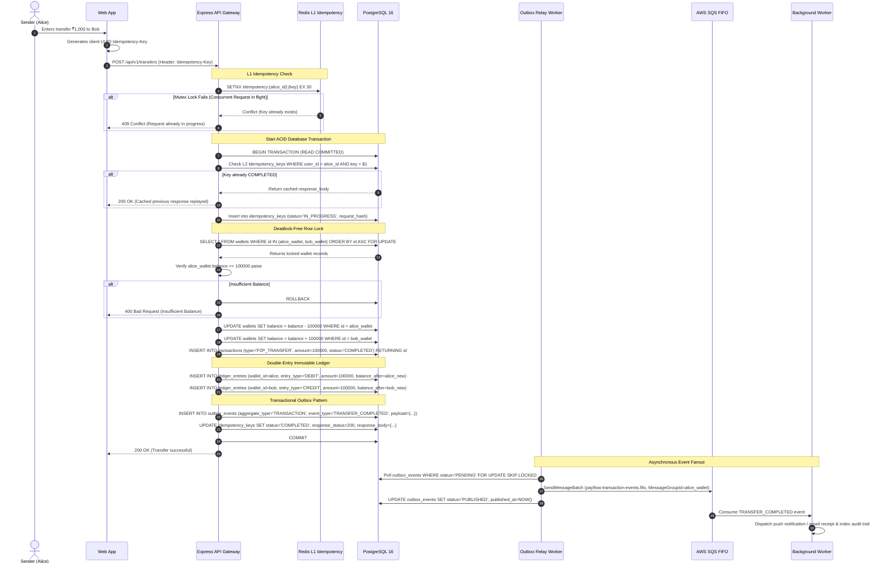
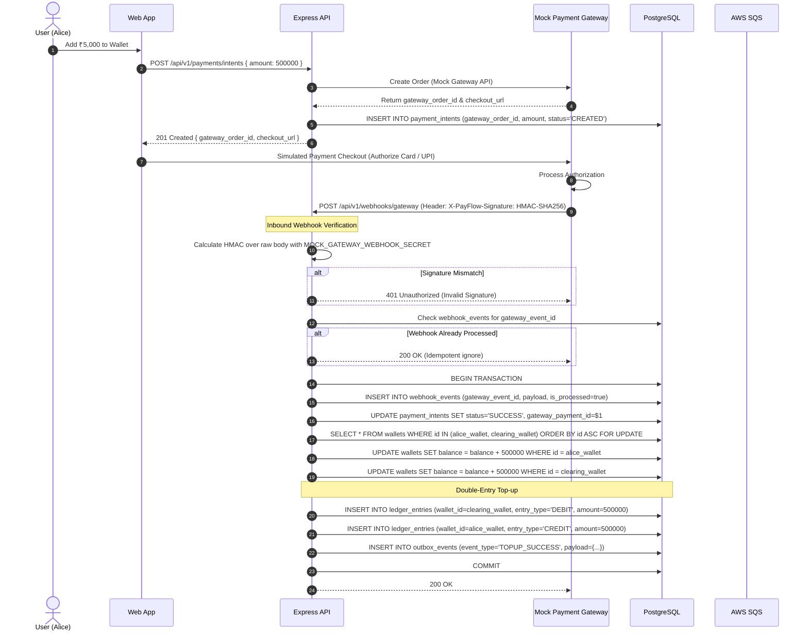
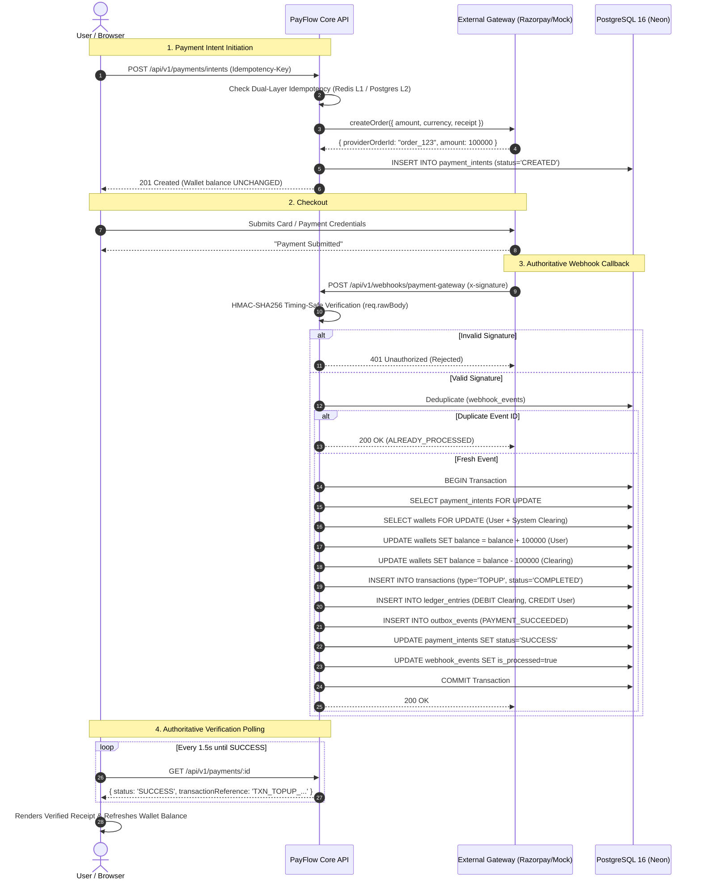
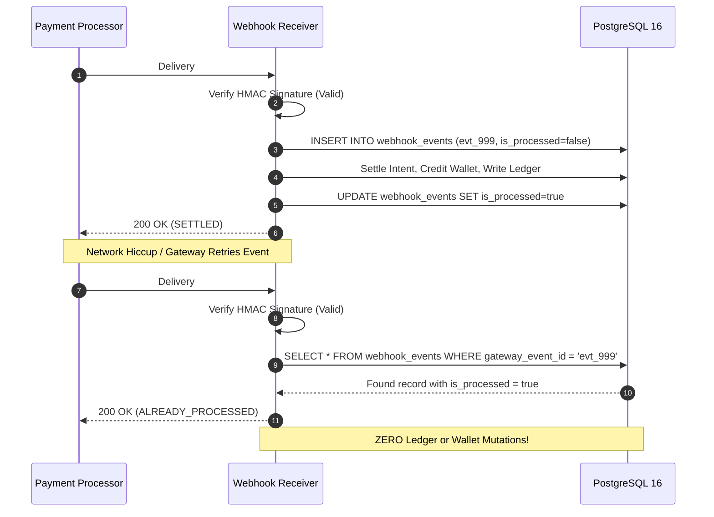
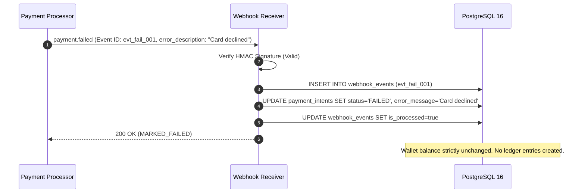

# PayFlow Payment Workflows & Sequence Specifications

## 1. P2P Wallet Transfer Workflow (ACID & Idempotency)



---

## 2. Add Money / Top-Up via Mock Gateway & Webhook



### 2.1 Phase 2 Internal Deposit Primitive (Double-Entry Settlement)
In Phase 2, the core double-entry accounting engine is established prior to connecting external gateway adapters:
1. **Client Request:** Authenticated user invokes `POST /api/v1/wallets/me/deposit` with `{ amount: 100000 }` (₹1,000.00).
2. **Validation:** Zod validates that `amount` is a strictly positive integer representing smallest currency unit (paise). Decimals and negative numbers are rejected.
3. **Pessimistic Lock:** Dedicated PostgreSQL client initiates transaction and acquires exclusive row locks on `SYSTEM_GATEWAY_CLEARING` and the user's `USER` wallet ordered by UUID:
   ```sql
   SELECT * FROM wallets WHERE id = ANY($1::uuid[]) ORDER BY id ASC FOR UPDATE;
   ```
4. **Double-Entry Balance Verification:**
   - DEBIT: `SYSTEM_GATEWAY_CLEARING` ₹1,000
   - CREDIT: User Wallet ₹1,000
   - $\sum \text{Debits} == \sum \text{Credits} == \text{Amount}$ verified by `LedgerService`.
5. **Atomic Commit:**
   - Transaction record written to `transactions`.
   - Immutable records written to `ledger_entries` (protected by immutability trigger).
   - Cached balances updated in `wallets`.
   - Transaction commits. On any failure, complete rollback occurs.

---

## 3. Transaction State Machine & Life Cycle

```
                       [ CREATED ]
                            |
                            v
                    [ IN_PROGRESS ]
                       /         \
                      /           \
                     v             v
              [ COMPLETED ]    [ FAILED ]
                    |
              (Refund Flow)
                    |
                                  [ REVERSED ]
```

---

## 4. Phase 4: External Payment Gateway Funding & Webhook Settlement

### 4.1 Wallet Funding Lifecycle Sequence


### 4.2 Webhook Deduplication & Replay Protection Sequence


### 4.3 Failed & Cancelled Payment Flow

