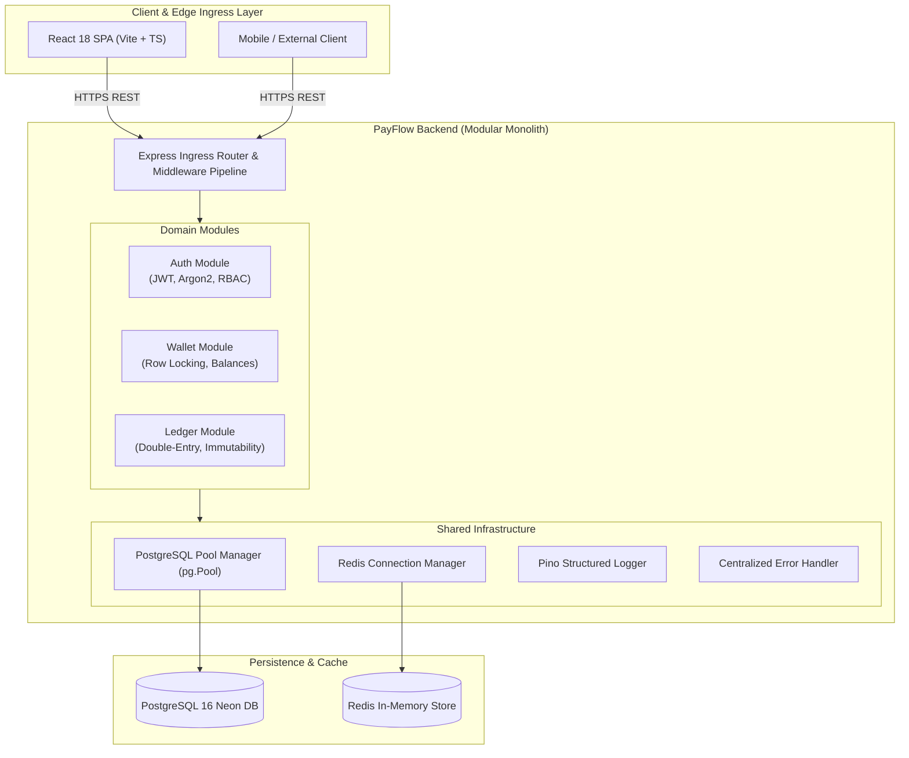
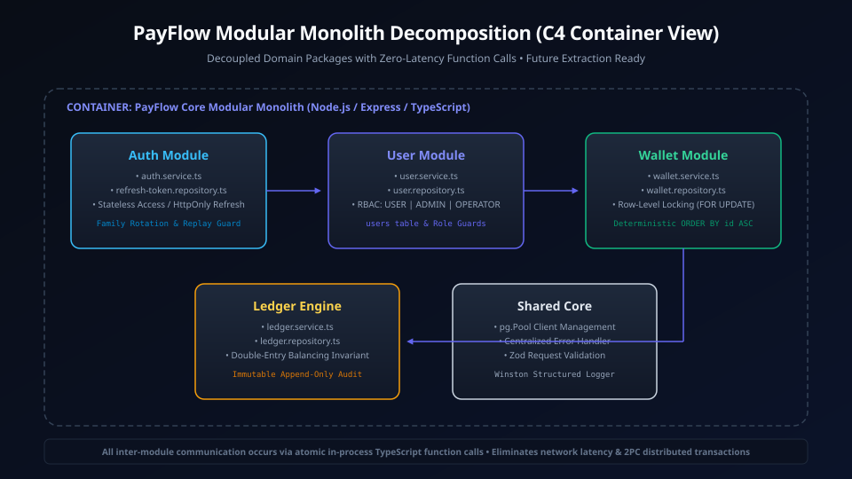
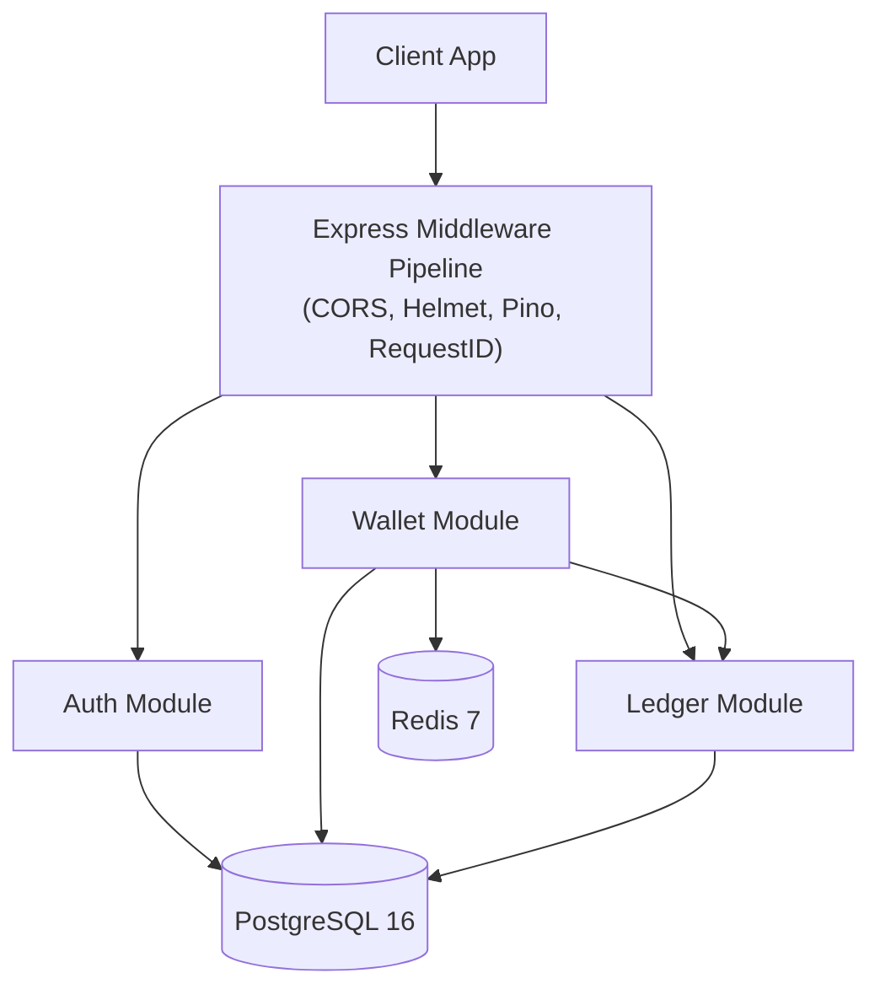

# Phase 0: Project Setup, Architecture & Foundation

> **Implementation Status:** `[STATUS: IMPLEMENTED & VERIFIED]`  
> **Repository Baseline:** Node.js v24+, TypeScript 5.5+, Express 4.19+, PostgreSQL 16 (Neon Serverless), Redis 7+, Docker Compose, Vitest 2.0+.

---

## 1. Phase Title, Scope & Metadata

- **Phase Code:** `PHASE-00`
- **Module Name:** Core Infrastructure, Shared Utilities, and Database Foundations
- **Target Audience:** FinTech Platform Engineers, Staff Architects, Technical Interviewers
- **Primary Objective:** Establish a zero-regression, strictly typed Modular Monolith architecture for institutional-grade financial transactions with bulletproof configuration management, connection pooling, standardized error telemetry, and baseline schema migrations.

---

## 2. Objectives & Deliverables

1. **Modular Monolith Layout:** Establish clear domain boundaries (`auth`, `wallet`, `ledger`, `transfer`, `shared`) under a single codebase to prevent microservice premature optimization while enforcing modular independence.
2. **Deterministic Configuration (`zod`):** Validate all process environment variables at startup before socket binding. If any database or security parameter is missing, fail fast with structured exit codes.
3. **High-Performance Connection Pools:** Initialize resilient connection pools for Neon PostgreSQL (`pg.Pool`) and Redis with aggressive connection limits, idle timeouts, and automatic retry backoffs.
4. **Standardized Telemetry & Logging:** Implement structured JSON logging (`pino`) correlating incoming HTTP requests via `x-request-id` headers for end-to-end distributed tracing.
5. **Universal API Envelope & Centralized Error Handling:** Standardize all success and error responses via strict TypeScript envelopes (`{ success: boolean, data?: T, error?: { code, message, details } }`).

---

## 3. Problems Solved & Technical Motivation

In financial software, subtle infrastructure ambiguities create existential vulnerabilities:
- **Environment Drift & Silent Misconfiguration:** An unverified environment variable (such as fallback secret keys or default database ports) can lead to catastrophic data leaks or runtime panics under high transaction loads.
- **Microservice Sprawl Anti-Pattern:** Splitting an early-stage payment platform into 10 microservices introduces distributed transactions (two-phase commit / saga complexity) prematurely. Phase 0 uses a **Modular Monolith** pattern: single deployment unit, shared database, but strict code isolation across domain modules.
- **Connection Exhaustion:** Payment surges can exhaust database sockets. Phase 0 configures fine-tuned connection pooling with health-check ping mechanisms.
- **Unstructured Errors:** Masking underlying database errors while providing actionable, localized feedback to clients without leaking system stack traces.

---

## 4. Architectural Design & System Topology

PayFlow is engineered as a Modular Monolith with clean boundary interfaces. Core shared capabilities are centralized in `src/shared/`:

```
backend/
├── src/
│   ├── config/              # Validated environment configurations (env.ts)
│   ├── modules/             # Domain modules
│   │   ├── auth/            # Phase 1: Identity & tokens
│   │   ├── wallet/          # Phase 2: Balances & accounts
│   │   ├── ledger/          # Phase 2: Double-entry audit entries
│   │   └── ...              # Future phases (transfer, webhook, etc.)
│   ├── shared/              # Shared infrastructure & utilities
│   │   ├── database/        # pg.Pool & migration runner
│   │   ├── redis/           # Redis client & lock abstractions
│   │   ├── errors/          # AppError hierarchy & status mappings
│   │   ├── middleware/      # Request correlation, error handler, rate limit
│   │   ├── utils/           # Math & string helpers
│   │   └── types/           # Global TypeScript declarations
│   ├── app.ts               # Express application pipeline configuration
│   └── server.ts            # Socket listener & graceful shutdown lifecycle
```

### Visual Architecture Diagram
The physical deployment and modular component layout are visualized below:


<details>
<summary>View Mermaid Source Diagram</summary>


</details>

---

## 5. Module & Component Breakdown

### System Context & Component (C4 Level 2)


<details>
<summary>View Mermaid Source Diagram</summary>


</details>

1. **Config Validator (`src/config/env.ts`):**
   - Utilizes `zod` to parse and validate `PORT`, `DATABASE_URL`, `REDIS_URL`, `JWT_SECRET`, and `NODE_ENV`.
   - Halts application boot immediately with exit code 1 if parsing fails.
2. **Database Engine (`src/shared/database/pool.ts`):**
   - Configures `pg.Pool` with SSL mode enabled for cloud databases (Neon PostgreSQL), max 20 connections, 30s idle timeout, and 2s connection timeout.
3. **Redis Engine (`src/shared/redis/client.ts`):**
   - Configures `ioredis` with exponential backoff reconnection strategies and offline queue handling.
4. **Structured Error Handler (`src/shared/errors/` & `src/shared/middleware/errorHandler.ts`):**
   - Custom `AppError` base class extending `Error`, enriched with `statusCode`, `errorCode`, and `isOperational`.
   - Maps PostgreSQL errors (`23505` unique violation, `23503` foreign key violation, `40P01` deadlock) to standardized HTTP 400/409/500 responses.

---

## 6. Database Schema & Data Models

Phase 0 establishes migration version control and essential database extensions:

```sql
-- Phase 0 Core Setup & Extensions
CREATE EXTENSION IF NOT EXISTS "uuid-ossp";
CREATE EXTENSION IF NOT EXISTS "pgcrypto";

-- Migration Tracking Table
CREATE TABLE IF NOT EXISTS schema_migrations (
    id SERIAL PRIMARY KEY,
    migration_name VARCHAR(255) NOT NULL UNIQUE,
    applied_at TIMESTAMP WITH TIME ZONE DEFAULT CURRENT_TIMESTAMP
);
```

- **UUID Strategy:** All primary keys across all domain tables use `UUIDv4` generated natively by PostgreSQL (`uuid_generate_v4()`) to prevent sequential enumeration attacks and IDOR vulnerabilities.
- **UTC Timestamps:** All timestamps are strictly stored as `TIMESTAMPTZ` (Timestamp with Time Zone) to eliminate ambiguity across international banking clearing windows.

---

## 7. API Specifications & Contracts

### Health & Liveness Checks
- **Endpoint:** `GET /health`
- **Purpose:** Kubernetes / AWS ALB liveness probe.
- **Response Format:**
  ```json
  {
    "success": true,
    "data": {
      "status": "UP",
      "timestamp": "2026-09-14T12:00:00.000Z",
      "services": {
        "database": "CONNECTED",
        "redis": "CONNECTED"
      }
    }
  }
  ```

---

## 8. Internal Request Lifecycle & Execution Pipeline

```
Incoming HTTP Request
  │
  ├──► [1] Request Correlation Middleware (Extracts or generates 'x-request-id' UUIDv4)
  │
  ├──► [2] Security Headers Middleware (Helmet: CSP, HSTS, X-Content-Type-Options)
  │
  ├──► [3] CORS Policy Enforcement (Whitelisted Origin, Methods: GET, POST, PUT, DELETE)
  │
  ├──► [4] Body Parsers (express.json() with strict 1mb payload limit)
  │
  ├──► [5] Structured HTTP Logger (Pino logs method, url, requestId, userAgent)
  │
  ├──► [6] Domain Route Dispatcher (Routes to /api/v1/...)
  │
  └──► [7] Global Error Handler (Catches all sync/async errors, formats RFC-compliant envelope)
```

---

## 9. Detailed Data Flow

1. **Bootstrap Initialization:**
   - Node process launches `server.ts`.
   - `env.ts` parses `process.env`.
   - `db.query('SELECT 1')` and `redis.ping()` execute concurrently.
   - If either fails, error is logged as fatal and process terminates.
   - Once healthy, Express begins listening on configured `PORT`.
2. **Graceful Shutdown:**
   - `SIGINT` / `SIGTERM` signals intercept active processes.
   - Socket stops accepting new connections.
   - Active database connections drain gracefully within a 10s grace period.
   - Redis connection closes cleanly.

---

## 10. Business Logic, Invariants & Integrity Constraints

1. **Zero Uncaught Exceptions:** No Promise rejection or uncaught exception may terminate the process abruptly without structured logging.
2. **Envelope Uniformity:** Every single API response must conform to `{ success: boolean, data?: ..., error?: ... }`.
3. **No Dynamic SQL String Interpolation:** SQL statements must strictly use parameterized queries (`$1, $2`) to guarantee 100% immunity to SQL injection.

---

## 11. Security, Authentication & Authorization Controls

- **HTTP Security Headers:** Implemented via `helmet()`:
  - `X-DNS-Prefetch-Control`: off
  - `X-Frame-Options`: SAMEORIGIN
  - `Strict-Transport-Security`: max-age=15552000; includeSubDomains
  - `X-Download-Options`: noopen
  - `X-Content-Type-Options`: nosniff
- **Payload Size Guards:** `express.json({ limit: '1mb' })` to prevent memory buffer overflow DDoS attacks.

---

## 12. Failure Modes, Edge Cases & Mitigation Strategies

| Failure Mode | Impact | Mitigation Strategy |
| :--- | :--- | :--- |
| **Database Unreachable on Boot** | Process hangs or crashes unpredictably | Explicit pre-flight check in `bootstrap()`; fast-fail with clear terminal diagnostic |
| **Redis Dropped Connection** | Cache/locking outages | Reconnect backoff policy with automatic retry; offline command queue limits |
| **PostgreSQL Pool Saturation** | Requests freeze waiting for client connection | Explicit `connectionTimeoutMillis: 2000` throws immediate timeout AppError |
| **Malformed JSON Payload** | Unhandled JSON parsing crash | Body-parser error intercepted by global error handler and returned as 400 Bad Request |

---

## 13. Concurrency, Race Conditions & Deadlock Prevention

- **Database Connection Contention:** Configured `max: 20` clients per worker node. Under load testing, connection pooling throttles incoming queries to prevent database OS thread exhaustion.
- **Node.js Event Loop Blocking:** All database and Redis calls are strictly non-blocking (`async/await`). Heavy operations (cryptography) are delegated to libuv worker threads (`argon2` native bindings).

---

## 14. Testing Strategy & Verification Plan

- **Unit Testing Framework:** Vitest with strict TypeScript typing.
- **Mocking Architecture:** In-memory mocks for `pg.Pool` and `ioredis` to enable sub-second unit test suites in CI without external service dependencies.
- **Health Check Integration Test:** Validates that `/health` correctly reflects live PostgreSQL and Redis socket statuses.

---

## 15. Technology Stack & Architectural Decision Records (ADRs)

### ADR 001: Selection of Modular Monolith over Microservices
- **Decision:** Build PayFlow as a modular monolith in a single repository with strict directory-level domain boundaries.
- **Context:** Early payment engines require ACID consistency across ledger entries and wallets. Distributed transactions across microservices introduce complex failure modes (2PC, Sagas) that complicate audit guarantees.
- **Consequence:** Rapid velocity, zero network serialization latency between modules, and guaranteed ACID transactions within a single PostgreSQL database.

### ADR 002: PostgreSQL Native `pg.Pool` vs Heavy ORM (Prisma / TypeORM)
- **Decision:** Use raw parameterized SQL queries with `pg.Pool` instead of Prisma or TypeORM.
- **Context:** FinTech applications require explicit control over SQL row-level locks (`SELECT ... FOR UPDATE`), transaction isolation levels (`SERIALIZABLE` / `READ COMMITTED`), and exact query execution plans. ORM query generators frequently introduce N+1 query patterns or hide locking nuances.
- **Consequence:** Unmatched query performance and total transparency over database locking behavior.

---

## 16. Boundaries & Explicit Non-Scope

- **Not in Phase 0:**
  - User authentication and session handling (handled in Phase 1).
  - Financial accounts and balance mutations (handled in Phase 2).
  - External network payment ingestion (handled in Phase 4).

---

## 17. Integration Bridges & Evolution to Next Phase

Phase 0 provides the foundation upon which Phase 1 builds:
- The centralized `errorHandler` will catch and format authentication exceptions (`UnauthorizedError`, `ForbiddenError`).
- The `pg.Pool` instance will execute user credential migrations and profile queries.
- The Redis client will store revoked refresh token families and rate-limiting counters.

---

## 18. Interview Presentation Guide (System Design & LLD)

### 90-Second System Design Pitch
> *"In Phase 0, we laid down the foundational architecture for PayFlow, a high-throughput digital wallet platform. Rather than prematurely adopting microservices, we designed a Modular Monolith. We established strict domain boundaries, guaranteed zero-configuration drift using Zod validation at boot, and implemented connection pooling with PostgreSQL and Redis. Every incoming request receives a unique UUIDv4 correlation ID for end-to-end tracing, and our error pipeline intercepts database errors—like unique constraint violations and deadlocks—translating them into standardized API responses without leaking internal stack traces."*

---

## 19. High-Frequency Interview Q&A Deep Dive

**Q: Why didn't you use Prisma or TypeORM for this financial application?**  
*Answer:* In financial engineering, raw control over database interactions is paramount. High-concurrency wallet operations require explicit control over transaction boundaries, query execution plans, and row-level locks (e.g., `SELECT ... FOR UPDATE`). ORMs introduce abstraction overhead, unpredictable SQL generation, and opaque connection handling that make deadlock prevention and auditability significantly harder to manage.

**Q: How does the system handle database connection exhaustion during traffic spikes?**  
*Answer:* We configure `pg.Pool` with explicit parameters: `max: 20` active clients, `idleTimeoutMillis: 30000`, and a `connectionTimeoutMillis: 2000`. If all 20 connections are busy and the queue exceeds timeout, the pool throws an error immediately rather than hanging requests indefinitely. Our global error handler intercepts this and returns a `503 Service Unavailable` with a `Retry-After` header.

---

## 20. Implementation Verification & Proof of Work

- **Live Endpoints:** `GET /health` operational.
- **Environment Boot Test:** Confirmed immediate process termination if `DATABASE_URL` is omitted.
- **Type Checking:** 100% clean compilation via `tsc --noEmit`.

---

## 21. Visual Diagrams

- System Architecture Diagram: `docs/diagrams/phase-0/system_architecture.svg`
- Modular Monolith C4 Model: `docs/diagrams/phase-0/modular_monolith_c4.svg`

---

## 22. Cross-Document Navigation & References

- Next Phase: [Phase 1: Authentication, Authorization & User Management](phase-1-auth-users.md)
- Core Architecture: [Architecture Overview](../architecture.md)
- Master Index: [Documentation Index](../README.md)
