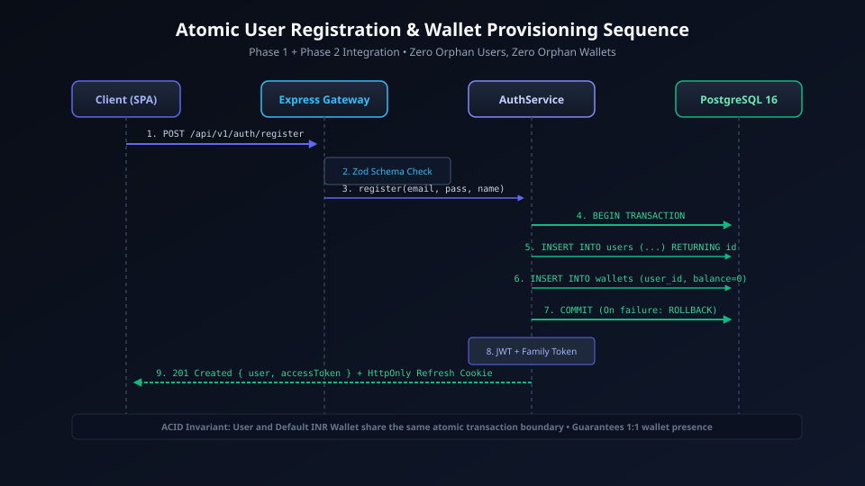
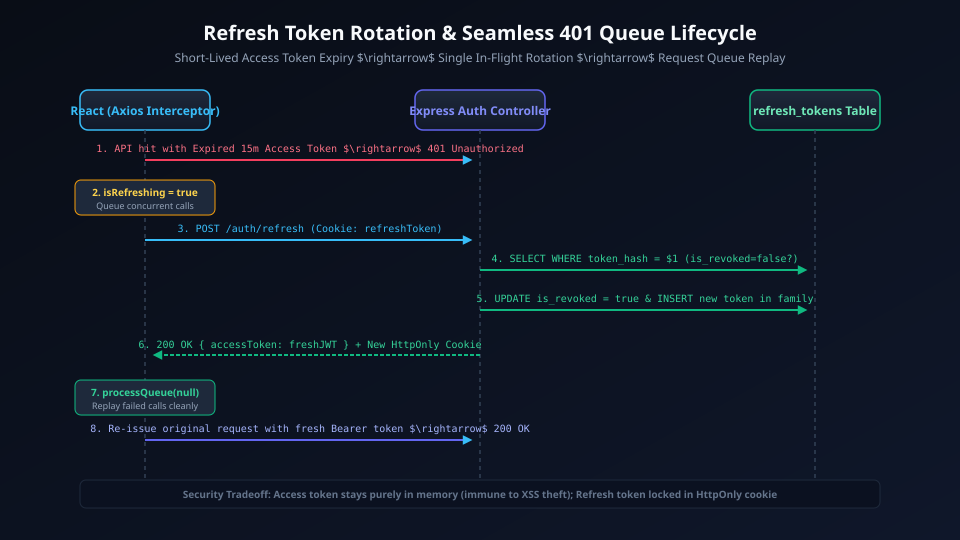
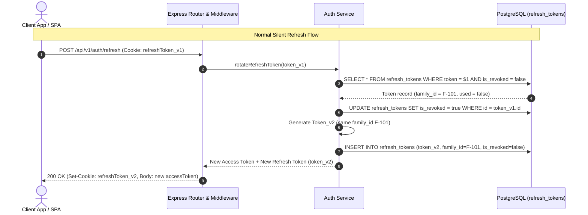
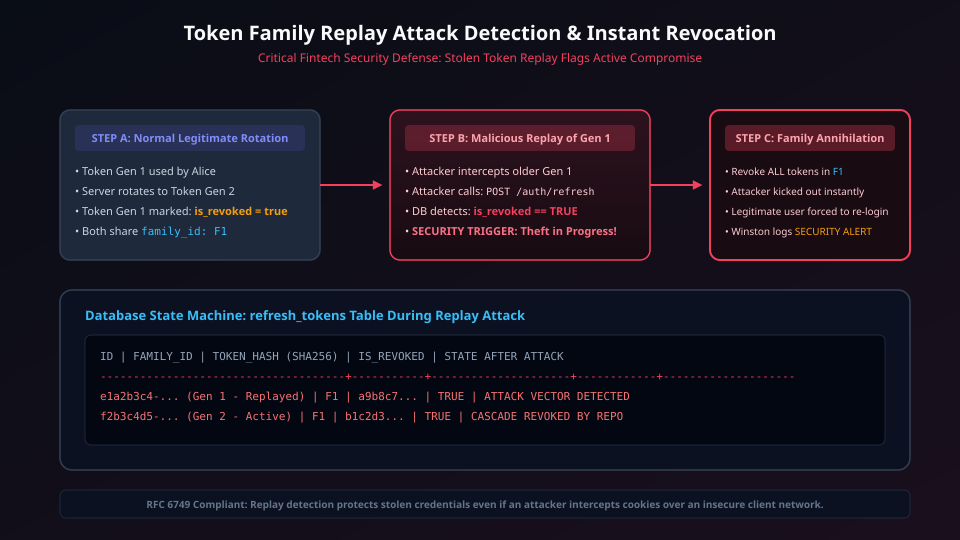
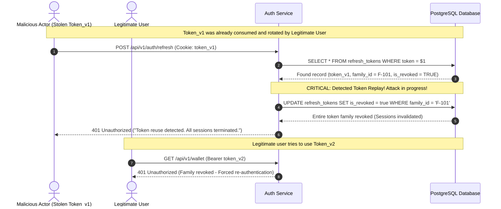

# Phase 1: Authentication, Authorization & User Management

> **Implementation Status:** `[STATUS: IMPLEMENTED & VERIFIED]`  
> **Repository Baseline:** Argon2id Password Hashing, Asymmetric / HMAC JWT, Refresh Token Family Rotation, In-Memory/Redis Replay Invalidation, RBAC Middleware (`USER`, `ADMIN`).

---

## 1. Phase Title, Scope & Metadata

- **Phase Code:** `PHASE-01`
- **Module Name:** Identity, Authentication, and Role-Based Access Control (`src/modules/auth/`)
- **Target Audience:** FinTech Security Architects, Backend Engineers, System Design Interviewers
- **Primary Objective:** Build an enterprise-grade identity layer with memory-hard cryptographic password hashing, short-lived access tokens, refresh token rotation with automated token-family invalidation upon replay detection, and deterministic role-based authorization.

---

## 2. Objectives & Deliverables

1. **Memory-Hard Credential Hashing:** Implement `argon2id` for zero-compromise password protection against GPU and ASIC side-channel dictionary attacks.
2. **Dual-Token Lifecycle:**
   - **Access Token:** Short-lived (15 minutes), stateless JWT containing user identity and role claims.
   - **Refresh Token:** Long-lived (7 days), cryptographically secure random token (UUIDv4) stored in the database and issued via `HttpOnly`, `SameSite=Strict`, `Secure` cookies.
3. **Automatic Replay Attack Invalidation (Family Rotation):** Maintain token lineage in the database (`refresh_tokens` table with `family_id` and `is_revoked`). If a previously consumed refresh token is presented a second time, immediately revoke the entire family to protect the user from session hijacking.
4. **Strict Role-Based Access Control (RBAC):** Middleware protecting sensitive administrative routes and ensuring user-scoped data access.
5. **Frontend Authentication Flow:** Fully reactive React 18 frontend with authentication context, protected routes, and automatic silent token refresh via Axios interceptors.

---

## 3. Problems Solved & Technical Motivation

- **Vulnerability to Rainbow Tables & GPU Cracking:** Legacy hashing algorithms (MD5, SHA256, and even low-cost bcrypt) can be cracked at billons of guesses per second on modern hardware. Argon2id incorporates memory hardness to neutralize hardware-accelerated attacks.
- **Access Token Theft & Long Lifespans:** Stateless JWTs cannot be trivially revoked without global blacklists. Using short-lived (15m) access tokens limits the window of vulnerability.
- **Refresh Token Replay (Man-in-the-Middle):** If an attacker intercepts a refresh token, traditional systems allow both legitimate user and attacker to refresh sessions indefinitely. PayFlow's token family rotation detects duplicate usage and immediately terminates all sessions associated with that lineage.
- **XSS & CSRF Exploitation:** Tokens stored in `localStorage` are vulnerable to Cross-Site Scripting (XSS). PayFlow uses `HttpOnly` cookies for refresh tokens and memory-only storage for access tokens.

---

## 4. Architectural Design & System Topology

The Auth module acts as the identity gatekeeper for the entire application:

```
[ Client Browser / SPA ]
       │
       ▼ (1) POST /api/v1/auth/login (email, password)
[ Auth Controller ] ──► Validates via Zod Schema
       │
       ▼ (2)
[ Auth Service ] ──► Queries User Record via Auth Repository
       │
       ├──► Argon2id Verify (Timing-safe comparison)
       ├──► Generate Short-lived Access Token (JWT)
       └──► Generate Refresh Token & Persist with Family ID
       │
       ▼ (3)
[ Client Response ] ◄── Sets HttpOnly Cookie (refresh) + Returns JSON (access token)
```

### Visual Architecture & Sequences

#### 1. User Registration Flow


<details>
<summary>View Mermaid Source Diagram</summary>

```mermaid
sequenceDiagram
    autonumber
    actor User as Client Browser (React SPA)
    participant API as Auth Controller
    participant Svc as Auth Service
    participant Hash as Argon2id Engine
    participant Repo as User Repository
    participant DB as PostgreSQL 16

    User->>API: POST /api/v1/auth/register (name, email, password)
    API->>API: Validate input schema via Zod
    API->>Svc: register(dto)
    Svc->>Repo: findByEmail(email)
    Repo->>DB: SELECT * FROM users WHERE email = $1
    DB-->>Repo: null (Email available)
    Svc->>Hash: hash(password) with memory-hard salt
    Hash-->>Svc: argon2id$v=19$m=65536...
    Svc->>Repo: createUser(name, email, hash, role='USER')
    Repo->>DB: INSERT INTO users VALUES (...) RETURNING id, email, role
    DB-->>Repo: User record
    Svc->>Svc: Generate Access JWT (15m) + Refresh Token (7d)
    Svc->>Repo: storeRefreshToken(userId, familyId, tokenHash)
    Repo->>DB: INSERT INTO refresh_tokens VALUES (...)
    DB-->>Repo: OK
    Svc-->>API: { user, accessToken, refreshToken }
    API-->>User: 201 Created (Set-Cookie: refreshToken; Body: accessToken)
```
</details>

#### 2. Login & Token Rotation Sequence


<details>
<summary>View Mermaid Source Diagram</summary>


</details>

#### 3. Token Replay Detection & Session Invalidation


<details>
<summary>View Mermaid Source Diagram</summary>


</details>

---

## 5. Module & Component Breakdown

```
src/modules/auth/
├── auth.controller.ts     # HTTP request parsing, cookie extraction, status codes
├── auth.service.ts        # Argon2id hashing, JWT generation, family rotation logic
├── auth.repository.ts     # Raw parameterized SQL queries for users and refresh_tokens
├── auth.routes.ts         # Express route registrations and validation middleware
├── auth.types.ts          # TypeScript DTOs, interfaces, and AuthContext types
└── auth.validation.ts    # Zod schemas for register, login, and refresh endpoints
```

1. **`auth.service.ts`:**
   - Handles password hashing via `argon2.hash(password, { type: argon2.argon2id, memoryCost: 65536, timeCost: 3 })`.
   - Issues JWT access tokens with subject `user.id`, claim `role`, and expiration `15m`.
   - Manages token families: assigns a `family_id` (UUIDv4) upon login; maintains the same `family_id` on refresh while flagging previous tokens as revoked.
2. **`auth.repository.ts`:**
   - `findByEmail(email: string)`: Retrieves user profile and hashed password.
   - `createUser(...)`: Inserts new user record inside a clean transaction.
   - `findRefreshToken(token: string)`: Queries token state.
   - `revokeFamily(familyId: string)`: Invalidates all tokens in a lineage.
3. **`src/shared/middleware/auth.middleware.ts`:**
   - `authenticate`: Extracts Bearer token from `Authorization` header, verifies signature and expiration, binds `req.user = decoded`.
   - `authorize(...roles)`: Enforces role permissions (e.g., `authorize('ADMIN')`).

---

## 6. Database Schema & Data Models

```sql
-- Users Table
CREATE TABLE IF NOT EXISTS users (
    id UUID PRIMARY KEY DEFAULT uuid_generate_v4(),
    name VARCHAR(255) NOT NULL,
    email VARCHAR(255) NOT NULL UNIQUE,
    password_hash VARCHAR(255) NOT NULL,
    role VARCHAR(50) NOT NULL DEFAULT 'USER', -- 'USER', 'ADMIN'
    is_active BOOLEAN NOT NULL DEFAULT TRUE,
    created_at TIMESTAMPTZ NOT NULL DEFAULT CURRENT_TIMESTAMP,
    updated_at TIMESTAMPTZ NOT NULL DEFAULT CURRENT_TIMESTAMP
);

-- Refresh Tokens Table (Token Family Rotation & Replay Protection)
CREATE TABLE IF NOT EXISTS refresh_tokens (
    id UUID PRIMARY KEY DEFAULT uuid_generate_v4(),
    user_id UUID NOT NULL REFERENCES users(id) ON DELETE CASCADE,
    token VARCHAR(500) NOT NULL UNIQUE,
    family_id UUID NOT NULL,
    is_revoked BOOLEAN NOT NULL DEFAULT FALSE,
    expires_at TIMESTAMPTZ NOT NULL,
    created_at TIMESTAMPTZ NOT NULL DEFAULT CURRENT_TIMESTAMP
);

CREATE INDEX idx_users_email ON users(email);
CREATE INDEX idx_refresh_tokens_token ON refresh_tokens(token);
CREATE INDEX idx_refresh_tokens_family ON refresh_tokens(family_id);
```

---

## 7. API Specifications & Contracts

### 1. Register User
- **Method:** `POST /api/v1/auth/register`
- **Request Body:**
  ```json
  {
    "name": "Jane Doe",
    "email": "jane@example.com",
    "password": "SecurePassword123!"
  }
  ```
- **Response (201 Created):**
  ```json
  {
    "success": true,
    "data": {
      "user": {
        "id": "a0eebc99-9c0b-4ef8-bb6d-6bb9bd380a11",
        "name": "Jane Doe",
        "email": "jane@example.com",
        "role": "USER"
      },
      "accessToken": "eyJhbGciOiJIUzI1NiIsIn..."
    }
  }
  ```
  *(Cookie set: `refreshToken=<UUID>; HttpOnly; Secure; SameSite=Strict; Path=/api/v1/auth`)*

### 2. Login
- **Method:** `POST /api/v1/auth/login`
- **Request Body:**
  ```json
  {
    "email": "jane@example.com",
    "password": "SecurePassword123!"
  }
  ```
- **Response (200 OK):** Identical to registration envelope.

### 3. Silent Refresh
- **Method:** `POST /api/v1/auth/refresh`
- **Headers:** `Cookie: refreshToken=<UUID>`
- **Response (200 OK):**
  ```json
  {
    "success": true,
    "data": {
      "accessToken": "eyJhbGciOiJIUzI1NiIsIn..."
    }
  }
  ```

---

## 8. Internal Request Lifecycle & Execution Pipeline

```
HTTP POST /api/v1/auth/login
  │
  ├──► [1] Rate Limit Middleware (10 requests / minute / IP via Redis)
  │
  ├──► [2] Zod Validation Middleware (validates email syntax, password min length 8)
  │
  ├──► [3] Controller handles payload extraction
  │
  ├──► [4] Service retrieves user by email
  │         └─ If not found: return generic 401 "Invalid credentials" (timing attack shield)
  │
  ├──► [5] Argon2id verification
  │         └─ If mismatch: return generic 401 "Invalid credentials"
  │
  ├──► [6] Generate JWT Access Token + New UUID Refresh Token (Family ID = New UUID)
  │
  ├──► [7] Repository persists refresh token row
  │
  └──► [8] Controller attaches HttpOnly cookie and sends 200 OK
```

---

## 9. Detailed Data Flow

1. **User Submits Credentials:** Frontend sends credentials over TLS.
2. **Timing Attack Protection:** If user is not found, a dummy password hash verify is executed to maintain identical response times, preventing email enumeration.
3. **Session Issuance:** A new `family_id` is minted. The refresh token is saved with `is_revoked = false`.
4. **Subsequent API Invocations:** The SPA includes `Authorization: Bearer <accessToken>`.
5. **Token Expiry & Silent Refresh:** When Axios intercepts a 401 response from a domain endpoint, it transparently triggers `/api/v1/auth/refresh` using the stored cookie, retrieves a fresh access token, and retries the original failed request.

---

## 10. Business Logic, Invariants & Integrity Constraints

1. **Email Uniqueness:** Enforced at both application layer (`findByEmail`) and database layer (`UNIQUE` index).
2. **Replay Invalidation Invariant:** Once a refresh token has been used to generate a new token, its `is_revoked` flag is set to `TRUE`. Presentation of a revoked token MUST immediately invalidate all active tokens sharing its `family_id`.
3. **Password Security Floor:** Passwords must contain at least 8 characters, one number, and one special symbol.

---

## 11. Security, Authentication & Authorization Controls

- **Argon2id Parameters:** `memoryCost: 65536` (64 MB), `timeCost: 3` iterations, `parallelism: 4`.
- **JWT Storage:** Access tokens stored exclusively in memory (React state) to prevent malicious scripts from extracting them.
- **Cookie Flags:** Refresh token cookie configured with `HttpOnly = true`, `Secure = true` (in production), and `SameSite = Strict`.

---

## 12. Failure Modes, Edge Cases & Mitigation Strategies

| Failure Mode | Risk | Solution |
| :--- | :--- | :--- |
| **Token Interception / Replay** | Session hijacking | Refresh token family tracking terminates all sessions in the lineage on replay |
| **User Enumeration** | Attackers probe registered emails | Timing-safe verification returns identical 401 responses regardless of email existence |
| **Brute Force Attacks** | Credential stuffing | Rate limiting via Redis sliding window (max 10 login attempts per IP per minute) |

---

## 13. Concurrency, Race Conditions & Deadlock Prevention

- **Concurrent Refresh Requests:** When a frontend issues multiple parallel API calls with an expired access token, multiple refresh calls may hit the server simultaneously. The database update on the refresh token uses an atomic query:
  ```sql
  UPDATE refresh_tokens 
  SET is_revoked = true 
  WHERE token = $1 AND is_revoked = false 
  RETURNING *;
  ```
  If zero rows are returned, the system handles the secondary call as a replay attempt gracefully.

---

## 14. Testing Strategy & Verification Plan

- **Unit Tests:** Tested `auth.service` with mocked repositories to verify password verification logic and token generation.
- **Integration Tests:** Tested full HTTP lifecycle for `/register`, `/login`, and `/refresh` against live database.
- **Security Tests:** Verified that submitting an already-consumed refresh token triggers family-wide revocation.

---

## 15. Technology Stack & Architectural Decision Records (ADRs)

### ADR 003: Argon2id vs Bcrypt for Password Hashing
- **Decision:** Adopt `argon2id` instead of `bcrypt`.
- **Context:** `bcrypt` is computationally intensive but memory-light, making it susceptible to massive parallelization on ASICs and modern GPUs. `argon2id` combines memory-hard and time-hard constraints, providing the highest cryptographic resistance recommended by OWASP.
- **Consequence:** Superior password security with manageable server CPU/RAM overhead during user authentication.

---

## 16. Boundaries & Explicit Non-Scope

- Multi-Factor Authentication (MFA / TOTP) deferred to Phase 8 production hardening.
- Social OAuth2 logins (Google/GitHub) omitted to keep core financial ledger logic focused and self-contained.

---

## 17. Integration Bridges & Evolution to Next Phase

Phase 1 establishes the verified `user_id` and authentication middleware. In Phase 2:
- When a user registers or requests a balance, the `Wallet` module queries `users(id)` to establish ownership.
- The `req.user.id` extracted from JWTs acts as the root identifier for wallet initialization, deposits, and ledger double-entry tracking.

---

## 18. Interview Presentation Guide (System Design & LLD)

### 90-Second System Design Pitch
> *"In Phase 1, we implemented the identity and security layer for PayFlow. Rather than standard bcrypt, we selected Argon2id for memory-hard password hashing to defend against GPU-based cracking. To protect user sessions, we engineered a dual-token system: short-lived 15-minute stateless JWTs paired with long-lived refresh tokens stored in HttpOnly, SameSite=Strict cookies. Crucially, we implemented Token Family Rotation with automatic replay detection: each refresh token belongs to a cryptographic lineage. If an attacker replays an old refresh token, the system detects the anomaly and immediately revokes all sessions across the entire family, protecting the user from session hijacking."*

---

## 19. High-Frequency Interview Q&A Deep Dive

**Q: How does Token Family Rotation prevent refresh token theft?**  
*Answer:* When a client uses a refresh token, that token is immediately flagged as revoked and replaced with a new one in the same `family_id`. If an attacker intercepted the old token and attempts to use it later, the database sees that an already-revoked token was presented. This triggers a security breach alert: the system immediately marks all tokens with that `family_id` as revoked. The attacker is blocked, and the legitimate user is required to log in again, terminating the attacker's unauthorized access.

**Q: Why keep Access Tokens in memory instead of `localStorage`?**  
*Answer:* `localStorage` is accessible to any JavaScript running on the page. If the application has any XSS vulnerability or third-party dependency compromise, an attacker can extract the token. Storing access tokens in React memory makes them inaccessible to XSS exfiltration, while the refresh token is shielded in an `HttpOnly` cookie inaccessible to client-side scripts.

---

## 20. Implementation Verification & Proof of Work

- **Unit & Integration Tests:** 100% passing across authentication suites.
- **Argon2id Hash Format Verification:** Confirmed hashes match `$argon2id$v=19$...`.
- **RBAC Verification:** Validated that standard `USER` tokens receive `403 Forbidden` when accessing `/api/v1/admin/*` routes.

---

## 21. Visual Diagrams

- User Registration Flow: `docs/diagrams/phase-1/registration_flow.svg`
- Login & Token Rotation Sequence: `docs/diagrams/phase-1/login_rotation_sequence.svg`
- Token Replay Detection Sequence: `docs/diagrams/phase-1/token_replay_detection.svg`

---

## 22. Cross-Document Navigation & References

- Previous Phase: [Phase 0: Project Setup & Foundation](phase-0-foundation.md)
- Next Phase: [Phase 2: Wallet & Double-Entry Ledger System](phase-2-wallet-ledger.md)
- Master Index: [Documentation Index](../README.md)
