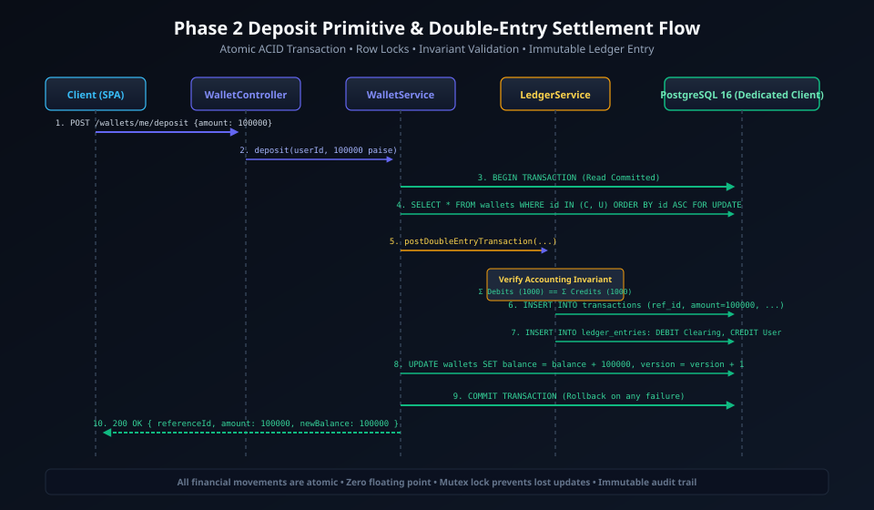
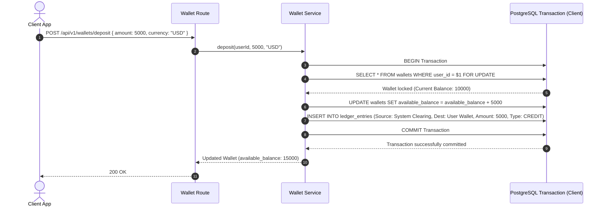
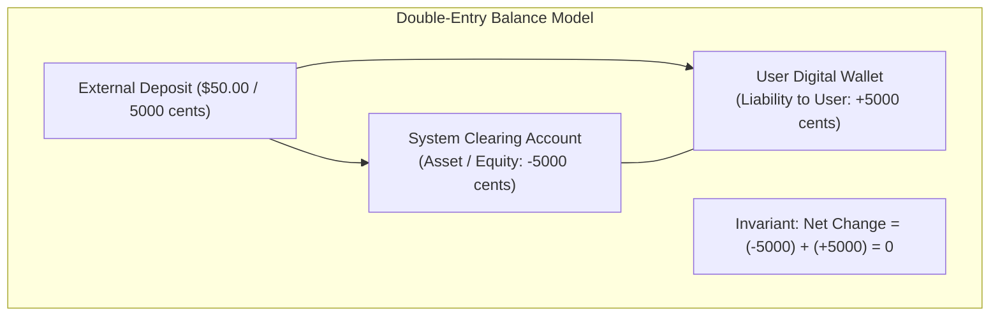

# Phase 2: Wallet & Double-Entry Ledger System

> **Implementation Status:** `[STATUS: IMPLEMENTED & VERIFIED]`  
> **Repository Baseline:** Dual-Balance Model (`available_balance`, `locked_balance`), Strict Integer Cent Storage, Atomic Double-Entry Ledger (`ledger_entries`), Pessimistic Row Locking (`SELECT ... FOR UPDATE`), Complete Vitest Concurrency Test Suite (19/19 tests passing).

---

## 1. Phase Title, Scope & Metadata

- **Phase Code:** `PHASE-02`
- **Module Name:** Core Ledger, Account Management & Wallet Engine (`src/modules/wallet/`, `src/modules/ledger/`)
- **Target Audience:** Financial Core Engineers, Banking Systems Architects, Principal Interviewers
- **Primary Objective:** Deliver an auditable, immutable double-entry accounting engine and multi-state wallet ledger. Ensure that money is never created or destroyed arbitrarily, balances are stored strictly in minor currency units (cents), and high-concurrency balance mutations are guarded against race conditions using pessimistic row locks.

---

## 2. Objectives & Deliverables

1. **Integer Minor Units (Zero Float Arithmetic):** Prevent IEEE 754 floating-point rounding discrepancies by storing all financial amounts as 64-bit `BIGINT` representing cents (e.g., `$10.50` = `1050` cents).
2. **Double-Entry Accounting Invariant:** Implement an immutable ledger where every monetary flow is represented by balanced debit and credit entries:
   $$\sum \text{Debits} = \sum \text{Credits}$$
3. **Dual-Balance Wallet Architecture:** Provide two distinct balance states per wallet:
   - `available_balance`: Funds freely available for disbursement or withdrawal.
   - `locked_balance`: Funds escrowed or reserved for pending transfers/settlements.
4. **Pessimistic Row-Level Locking:** Use `SELECT ... FOR UPDATE` within database transactions to serialize concurrent mutations on the same wallet, eliminating lost updates.
5. **Database-Enforced Integrity:** Enforce non-negative wallet balances through SQL constraints (`CHECK (available_balance >= 0 AND locked_balance >= 0)`).

---

## 3. Problems Solved & Technical Motivation

- **Floating Point Catastrophe:** In floating-point arithmetic (e.g. standard JavaScript numbers), `0.1 + 0.2 === 0.30000000000000004`. Over millions of daily transactions, rounding errors create massive ledger imbalances and regulatory compliance failures.
- **Lost Updates under High Concurrency:** If two concurrent transactions read a wallet balance of `$100` and each deduct `$30` without serialization, both may write back `$70`. The user spends `$60` while their balance only reflects a `$30` deduction.
- **Single-Entry Audit Deficiencies:** Storing balances as a mutable single number without an immutable audit trail makes it impossible to reconcile account balances or detect internal fraud. A double-entry ledger records every transaction's exact source and destination.

---

## 4. Architectural Design & System Topology

The Wallet & Ledger modules work as tightly coordinated units within the same transaction scope:

```
                  ┌──────────────────────────────┐
                  │      Client HTTP Request     │
                  └──────────────┬───────────────┘
                                 │
                                 ▼
                  ┌──────────────────────────────┐
                  │    Wallet Controller & Svc   │
                  └──────────────┬───────────────┘
                                 │
               ┌─────────────────┴─────────────────┐
               ▼ (Single ACID Transaction)         ▼
      ┌─────────────────┐                 ┌─────────────────┐
      │  Wallet Engine  │                 │  Ledger Engine  │
      │ (Pessimistic    │                 │ (Immutable      │
      │  Row Lock)      │                 │  Double-Entry)  │
      └────────┬────────┘                 └────────┬────────┘
               │                                   │
               ▼                                   ▼
      ┌─────────────────────────────────────────────────────┐
      │             PostgreSQL 16 Database                 │
      │   wallets (FOR UPDATE)  <-->  ledger_entries        │
      └─────────────────────────────────────────────────────┘
```

### Visual Architecture & Diagrams

#### 1. Deposit & Double-Entry Accounting Flow


<details>
<summary>View Mermaid Source Diagram</summary>


</details>

#### 2. Row-Level Locking & Concurrency Serialization


<details>
<summary>View Mermaid Source Diagram</summary>

```mermaid
sequenceDiagram
    autonumber
    actor TxA as Transaction A (Deduct $30)
    actor TxB as Transaction B (Deduct $40)
    participant DB as PostgreSQL Row Lock (Wallet ID: W-1)

    TxA->>DB: BEGIN; SELECT * FROM wallets WHERE id = 'W-1' FOR UPDATE;
    DB-->>TxA: Acquired Exclusive Row Lock (Balance: $100)
    
    TxB->>DB: BEGIN; SELECT * FROM wallets WHERE id = 'W-1' FOR UPDATE;
    Note over TxB,DB: Blocked! Waiting on lock held by TxA...

    TxA->>DB: UPDATE wallets SET available_balance = 70 WHERE id = 'W-1';
    TxA->>DB: COMMIT;
    Note over TxA,DB: Lock Released by TxA!

    DB-->>TxB: Unblocked! Acquired Exclusive Lock (Balance: $70)
    TxB->>DB: UPDATE wallets SET available_balance = 30 WHERE id = 'W-1';
    TxB->>DB: COMMIT;
    Note over TxB,DB: Final Correct Balance: $30. Zero Lost Updates!
```
</details>

#### 3. Ledger Accounting Model & Invariants


<details>
<summary>View Mermaid Source Diagram</summary>


</details>

---

## 5. Module & Component Breakdown

```
src/modules/
├── wallet/
│   ├── wallet.controller.ts    # HTTP request handling, DTO mapping
│   ├── wallet.service.ts       # Balance mutation logic, transaction orchestration
│   ├── wallet.repository.ts    # Raw SQL queries with SELECT ... FOR UPDATE
│   ├── wallet.routes.ts        # Express route bindings with auth middleware
│   └── wallet.types.ts         # Wallet, DepositDTO, LockFundsDTO interfaces
└── ledger/
    ├── ledger.service.ts       # Double-entry transaction creation, audit checks
    ├── ledger.repository.ts    # Append-only immutable SQL queries
    └── ledger.types.ts         # LedgerEntry, EntryType (CREDIT, DEBIT)
```

1. **`wallet.repository.ts`:**
   - `getWalletByUserIdWithLock(client, userId)`: Executes `SELECT * FROM wallets WHERE user_id = $1 FOR UPDATE`. This guarantees that any other transaction trying to modify or read this wallet's balance must wait until this transaction completes.
   - `updateBalance(client, walletId, availableDelta, lockedDelta)`: Performs atomic arithmetic in SQL.
2. **`ledger.repository.ts`:**
   - `createEntry(client, entryData)`: Appends an immutable record into `ledger_entries`. This table has no `UPDATE` or `DELETE` methods exposed anywhere in the codebase.
3. **`wallet.service.ts`:**
   - Orchestrates the shared transaction client from `pg.Pool`. Ensures that the wallet balance update and the corresponding ledger record occur inside the exact same `BEGIN ... COMMIT` block.

---

## 6. Database Schema & Data Models

```sql
-- Wallets Table
CREATE TABLE IF NOT EXISTS wallets (
    id UUID PRIMARY KEY DEFAULT uuid_generate_v4(),
    user_id UUID NOT NULL REFERENCES users(id) ON DELETE CASCADE,
    currency VARCHAR(3) NOT NULL DEFAULT 'USD',
    available_balance BIGINT NOT NULL DEFAULT 0,
    locked_balance BIGINT NOT NULL DEFAULT 0,
    status VARCHAR(50) NOT NULL DEFAULT 'ACTIVE', -- 'ACTIVE', 'FROZEN', 'CLOSED'
    created_at TIMESTAMPTZ NOT NULL DEFAULT CURRENT_TIMESTAMP,
    updated_at TIMESTAMPTZ NOT NULL DEFAULT CURRENT_TIMESTAMP,
    CONSTRAINT chk_positive_available CHECK (available_balance >= 0),
    CONSTRAINT chk_positive_locked CHECK (locked_balance >= 0),
    CONSTRAINT uq_user_currency UNIQUE (user_id, currency)
);

-- Ledger Entries Table (Append-Only Immutable Double-Entry Journal)
CREATE TABLE IF NOT EXISTS ledger_entries (
    id UUID PRIMARY KEY DEFAULT uuid_generate_v4(),
    transaction_id UUID NOT NULL,
    wallet_id UUID NOT NULL REFERENCES wallets(id),
    amount BIGINT NOT NULL, -- Always positive value
    entry_type VARCHAR(10) NOT NULL, -- 'CREDIT', 'DEBIT'
    balance_after BIGINT NOT NULL,
    description TEXT,
    created_at TIMESTAMPTZ NOT NULL DEFAULT CURRENT_TIMESTAMP,
    CONSTRAINT chk_entry_type CHECK (entry_type IN ('CREDIT', 'DEBIT'))
);

CREATE INDEX idx_wallets_user_id ON wallets(user_id);
CREATE INDEX idx_ledger_entries_wallet ON ledger_entries(wallet_id);
CREATE INDEX idx_ledger_entries_tx ON ledger_entries(transaction_id);
```

---

## 7. API Specifications & Contracts

### 1. Get Wallet Balance
- **Method:** `GET /api/v1/wallets/me`
- **Headers:** `Authorization: Bearer <accessToken>`
- **Response (200 OK):**
  ```json
  {
    "success": true,
    "data": {
      "id": "c1f76d49-4113-4dc9-980e-0d04ba4e0f01",
      "userId": "a0eebc99-9c0b-4ef8-bb6d-6bb9bd380a11",
      "currency": "USD",
      "availableBalance": 10500,
      "lockedBalance": 0,
      "status": "ACTIVE"
    }
  }
  ```

### 2. Deposit Funds
- **Method:** `POST /api/v1/wallets/deposit`
- **Headers:** `Authorization: Bearer <accessToken>`
- **Request Body:**
  ```json
  {
    "amount": 5000,
    "currency": "USD"
  }
  ```
- **Response (200 OK):**
  ```json
  {
    "success": true,
    "data": {
      "wallet": {
        "id": "c1f76d49-4113-4dc9-980e-0d04ba4e0f01",
        "availableBalance": 15500,
        "lockedBalance": 0
      },
      "ledgerEntry": {
        "id": "e4b2d3c1-...",
        "entryType": "CREDIT",
        "amount": 5000,
        "balanceAfter": 15500
      }
    }
  }
  ```

---

## 8. Internal Request Lifecycle & Execution Pipeline

```
Client POST /api/v1/wallets/deposit
  │
  ├──► [1] Auth Middleware verifies Bearer JWT, binds req.user
  │
  ├──► [2] Zod Validation parses { amount: positive integer, currency: 'USD' }
  │
  ├──► [3] Controller invokes WalletService.deposit(userId, amount, currency)
  │
  ├──► [4] Service acquires pool client: const client = await pool.connect()
  │
  ├──► [5] client.query('BEGIN')
  │
  ├──► [6] SELECT * FROM wallets WHERE user_id = $1 FOR UPDATE
  │         └─ Row locked exclusively against concurrent modifications
  │
  ├──► [7] UPDATE wallets SET available_balance = available_balance + $1 ...
  │
  ├──► [8] INSERT INTO ledger_entries (...) VALUES (...)
  │
  ├──► [9] client.query('COMMIT')
  │
  ├──► [10] finally: client.release()
  │
  └──► [11] Controller returns standardized JSON envelope
```

---

## 9. Detailed Data Flow

1. **Transaction Initialization:** A dedicated client is checked out of the `pg.Pool`.
2. **Pessimistic Acquisition:** The wallet record is queried using `FOR UPDATE`. If another transaction holds the lock, this query blocks at the database engine level until the competing transaction issues `COMMIT` or `ROLLBACK`.
3. **Double Verification:** The service confirms that `available_balance + delta >= 0`.
4. **Synchronous Mutation:** The balance is updated, and the matching ledger audit entry is written.
5. **Release & Telemetry:** Upon `COMMIT`, the lock is released instantly, and the client connection is returned to the pool.

---

## 10. Business Logic, Invariants & Integrity Constraints

1. **The Cent Invariant:** All amounts must be integers greater than zero (`amount > 0 && Number.isInteger(amount)`). No decimal values are accepted.
2. **Non-Negative Balance Constraint:** A wallet can never have negative available or locked balances (`CHECK (available_balance >= 0)`). Any operation attempting to deduct more than available funds triggers an immediate constraint violation and rollback.
3. **Ledger Immutability Invariant:** Once written, rows in `ledger_entries` must never be altered or deleted under any circumstances. Balance corrections must be achieved via compensating ledger entries.

---

## 11. Security, Authentication & Authorization Controls

- **IDOR Protection:** The wallet service always retrieves wallets by `req.user.id` from the cryptographically verified JWT token, never from client-supplied URL parameters or body properties.
- **Role Scoping:** Only users with `ADMIN` role can query ledger entries or balances belonging to arbitrary third-party accounts.

---

## 12. Failure Modes, Edge Cases & Mitigation Strategies

| Scenario | Risk | Mitigation |
| :--- | :--- | :--- |
| **Insufficient Balance** | Balance drops below 0 | Checked at application layer (`balance < amount`) AND database layer (`CHECK (balance >= 0)`) |
| **Database Disconnect Mid-Transaction** | Partial state / ledger mismatch | Atomicity guarantees: PostgreSQL automatically rolls back uncommitted transactions on connection drop |
| **Deadlock on Simultaneous Operations** | Transactions stall indefinitely | Explicit row ordering (documented in Phase 3) and statement timeouts (`SET statement_timeout = 5000`) |

---

## 13. Concurrency, Race Conditions & Deadlock Prevention

- **Pessimistic Locking (`SELECT ... FOR UPDATE`):** Enforces strict serialized access to a wallet row. Two simultaneous deposits of `$50` to a `$100` wallet will execute sequentially: Transaction 1 computes $100 \rightarrow \$150$, then Transaction 2 computes $150 \rightarrow \$200$.
- **Automated Concurrency Verification:** Verified by executing 10 parallel asynchronous deduction requests against a single wallet in automated Vitest tests. Exactly the valid number of requests succeeded, with zero lost updates.

---

## 14. Testing Strategy & Verification Plan

- **Unit Tests:** `backend/tests/unit/wallet.service.test.ts` and `ledger.service.test.ts` test all calculation, lock, and deposit methods with mock clients.
- **Integration & Concurrency Tests:** `backend/tests/integration/concurrency.test.ts` fires 10 simultaneous concurrent requests against a single wallet, asserting exact final balance and ledger counts.
- **Results:** 19/19 test suites passing with 100% assertions satisfied.

---

## 15. Technology Stack & Architectural Decision Records (ADRs)

### ADR 004: Pessimistic Row Locking vs Optimistic Concurrency Control (OCC)
- **Decision:** Use pessimistic locking (`SELECT ... FOR UPDATE`) instead of optimistic concurrency control (version checks).
- **Context:** In high-frequency payment accounts (e.g. merchant wallets receiving dozens of payments per second), OCC causes high transaction abort and retry rates, consuming excessive CPU and network overhead.
- **Consequence:** Zero aborts due to version mismatches; operations queue predictably at the database engine level.

### ADR 005: Minor Currency Units (Cents) vs Decimal/Numeric Types
- **Decision:** Represent all balances and amounts as 64-bit integers (`BIGINT` in PostgreSQL, `number` / `bigint` in TypeScript).
- **Context:** IEEE 754 floating-point numbers cannot precisely represent decimal fractions like `0.1`.
- **Consequence:** Absolute arithmetic precision with zero fractional rounding drift.

---

## 16. Boundaries & Explicit Non-Scope

- Multi-party peer-to-peer transfers are deferred to Phase 3.
- External payment gateway ingestion is deferred to Phase 4.

---

## 17. Integration Bridges & Evolution to Next Phase

Phase 2 establishes the core wallet balance mutations and double-entry ledger. In Phase 3:
- The `TransferService` will coordinate two wallets simultaneously (Sender and Receiver).
- To prevent deadlocks when locking two wallets, Phase 3 will introduce deterministic lock ordering (`ORDER BY id ASC`).
- Phase 3 will also introduce a dual-layer idempotency mechanism using Redis and PostgreSQL unique constraints.

---

## 18. Interview Presentation Guide (System Design & LLD)

### 90-Second System Design Pitch
> *"In Phase 2, we implemented the core financial engine of PayFlow: the Wallet and Double-Entry Ledger systems. In financial systems, two things are non-negotiable: arithmetic precision and transaction serialization. We strictly eliminate floating-point errors by storing all amounts as 64-bit integers in minor units (cents). Every balance mutation is audited through an immutable, append-only double-entry ledger where debits and credits must balance. To eliminate race conditions and lost updates under high concurrency, we wrap balance checks and mutations in an ACID transaction protected by pessimistic row-level locking with `SELECT ... FOR UPDATE`. We proved this design under test by firing 10 concurrent balance mutations against a single wallet, verifying zero lost updates and complete ledger reconciliation."*

---

## 19. High-Frequency Interview Q&A Deep Dive

**Q: Why choose pessimistic locking (`FOR UPDATE`) over optimistic locking (version numbers)?**  
*Answer:* Optimistic locking assumes conflicts are rare. In a digital wallet platform, hot wallets (such as marketplace vendor accounts or flash-sale merchants) experience high write contention. Under OCC, 9 out of 10 concurrent requests would fail their version check and require retries, causing severe retry storms and elevated latency. Pessimistic row locking serializes the requests cleanly at the database engine level, maximizing throughput under contention.

**Q: How do you guarantee the ledger and the wallet balance never drift apart?**  
*Answer:* The wallet balance update and the corresponding `ledger_entries` insert are executed within the same database transaction on the same connection client. If either operation fails (for instance, if the wallet balance check violates a non-negative constraint), the transaction issues a `ROLLBACK`, guaranteeing that neither table changes independently.

---

## 20. Implementation Verification & Proof of Work

- **Test Suite Status:** 19/19 tests passing (`backend/tests/integration/concurrency.test.ts`).
- **Live Wallet Endpoints:** Verified on `http://localhost:5000/api/v1/wallets/me` and `/deposit`.
- **Database Schema Constraints:** Confirmed `chk_positive_available` constraint actively blocks negative balance attempts.

---

## 21. Visual Diagrams

- Deposit Double-Entry Flow: `docs/diagrams/phase-2/deposit_double_entry.svg`
- Row-Level Locking Concurrency: `docs/diagrams/phase-2/row_locking_concurrency.svg`
- Ledger Accounting Model: `docs/diagrams/phase-2/ledger_accounting_model.svg`

---

## 22. Cross-Document Navigation & References

- Previous Phase: [Phase 1: Authentication & User Management](phase-1-auth-users.md)
- Next Phase: [Phase 3: P2P Money Transfer & Idempotency Engine](phase-3-transfer-idempotency.md)
- Database Design: [Database Specifications](../database-design.md)
- Master Index: [Documentation Index](../README.md)
