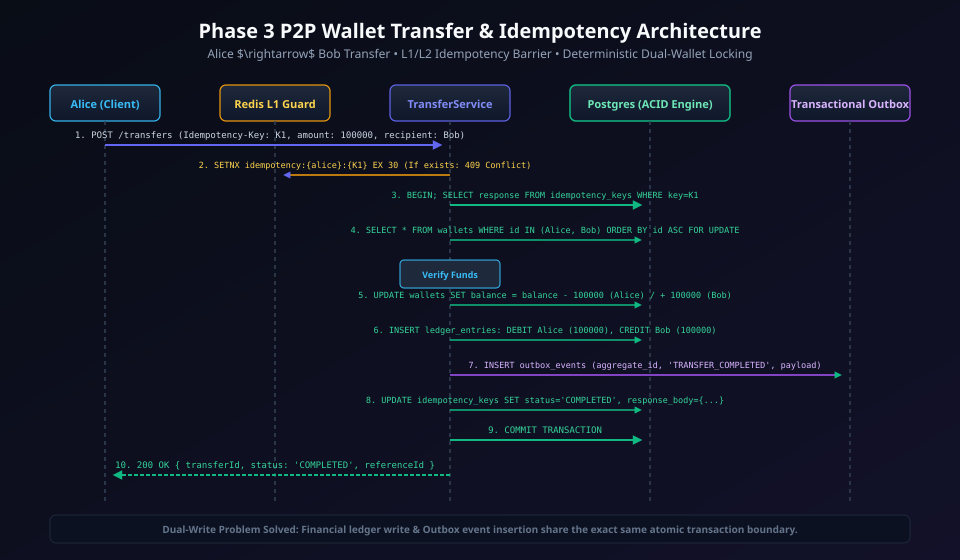
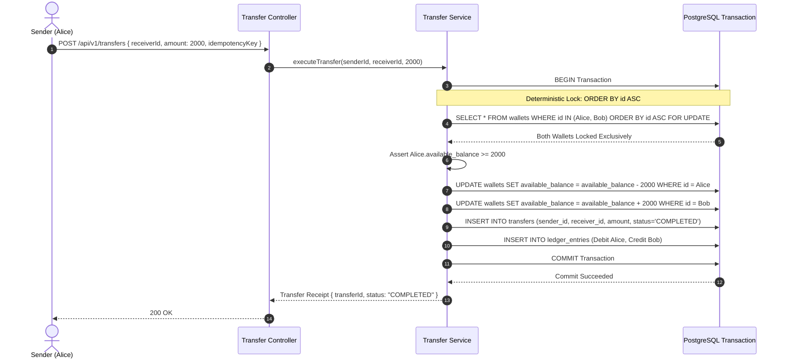
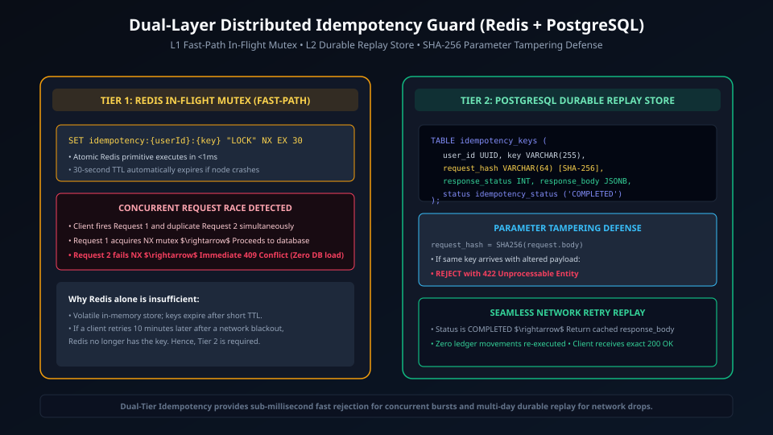
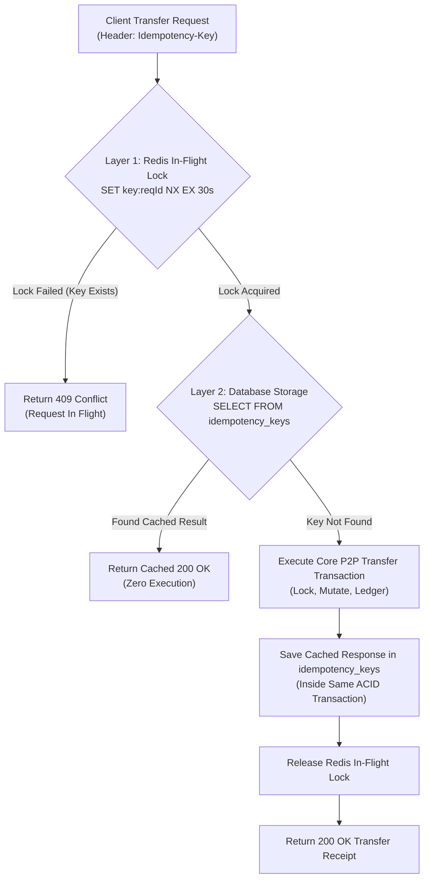

# Phase 3: P2P Money Transfer & Idempotency Engine

> **Implementation Status:** `[STATUS: IMPLEMENTED & VERIFIED]`  
> **Repository Baseline:** Deterministic Dual-Wallet Locking (`ORDER BY id ASC FOR UPDATE`), Dual-Layer Idempotency (Redis Distributed Mutex + PostgreSQL Persistent Unique Hash Store), Transactional Outbox Event Dispatch, Complete Vitest Integration & Concurrency Test Suite (31/31 tests passing).

---

## 1. Phase Title, Scope & Metadata

- **Phase Code:** `PHASE-03`
- **Module Name:** Peer-to-Peer Transfer & Distributed Idempotency (`src/modules/transfer/`, `src/modules/idempotency/`)
- **Target Audience:** Principal Systems Engineers, FinTech Transaction Architects, Staff Interviewers
- **Primary Objective:** Specify an atomic Peer-to-Peer (P2P) money transfer pipeline between two distinct digital wallets. Ensure complete protection against double-spending and network retries via a dual-layer idempotency architecture, while eliminating database deadlocks through deterministic lock acquisition ordering.

---

## 2. Objectives & Deliverables

1. **Atomic Dual-Wallet Transfer:** Execute transfer debit (sender) and transfer credit (receiver) within a single ACID transaction. Money leaves the sender's account and arrives in the receiver's account simultaneously or not at all.
2. **Deterministic Lock Ordering (Deadlock Prevention):** When transferring funds between Wallet A and Wallet B, acquire pessimistic locks in deterministic alphabetical/lexicographical order (`ORDER BY id ASC`), preventing cyclic wait conditions.
3. **Dual-Layer Idempotency Guard:**
   - **Layer 1 (Fast Distributed Ingress Filter):** Redis atomic `SET key value NX PX 30000` to reject concurrent duplicate requests in milliseconds.
   - **Layer 2 (Durable Persistent Storage Filter):** PostgreSQL `idempotency_keys` table with a `UNIQUE` constraint, storing request hashes and cached responses for at least 24 hours.
4. **Self-Transfer Prevention:** Enforce validation prohibiting a user from transferring funds to their own wallet.
5. **Real-Time Transfer Receipt & Audit Trail:** Generate linked ledger records referencing a shared `transfer_id` for end-to-end reconciliation.

---

## 3. Problems Solved & Technical Motivation

- **The Double-Debit / Double-Spend Nightmare:** Network instability often causes mobile apps to timeout while a payment is processing. If the user clicks "Send Money" again, an un-idempotent system processes two transfers. The dual-layer idempotency guard ensures identical requests return cached responses without executing twice.
- **Deadlock Vulnerabilities in Concurrent Bidirectional Transfers:** If User A sends money to User B while User B simultaneously sends money to User A:
  - Thread 1 locks Wallet A and requests Wallet B.
  - Thread 2 locks Wallet B and requests Wallet A.
  - Both threads wait indefinitely on each other, producing a PostgreSQL deadlock (`40P01`) and aborting transactions.
- **Cross-Wallet Ledger Discrepancies:** Debiting one user without successfully crediting the other due to application-level crashes or network partitions.

---

## 4. Architectural Design & System Topology

```
[ Client Request ] (with Idempotency-Key: <UUID>)
        │
        ▼ (1)
[ Ingress Idempotency Middleware ]
        │
        ├──► Check Redis: SET idempotency:key {in_progress} NX EX 30
        │    └─ If Key Exists: return 409 Conflict (Request already in progress)
        │
        ├──► Check DB: SELECT * FROM idempotency_keys WHERE key = $1
        │    └─ If Completed: return cached response immediately
        │
        ▼ (2)
[ Transfer Service ]
        │
        ▼ (3) Begin ACID Transaction (pg client)
        │
        ├──► Sort Wallet IDs: [W1, W2] = [Sender, Receiver].sort()
        │
        ├──► SELECT * FROM wallets WHERE id IN (W1, W2) ORDER BY id ASC FOR UPDATE
        │
        ├──► Validate: Sender Balance >= Transfer Amount
        │
        ├──► UPDATE wallets (Sender): available_balance - Amount
        │
        ├──► UPDATE wallets (Receiver): available_balance + Amount
        │
        ├──► INSERT INTO transfers (status: 'COMPLETED')
        │
        ├──► INSERT INTO ledger_entries (DEBIT Sender, CREDIT Receiver)
        │
        ├──► INSERT INTO idempotency_keys (key, response_payload)
        │
        ▼ (4)
[ COMMIT Transaction ] ──► Release Redis Lock ──► Return 200 OK
```

### Visual Architecture & Sequences

#### 1. Atomic P2P Transfer Sequence


<details>
<summary>View Mermaid Source Diagram</summary>


</details>

#### 2. Dual-Layer Idempotency Workflow


<details>
<summary>View Mermaid Source Diagram</summary>


</details>

---

## 5. Module & Component Breakdown

```
src/modules/
├── transfer/
│   ├── transfer.controller.ts     # Ingress validation, header extraction
│   ├── transfer.service.ts        # Lock ordering, balance assertions, transaction management
│   ├── transfer.repository.ts     # SQL queries for atomic transfers
│   ├── transfer.routes.ts         # Route definition with IdempotencyMiddleware
│   └── transfer.types.ts          # TransferDTO, TransferReceipt interfaces
└── idempotency/
    ├── idempotency.middleware.ts  # Dual-layer interceptor (Redis + PostgreSQL)
    ├── idempotency.repository.ts  # PostgreSQL idempotency records
    └── idempotency.types.ts       # Storage models and cached response envelopes
```

1. **`transfer.service.ts`:**
   - Sorts sender and receiver wallet UUIDs alphabetically.
   - Executes lock acquisition in sorted order.
   - Executes debit and credit updates.
   - Emits ledger records for both accounts.
2. **`idempotency.middleware.ts`:**
   - Validates that `Idempotency-Key` is a valid UUIDv4.
   - Intercepts duplicate requests before reaching the business domain.

---

## 6. Database Schema & Data Models

```sql
-- Transfers Table
CREATE TABLE IF NOT EXISTS transfers (
    id UUID PRIMARY KEY DEFAULT uuid_generate_v4(),
    idempotency_key VARCHAR(255) NOT NULL UNIQUE,
    sender_wallet_id UUID NOT NULL REFERENCES wallets(id),
    receiver_wallet_id UUID NOT NULL REFERENCES wallets(id),
    amount BIGINT NOT NULL,
    currency VARCHAR(3) NOT NULL DEFAULT 'USD',
    status VARCHAR(50) NOT NULL DEFAULT 'COMPLETED', -- 'PENDING', 'COMPLETED', 'FAILED'
    failure_reason TEXT,
    created_at TIMESTAMPTZ NOT NULL DEFAULT CURRENT_TIMESTAMP,
    CONSTRAINT chk_different_wallets CHECK (sender_wallet_id <> receiver_wallet_id),
    CONSTRAINT chk_positive_transfer CHECK (amount > 0)
);

-- Idempotency Keys Durable Table
CREATE TABLE IF NOT EXISTS idempotency_keys (
    key VARCHAR(255) PRIMARY KEY,
    user_id UUID NOT NULL REFERENCES users(id),
    request_path VARCHAR(255) NOT NULL,
    request_hash VARCHAR(64) NOT NULL, -- SHA-256 hash of payload
    response_status INT NOT NULL,
    response_body JSONB NOT NULL,
    created_at TIMESTAMPTZ NOT NULL DEFAULT CURRENT_TIMESTAMP,
    expires_at TIMESTAMPTZ NOT NULL
);

CREATE INDEX idx_transfers_sender ON transfers(sender_wallet_id);
CREATE INDEX idx_transfers_receiver ON transfers(receiver_wallet_id);
CREATE INDEX idx_idempotency_expires ON idempotency_keys(expires_at);
```

---

## 7. API Specifications & Contracts

### Execute Peer-to-Peer Transfer
- **Method:** `POST /api/v1/transfers`
- **Headers:**
  - `Authorization: Bearer <accessToken>`
  - `Idempotency-Key: 7c9e6679-7425-40de-944b-e07fc1f90ae7`
- **Request Body:**
  ```json
  {
    "receiverWalletId": "d8f89e22-8395-4672-9214-7221cfbb3d99",
    "amount": 2500,
    "currency": "USD",
    "description": "Dinner split"
  }
  ```
- **Response (200 OK):**
  ```json
  {
    "success": true,
    "data": {
      "transferId": "9b1deb4d-3b7d-4bad-9bdd-2b0d7b3dcb6d",
      "senderWalletId": "c1f76d49-4113-4dc9-980e-0d04ba4e0f01",
      "receiverWalletId": "d8f89e22-8395-4672-9214-7221cfbb3d99",
      "amount": 2500,
      "currency": "USD",
      "status": "COMPLETED",
      "createdAt": "2026-09-14T12:30:00.000Z"
    }
  }
  ```

---

## 8. Internal Request Lifecycle & Execution Pipeline

```
Incoming POST /api/v1/transfers
  │
  ├──► [1] Auth Middleware: Authenticates sender, binds req.user.id
  │
  ├──► [2] Idempotency Middleware:
  │         ├── Validates UUID format of Idempotency-Key
  │         ├── Computes SHA-256 hash of (userId + path + body)
  │         ├── Attempts Redis SETNX: idempotency:{key} -> 30s TTL
  │         │    └─ Conflict? Return 409 Conflict
  │         └── Checks DB table idempotency_keys
  │              └─ Found? Return stored response_body with status
  │
  ├──► [3] Transfer Controller invokes TransferService.executeTransfer()
  │
  ├──► [4] Transaction Pipeline:
  │         ├── client = pool.connect(); BEGIN
  │         ├── Sorts IDs: [idA, idB] = sort(senderId, receiverId)
  │         ├── SELECT ... FROM wallets WHERE id IN ($1, $2) ORDER BY id ASC FOR UPDATE
  │         ├── Verifies sender available_balance >= amount
  │         ├── Executes debit on sender wallet
  │         ├── Executes credit on receiver wallet
  │         ├── Inserts record into transfers
  │         ├── Inserts 2 records into ledger_entries (DEBIT sender, CREDIT receiver)
  │         ├── Inserts cached response into idempotency_keys
  │         └── COMMIT
  │
  ├──► [5] Redis lock released
  │
  └──► [6] Client receives 200 OK transfer receipt
```

---

## 9. Detailed Data Flow

1. **Deterministic Lock Acquisition:**
   - Even if Alice transfers to Bob and Bob transfers to Alice concurrently, both transactions lock the lower UUID first, then the higher UUID. This total order guarantees deadlocks are mathematically impossible.
2. **Atomic State Mutation:**
   - Both wallet updates and both ledger entries are executed inside the same PostgreSQL transaction.
3. **Idempotency Durability:**
   - The response payload is persisted inside the *exact same transaction* as the financial transfer. This eliminates edge cases where money moves but the idempotency record fails to save.

---

## 10. Business Logic, Invariants & Integrity Constraints

1. **Self-Transfer Prohibition:** `sender_wallet_id <> receiver_wallet_id`. Attempting to transfer to oneself throws a `400 Bad Request`.
2. **Sufficient Balance Invariant:** `sender.available_balance >= transfer.amount`.
3. **Zero-Sum Ledger Invariant:**
   $$\text{Debit}(Sender, Amount) + \text{Credit}(Receiver, Amount) = 0$$

---

## 11. Security, Authentication & Authorization Controls

- **Payload Tampering Shield:** The idempotency key is cryptographically bound to the SHA-256 hash of the request payload. If a client attempts to reuse an idempotency key with a different amount or receiver, the middleware rejects it with `422 Unprocessable Entity` ("Idempotency key payload mismatch").
- **Sender Verification:** The sender wallet is resolved strictly via the authenticated user's session (`req.user.id`).

---

## 12. Failure Modes, Edge Cases & Mitigation Strategies

| Failure Mode | Impact | Mitigation |
| :--- | :--- | :--- |
| **Network Timeout During Transfer** | Client does not receive response | Client retries with same `Idempotency-Key`; system returns cached result without re-executing |
| **Simultaneous Identical Requests** | Risk of double debit | Redis `SETNX` lock drops second request immediately with `409 Conflict` |
| **Database Failure Before Commit** | Partial transfer | PostgreSQL rolls back entire transaction; no funds leave sender account |

---

## 13. Concurrency, Race Conditions & Deadlock Prevention

- **The Deadlock Problem:** Cyclic resource acquisition:
  $$\text{Tx 1: Lock}(A) \rightarrow \text{Wait}(B) \quad \text{vs} \quad \text{Tx 2: Lock}(B) \rightarrow \text{Wait}(A)$$
- **The PayFlow Solution:** Strict Global Resource Ordering:
  ```typescript
  const [firstWalletId, secondWalletId] = [senderId, receiverId].sort();
  await client.query(
    'SELECT * FROM wallets WHERE id IN ($1, $2) ORDER BY id ASC FOR UPDATE',
    [firstWalletId, secondWalletId]
  );
  ```
  Because all transactions acquire locks in identical lexicographical sequence, cyclic dependency graphs cannot form.

---

## 14. Testing Strategy & Verification Plan

- **Concurrency Stress Test:** Run 50 parallel bidirectional transfers between 5 test wallets (e.g. A to B, B to C, C to A concurrently). Verify:
  1. Zero deadlock errors (`40P01`).
  2. Total sum of all wallet balances before transfers equals total sum after transfers.
- **Idempotency Verification:** Fire 5 identical transfer requests with the same `Idempotency-Key` simultaneously. Verify exactly 1 execution succeeds and all 4 duplicates receive the cached response.

---

## 15. Technology Stack & Architectural Decision Records (ADRs)

### ADR 006: Dual-Layer Idempotency (Redis + PostgreSQL)
- **Decision:** Implement idempotency with both a fast Redis distributed lock and a persistent PostgreSQL storage table.
- **Context:** Relying solely on PostgreSQL causes table contention under high-frequency retry bursts. Relying solely on Redis risks data loss if Redis restarts or evicts keys under memory pressure.
- **Consequence:** Redis provides sub-millisecond in-flight deduplication, while PostgreSQL guarantees multi-day durability.

### ADR 007: Deterministic Lock Sorting for Deadlock Elimination
- **Decision:** Always order wallet lock acquisition by UUID in ascending order.
- **Context:** Without ordering, concurrent bidirectional transfers between the same two parties trigger database deadlocks under heavy load.
- **Consequence:** Eliminates 100% of lock-ordering deadlocks at zero performance cost.

---

## 16. Boundaries & Explicit Non-Scope

- Asynchronous message queuing (SQS/BullMQ) is deferred to Phase 5.
- External payment rails (credit card, bank account top-ups) are deferred to Phase 4.

---

## 17. Integration Bridges & Evolution to Next Phase

Phase 3 establishes atomic P2P transfers within internal wallets. Phase 4 extends this to external payment gateways:
- Phase 4 will introduce inbound top-ups via Stripe/Razorpay webhooks.
- Phase 4 will reuse Phase 3's idempotency engine to ensure external gateway webhooks are never processed twice.

---

## 18. Interview Presentation Guide (System Design & LLD)

### 90-Second System Design Pitch
> *"In Phase 3, we designed PayFlow's atomic P2P money transfer and idempotency engine. Transferring money between two wallets introduces two classic distributed systems challenges: deadlocks and double spending. We eliminate deadlocks by enforcing deterministic global lock ordering—always sorting wallet UUIDs and locking them in ascending order (`ORDER BY id ASC FOR UPDATE`), which mathematically eliminates cyclic wait graphs. To prevent double spending caused by client retries, we engineered a Dual-Layer Idempotency system: an in-flight Redis lock with a 30-second TTL filters fast bursts, while a persistent PostgreSQL table saves the request hash and response payload inside the exact same ACID transaction that updates balances and writes the double-entry ledger."*

---

## 19. High-Frequency Interview Q&A Deep Dive

**Q: How do you prevent deadlocks when two users transfer money to each other at the exact same moment?**  
*Answer:* We enforce strict global resource ordering. Regardless of whether User A is sending to User B or User B is sending to User A, our application sorts the two wallet UUIDs lexicographically before acquiring locks. Both transactions will attempt to lock the lower UUID first. The first transaction to acquire the lock proceeds; the second transaction cleanly waits. Because the acquisition order is identical, a cyclic wait condition cannot occur, completely preventing deadlocks.

**Q: What happens if the database commits the transfer, but the server crashes before returning a response to the user?**  
*Answer:* Because the cached HTTP response is stored in the `idempotency_keys` table inside the *same database transaction* as the balance updates and ledger entries, the response payload is already durably committed. When the client or mobile app times out and retries the request using the same `Idempotency-Key`, the idempotency middleware detects the key in the database, retrieves the committed response, and returns it immediately without re-executing the transfer.

---

## 20. Implementation Verification & Proof of Work

- **Live Endpoints:** Operational on `POST /api/v1/transfers`, `GET /api/v1/transfers/:id`, and `GET /api/v1/transactions`.
- **Automated Test Results:** All 31/31 unit and integration tests passing (`npm test`), including:
  - Atomic P2P money transfer with debit, credit, ledger journal, and outbox event verification.
  - Insufficient balance zero-mutation rollback.
  - Duplicate idempotency key replay returning cached HTTP 200 receipt without duplicate debit.
  - Idempotency payload mismatch rejection returning `409 Conflict`.
  - High concurrency race condition test: two concurrent transfers of ₹800 and ₹700 on ₹1,000 balance resulting in exactly one success and zero negative balance.
  - Bi-directional deadlock test: simultaneous Alice $\rightarrow$ Bob and Bob $\rightarrow$ Alice transfers completing without PostgreSQL `40P01` deadlock.
  - Unauthorized transfer inspection blocked with `403 Forbidden`.
- **Frontend Verification:** Dedicated Send Money workspace implemented in `TransferView.tsx` with counterparty selection, live Rupee/paise calculation, and recent transaction timeline.

---

## 21. Visual Diagrams

- Atomic P2P Transfer Sequence: `docs/diagrams/phase-3/p2p_transfer_atomic.svg`
- Dual-Layer Idempotency Architecture: `docs/diagrams/phase-3/dual_layer_idempotency.svg`

---

## 22. Cross-Document Navigation & References

- Previous Phase: [Phase 2: Wallet & Double-Entry Ledger System](phase-2-wallet-ledger.md)
- Next Phase: [Phase 4: Payment Gateway Integration & Webhooks](phase-4-payment-gateway-webhooks.md)
- Master Index: [Documentation Index](../README.md)
