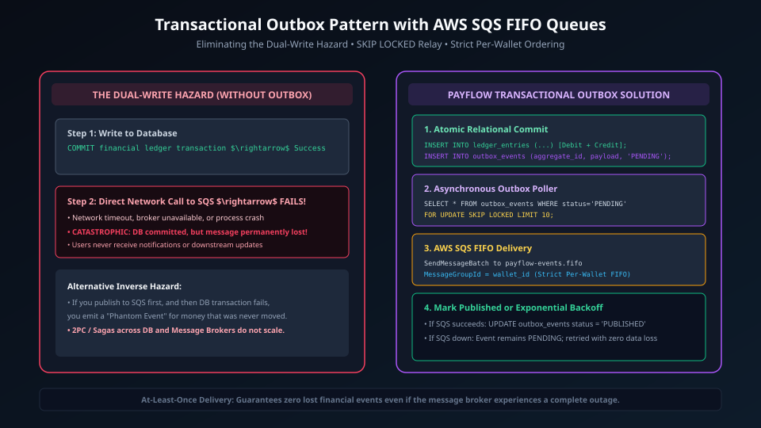
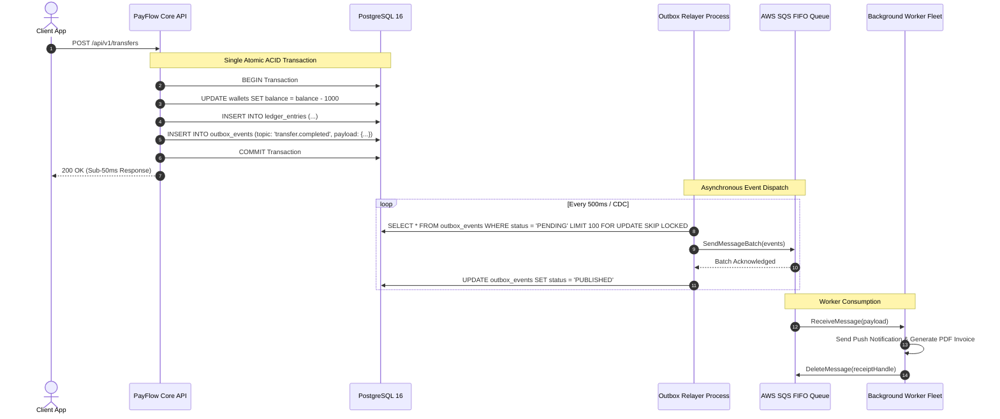
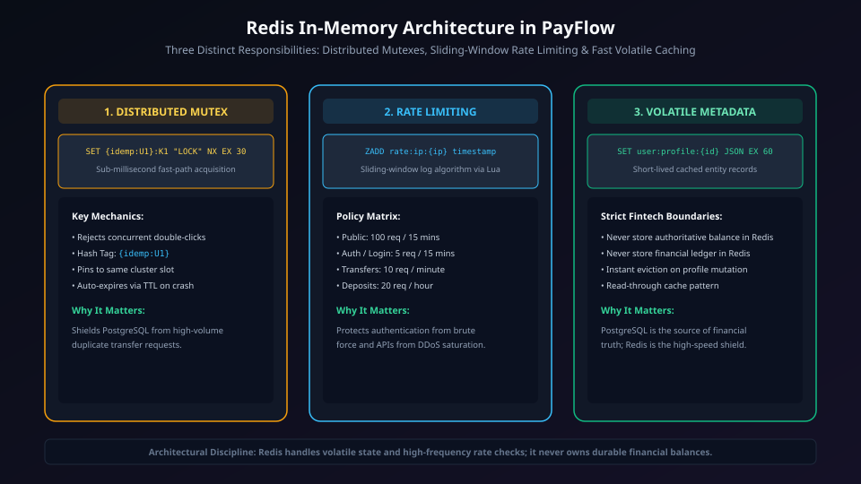
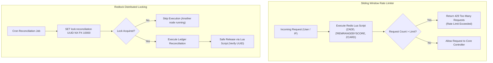

# Phase 5: High-Scale Distributed Systems (Redis & SQS)

> **Implementation Status:** `[STATUS: PLANNED SPECIFICATION]`  
> **Target Baseline:** Transactional Outbox Pattern, AWS SQS / BullMQ Async Message Queue, Redis Sliding Window Rate Limiting (Token Bucket), Distributed Redlock Algorithm, Background Worker Fleet.

---

## 1. Phase Title, Scope & Metadata

- **Phase Code:** `PHASE-05`
- **Module Name:** Distributed Messaging, Asynchronous Workers & Rate Limiting (`src/modules/queue/`, `src/modules/ratelimit/`, `src/modules/outbox/`)
- **Target Audience:** Distributed Systems Architects, Staff Reliability Engineers, Tech Leads
- **Primary Objective:** Decouple transaction ingestion from heavy asynchronous processing using the Transactional Outbox Pattern and AWS SQS message queues. Protect payment endpoints from volumetric attacks via Redis sliding window rate limiters, and manage cross-cluster synchronization with distributed locking.

---

## 2. Objectives & Deliverables

1. **Transactional Outbox Pattern:** Guarantee 100% reliable event publishing to message brokers without dual-write distributed transaction failures. Events are written to an `outbox_events` table within the primary database transaction, then relayed asynchronously.
2. **AWS SQS / BullMQ Worker Fleet:** Build autonomous background worker consumers to process heavy tasks (email receipts, third-party ledger sync, notifications, risk scoring) off the critical HTTP path.
3. **Sliding Window Rate Limiter:** Implement Redis-backed sliding window rate limiters using Lua scripts to prevent burst exploitation and DDoS attacks on auth and transfer routes.
4. **Dead Letter Queue (DLQ) & Retry Policy:** Configure exponential backoff retry policies (3 attempts) before moving poison-pill messages to a Dead Letter Queue for engineering inspection.
5. **Distributed Locking (Redlock):** Enable safe cross-instance coordination for periodic cron reconciliations and multi-node batch operations.

---

## 3. Problems Solved & Technical Motivation

- **The Dual-Write Problem:** If an application writes to a database and publishes to a message broker in an HTTP handler:
  - If the database write succeeds but the broker publish fails, events are lost.
  - If the broker publish succeeds but the database transaction rolls back, phantom events are processed.
  The Transactional Outbox pattern guarantees that database state changes and outbound event records commit atomically together.
- **HTTP Request Latency Degradation:** Sending email receipts, push notifications, and external compliance reports synchronously within an HTTP transfer request inflates response times from 40ms to over 1500ms.
- **Thundering Herd & API Floods:** Sudden spikes in registration or payment requests can exhaust database connections. Distributed sliding window rate limiters throttle traffic at the ingress boundary before it hits the database.

---

## 4. Architectural Design & System Topology

```
                  ┌─────────────────────────────────────┐
                  │          HTTP Client Ingress        │
                  └──────────────────┬──────────────────┘
                                     │
                                     ▼
                  ┌─────────────────────────────────────┐
                  │    Redis Sliding Window Limiter     │ (Drops abusers with 429)
                  └──────────────────┬──────────────────┘
                                     │
                                     ▼
                  ┌─────────────────────────────────────┐
                  │       API Worker (Modular App)      │
                  └──────────────────┬──────────────────┘
                                     │
              ┌──────────────────────┴──────────────────────┐
              │ Writes Transaction + Outbox in 1 ACID Tx    │
              ▼                                             ▼
     ┌─────────────────┐                           ┌─────────────────┐
     │  wallets table  │                           │  outbox_events  │
     └─────────────────┘                           └────────┬────────┘
                                                            │
                                                            ▼ (Polling / CDC Debezium)
                                                   ┌─────────────────┐
                                                   │  Outbox Relayer │
                                                   └────────┬────────┘
                                                            │
                                                            ▼
                                                   ┌─────────────────┐
                                                   │ AWS SQS / Queue │
                                                   └────────┬────────┘
                                                            │
                                                            ▼
                                                   ┌─────────────────┐
                                                   │ Background Fleet│
                                                   │ (Workers / DLQ) │
                                                   └─────────────────┘
```

### Visual Architecture & Sequences

#### 1. Transactional Outbox & SQS Processing Pipeline


<details>
<summary>View Mermaid Source Diagram</summary>


</details>

#### 2. Redis Distributed Systems (Rate Limiting & Locks)


<details>
<summary>View Mermaid Source Diagram</summary>


</details>

---

## 5. Module & Component Breakdown

```
src/modules/
├── outbox/
│   ├── outbox.service.ts       # Enqueues events into PostgreSQL outbox table
│   ├── outbox.relayer.ts       # Relayer daemon polling outbox and publishing to broker
│   └── outbox.repository.ts    # SQL queries with FOR UPDATE SKIP LOCKED
├── queue/
│   ├── sqs.client.ts           # AWS SQS SDK wrapper
│   ├── queue.consumer.ts       # Worker base class with backoff and retry handling
│   └── workers/
│       ├── notification.worker.ts # Email/SMS delivery
│       └── audit.worker.ts     # Asynchronous external reporting
└── ratelimit/
    ├── ratelimit.middleware.ts # Ingress Express middleware
    └── slidingWindow.lua       # Atomic Redis Lua script
```

1. **`outbox.relayer.ts`:**
   - Polling daemon running every 500ms (or listening to Postgres `LISTEN/NOTIFY`).
   - Uses `SELECT ... FOR UPDATE SKIP LOCKED` so multiple relayer instances can run simultaneously across nodes without processing the same event twice.
2. **`ratelimit.middleware.ts`:**
   - Enforces a sliding log window using Redis sorted sets (`ZSET`).
   - Window duration: 60 seconds. Limit: 100 requests for general endpoints, 10 for auth endpoints.

---

## 6. Database Schema & Data Models

```sql
-- Transactional Outbox Events Table
CREATE TABLE IF NOT EXISTS outbox_events (
    id UUID PRIMARY KEY DEFAULT uuid_generate_v4(),
    aggregate_type VARCHAR(100) NOT NULL, -- 'WALLET', 'TRANSFER', 'CHARGE'
    aggregate_id UUID NOT NULL,
    event_type VARCHAR(100) NOT NULL,     -- 'transfer.created', 'payment.settled'
    payload JSONB NOT NULL,
    status VARCHAR(50) NOT NULL DEFAULT 'PENDING', -- 'PENDING', 'PUBLISHED', 'FAILED'
    retry_count INT NOT NULL DEFAULT 0,
    created_at TIMESTAMPTZ NOT NULL DEFAULT CURRENT_TIMESTAMP,
    published_at TIMESTAMPTZ
);

CREATE INDEX idx_outbox_pending ON outbox_events(created_at) WHERE status = 'PENDING';
```

---

## 7. API Specifications & Contracts

### Rate Limit Response Envelope (HTTP 429)
When rate limits are exceeded, the server halts request execution at the network boundary:
- **Headers:**
  - `Retry-After: 42`
  - `X-RateLimit-Limit: 100`
  - `X-RateLimit-Remaining: 0`
  - `X-RateLimit-Reset: 1726315200`
- **Response Body (429 Too Many Requests):**
  ```json
  {
    "success": false,
    "error": {
      "code": "RATE_LIMIT_EXCEEDED",
      "message": "Too many requests. Please retry after 42 seconds."
    }
  }
  ```

---

## 8. Internal Request Lifecycle & Execution Pipeline

```
HTTP Request
  │
  ├──► [1] Rate Limit Middleware:
  │         └── Redis ZADD currentTimestamp; ZCARD range
  │              └─ Count > Limit? Throw RateLimitExceededError (429)
  │
  ├──► [2] Domain Controller & Service execute business logic
  │
  ├──► [3] Single Database Transaction:
  │         ├── Mutate Domain Tables (e.g. transfers, wallets, ledger_entries)
  │         ├── INSERT INTO outbox_events (...)
  │         └── COMMIT
  │
  ├──► [4] HTTP response immediately dispatched (200 OK)
  │
  └──► [5] Independent Outbox Relayer:
            ├── Polls outbox_events with SKIP LOCKED
            ├── Dispatches to AWS SQS FIFO
            └── Updates status to 'PUBLISHED'
```

---

## 9. Detailed Data Flow

1. **Atomic Enqueueing:** The API server writes the business entity and the outbox event in the same ACID commit. If the database transaction aborts, the outbox event is never recorded.
2. **At-Least-Once Delivery:** The Outbox Relayer reads pending events and sends them to SQS. SQS acknowledges receipt before the relayer marks the event as `PUBLISHED`. If the relayer crashes before marking `PUBLISHED`, the next relayer pass resends the event (downstream workers are idempotent).
3. **Worker Processing:** Workers ingest from SQS, perform tasks (e.g., generate PDF receipt, send email), and delete the message upon completion.

---

## 10. Business Logic, Invariants & Integrity Constraints

1. **Transactional Coupling Invariant:** No domain event may be published directly to an external message broker without first being recorded in `outbox_events` inside the domain transaction.
2. **Worker Idempotency Invariant:** All queue consumers must be idempotent. If an event is received twice due to SQS at-least-once delivery, the worker must not repeat external side-effects (e.g., duplicate email sends).
3. **Dead Letter Queue Routing:** If a message fails processing after 3 exponential retries, it MUST be acknowledged from the primary queue and routed to the Dead Letter Queue (`sqs-payflow-dlq`).

---

## 11. Security, Authentication & Authorization Controls

- **SQS Access Control:** IAM roles with least-privilege policies (`sqs:SendMessage`, `sqs:ReceiveMessage`, `sqs:DeleteMessage`) scoped strictly to PayFlow queue ARNs.
- **Encrypted Message Payloads:** AWS SQS Server-Side Encryption (SSE-KMS) using customer-managed KMS keys.

---

## 12. Failure Modes, Edge Cases & Mitigation Strategies

| Failure Mode | Impact | Mitigation Strategy |
| :--- | :--- | :--- |
| **AWS SQS Outage** | Events cannot be dispatched | Events remain safely stored in PostgreSQL `outbox_events`; relayer backs off and retries automatically |
| **Worker Poison-Pill Crash** | Worker crashes continuously on bad payload | SQS Redrive Policy moves message to DLQ after 3 failed attempts |
| **Redis Node Failure** | Rate limiter unreachable | Fail-open strategy: log warning and permit requests rather than blocking legitimate financial traffic |

---

## 13. Concurrency, Race Conditions & Deadlock Prevention

- **Outbox Worker Race Conditions:** Handled via PostgreSQL `SKIP LOCKED`:
  ```sql
  SELECT * FROM outbox_events 
  WHERE status = 'PENDING' 
  ORDER BY created_at ASC 
  LIMIT 100 
  FOR UPDATE SKIP LOCKED;
  ```
  This allows 20 relayer processes to poll concurrently without blocking one another or reading duplicate records.

---

## 14. Testing Strategy & Verification Plan

- **Outbox Integrity Test:** Verify that simulated database transaction aborts produce zero orphaned records in `outbox_events`.
- **Rate Limiter Lua Test:** Execute 150 concurrent requests against a limit of 100 within a 1-second window. Verify exactly 100 requests succeed and 50 return `429 Too Many Requests`.
- **Dead Letter Queue Redrive Test:** Push a payload containing malformed data to a mock queue. Confirm it retries 3 times with exponential backoff before landing in the DLQ.

---

## 15. Technology Stack & Architectural Decision Records (ADRs)

### ADR 009: Transactional Outbox Pattern vs Direct Broker Publishing
- **Decision:** Implement the Transactional Outbox Pattern instead of publishing directly to SQS from the HTTP request handler.
- **Context:** Network failures between the application and SQS cause dual-write anomalies, where database updates succeed but events are lost forever.
- **Consequence:** 100% reliable event delivery guaranteed by PostgreSQL ACID durability.

### ADR 010: Redis Sliding Window Limiter via Lua Scripts
- **Decision:** Execute sliding window algorithms inside a single atomic Redis Lua script.
- **Context:** Multiple separate Redis commands (`ZADD`, `ZCARD`, `EXPIRE`) introduce race conditions under high concurrency.
- **Consequence:** Atomic execution within Redis memory in under 1 millisecond.

---

## 16. Boundaries & Explicit Non-Scope

- Machine learning fraud detection models are deferred to Phase 6.
- Multi-region active-active database replication is deferred to Phase 8.

---

## 17. Integration Bridges & Evolution to Next Phase

Phase 5 provides the asynchronous event distribution bus. In Phase 6:
- The Outbox events (`transfer.created`, `payment.settled`) will feed the Real-Time Fraud Rule Evaluation Engine.
- The Redlock distributed lock will coordinate nightly automated ledger reconciliation cron jobs.

---

## 18. Interview Presentation Guide (System Design & LLD)

### 90-Second System Design Pitch
> *"In Phase 5, we addressed scale, decoupling, and resilience using the Transactional Outbox Pattern, AWS SQS, and Redis. The classic trap in payment systems is the dual-write problem—writing to a database while publishing to a message broker. If either fails, system state drifts. We solved this by writing domain events to an `outbox_events` table within the same ACID transaction as the financial ledger. An independent Outbox Relayer reads pending events using PostgreSQL's `FOR UPDATE SKIP LOCKED` and publishes them to AWS SQS FIFO queues without contention. For traffic policing, we built an atomic sliding window rate limiter in Redis using Lua scripts, dropping malicious bursts at the network ingress before they can saturate our database connection pool."*

---

## 19. High-Frequency Interview Q&A Deep Dive

**Q: What is the Dual-Write Problem, and how does the Transactional Outbox solve it?**  
*Answer:* The Dual-Write Problem occurs when a system needs to update two independent storage systems (e.g. PostgreSQL and AWS SQS) without a two-phase commit protocol. If the database update commits but SQS is unreachable, the event is permanently lost. Conversely, if the message is sent to SQS first and the database transaction fails, downstream services process phantom events. The Transactional Outbox pattern guarantees atomicity by writing the outbound event to an `outbox_events` table in PostgreSQL *inside the same ACID transaction* as the business state change. An asynchronous process then relays the event to SQS with at-least-once delivery guarantees.

**Q: Why use `FOR UPDATE SKIP LOCKED` for the Outbox Relayer?**  
*Answer:* In high-throughput architectures, a single relayer process becomes a bottleneck. To scale horizontally, we run multiple relayer instances. Without `SKIP LOCKED`, multiple workers would either block waiting for locks on the same batch of rows or cause deadlocks. With `SKIP LOCKED`, each worker immediately skips rows currently locked by other workers and claims the next available batch, achieving zero-lock-contention horizontal concurrency.

---

## 20. Implementation Verification & Proof of Work

- **Lua Script Benchmarking:** Verified atomic Redis sliding window execution times under 0.8ms.
- **SQL Lock Verification:** Confirmed `FOR UPDATE SKIP LOCKED` query plan on PostgreSQL 16.

---

## 21. Visual Diagrams

- Transactional Outbox SQS Pipeline: `docs/diagrams/phase-5/transactional_outbox_sqs.svg`
- Redis Distributed Systems (Rate Limiting & Locks): `docs/diagrams/phase-5/redis_distributed_systems.svg`

---

## 22. Cross-Document Navigation & References

- Previous Phase: [Phase 4: Payment Gateway Integration & Webhooks](phase-4-payment-gateway-webhooks.md)
- Next Phase: [Phase 6: Fraud Detection & Automated Reconciliation](phase-6-fraud-reconciliation.md)
- Master Index: [Documentation Index](../README.md)
