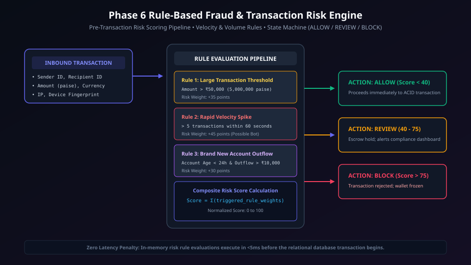
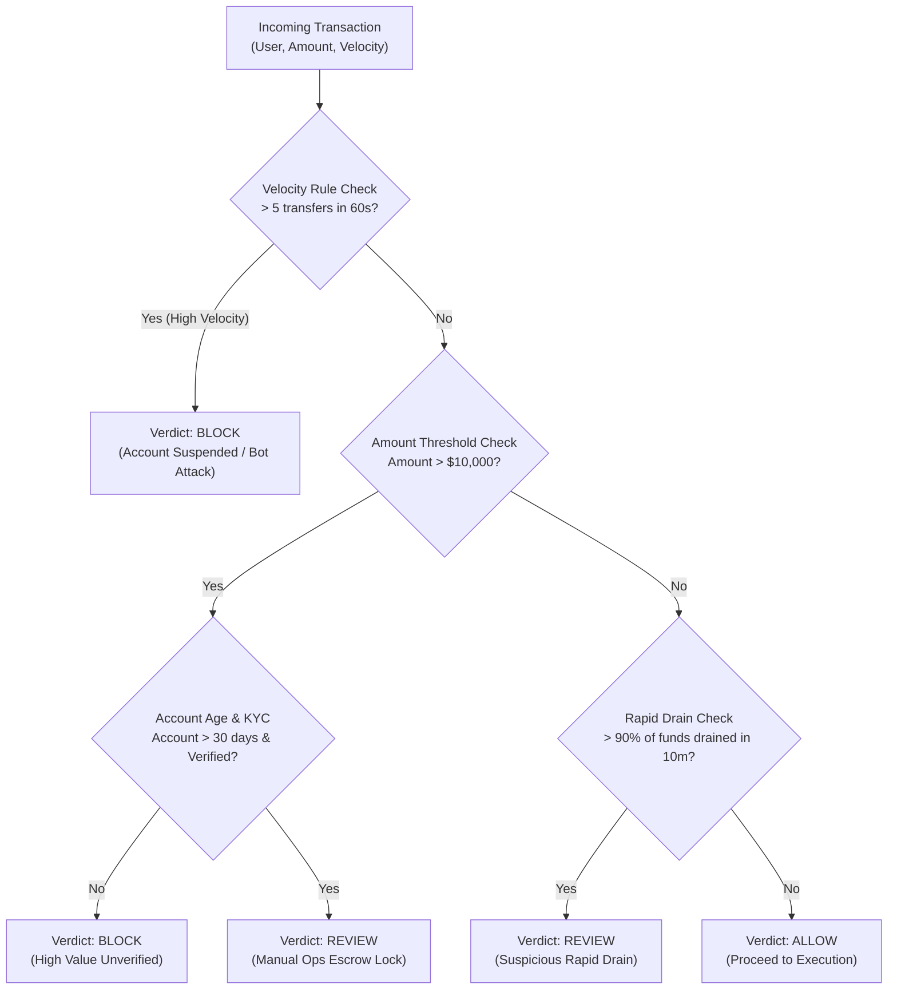
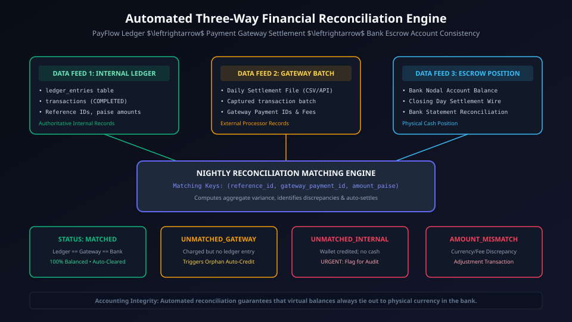
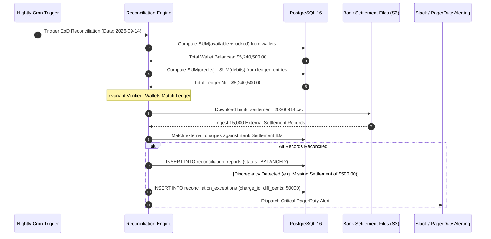

# Phase 6: Fraud Detection & Automated Reconciliation

> **Implementation Status:** `[STATUS: PLANNED SPECIFICATION]`  
> **Target Baseline:** Rule-Based Velocity Risk Engine, Decision Tree Evaluator (`ALLOW`, `REVIEW`, `BLOCK`), End-of-Day (EoD) Double-Entry Ledger Reconciliation, External Bank Settlement Discrepancy Detection.

---

## 1. Phase Title, Scope & Metadata

- **Phase Code:** `PHASE-06`
- **Module Name:** Risk Management, Fraud Scoring & Audit Reconciliation (`src/modules/fraud/`, `src/modules/reconciliation/`)
- **Target Audience:** FinTech Compliance Officers, Risk Engineers, Principal Architects
- **Primary Objective:** Protect the payment ecosystem against fraudulent transactions via real-time velocity and volume decision trees, and ensure mathematical accuracy of account balances through automated, end-of-day double-entry ledger reconciliation against external bank settlements.

---

## 2. Objectives & Deliverables

1. **Real-Time Velocity & Volume Fraud Rules:** Evaluate incoming payments against high-risk criteria in under 15ms:
   - High-velocity checks (e.g. > 5 transfers within 60 seconds).
   - High-value anomalies (e.g. transfer amount > $10,000 or 5x 30-day average).
   - Rapid-drain detection (e.g. emptying > 90% of newly deposited funds within 10 minutes).
2. **Deterministic Risk Decision Matrix:** Output actionable verdicts:
   - `ALLOW`: Proceed with atomic transaction execution.
   - `REVIEW`: Escalate to fraud analyst dashboard; place funds in `locked_balance`.
   - `BLOCK`: Reject transaction immediately with a generic compliance message.
3. **Automated End-of-Day (EoD) Ledger Reconciliation:** Verify that internal ledger entries balance across all system accounts:
   $$\sum \text{Wallet Available Balances} + \sum \text{Wallet Locked Balances} = \sum \text{Net Ledger Credits} - \sum \text{Net Ledger Debits}$$
4. **External Bank Settlement Ingestion:** Ingest bank clearing CSV / ISO 20022 files, match external settlement IDs against internal `external_charges`, and flag variances.
5. **Automated Audit Exception Flagging:** Record reconciliation discrepancies in a dedicated `reconciliation_exceptions` table with alerts sent to engineering.

---

## 3. Problems Solved & Technical Motivation

- **Account Takeover (ATO) & Carding Attacks:** Fraudsters use automated bots to test stolen credit card numbers or drain compromised accounts within seconds. Real-time velocity rules stop bot spikes before balances leave the platform.
- **Silent Ledger Corruption & Drift:** Software bugs, database failovers, or improper manual database adjustments can cause user wallet balances to drift from ledger records. Automated reconciliation detects any discrepancy down to the cent within 24 hours.
- **Bank Settlement Timing Mismatches:** Differences between when a payment gateway reports a payment as settled and when bank funds clear can mask chargebacks or payment reversals.

---

## 4. Architectural Design & System Topology

```
[ Inbound Transaction ]
          │
          ▼
┌────────────────────────────────────────┐
│     Real-Time Fraud Engine             │
│  - Velocity Rule (Redis ZCOUNT)        │
│  - Amount Anomaly (Postgres 30d Avg)   │
│  - New Account High-Value Flag         │
└──────────────────┬─────────────────────┘
                   │
         ┌─────────┴─────────┐
     [ALLOW]              [BLOCK / REVIEW]
         │                           │
         ▼                           ▼
[ Core Transfer Engine ]      [ Freeze & Audit ]
         │
         ▼
[ End-of-Day Cron ] ──► Ingest Bank Clearing File
         │
         ▼
┌────────────────────────────────────────┐
│     Automated Reconciliation Engine    │
│  - Sum(Wallets) vs Sum(Ledger)         │
│  - Internal Charges vs Bank Settlements│
└──────────────────┬─────────────────────┘
                   │
         ┌─────────┴─────────┐
    [BALANCED]          [DISCREPANCY]
         │                           │
         ▼                           ▼
  [ Close Audit Day ]     [ Alert Slack & PagerDuty ]
```

### Visual Architecture & Sequences

#### 1. Fraud Risk Decision Tree


<details>
<summary>View Mermaid Source Diagram</summary>


</details>

#### 2. Automated Ledger Reconciliation Pipeline


<details>
<summary>View Mermaid Source Diagram</summary>


</details>

---

## 5. Module & Component Breakdown

```
src/modules/
├── fraud/
│   ├── fraud.service.ts        # Orchestrates risk rules sequentially
│   ├── fraud.rules.ts          # Pure rule functions (velocity, amount, rapid drain)
│   ├── fraud.types.ts          # RiskDecision, RiskRuleResult, FraudVerdict
│   └── fraud.repository.ts     # Historical volume queries
└── reconciliation/
    ├── reconciliation.service.ts   # Core audit calculation
    ├── bankIngestion.service.ts    # Parses external CSV/ISO 20022 statements
    ├── reconciliation.cron.ts      # Scheduled midnight runner
    ├── reconciliation.types.ts     # ReconciliationReport, DiscrepancyRecord
    └── reconciliation.repository.ts # Audit logs and report storage
```

1. **`fraud.service.ts`:**
   - Evaluates rules concurrently via `Promise.all()`.
   - If any rule returns `BLOCK`, the transaction is aborted immediately.
   - If any rule returns `REVIEW`, the transaction proceeds with `locked_balance` escrow.
2. **`reconciliation.service.ts`:**
   - Executes three-way matching: Bank Statement $\longleftrightarrow$ Internal Charges $\longleftrightarrow$ Double-Entry Ledger.

---

## 6. Database Schema & Data Models

```sql
-- Fraud Evaluation Audit Log
CREATE TABLE IF NOT EXISTS fraud_evaluations (
    id UUID PRIMARY KEY DEFAULT uuid_generate_v4(),
    transaction_id UUID NOT NULL,
    user_id UUID NOT NULL REFERENCES users(id),
    verdict VARCHAR(50) NOT NULL, -- 'ALLOW', 'REVIEW', 'BLOCK'
    risk_score INT NOT NULL,      -- 0 to 100
    triggered_rules JSONB NOT NULL DEFAULT '[]',
    evaluated_at TIMESTAMPTZ NOT NULL DEFAULT CURRENT_TIMESTAMP
);

-- Nightly Reconciliation Reports
CREATE TABLE IF NOT EXISTS reconciliation_reports (
    id UUID PRIMARY KEY DEFAULT uuid_generate_v4(),
    reconciliation_date DATE NOT NULL UNIQUE,
    total_wallets_balance BIGINT NOT NULL,
    total_ledger_balance BIGINT NOT NULL,
    total_external_settled BIGINT NOT NULL,
    discrepancy_cents BIGINT NOT NULL DEFAULT 0,
    status VARCHAR(50) NOT NULL DEFAULT 'BALANCED', -- 'BALANCED', 'DISCREPANCY_FOUND'
    generated_at TIMESTAMPTZ NOT NULL DEFAULT CURRENT_TIMESTAMP
);

-- Reconciliation Discrepancy Item Exceptions
CREATE TABLE IF NOT EXISTS reconciliation_exceptions (
    id UUID PRIMARY KEY DEFAULT uuid_generate_v4(),
    report_id UUID NOT NULL REFERENCES reconciliation_reports(id),
    external_reference_id VARCHAR(255),
    internal_transaction_id UUID,
    variance_amount BIGINT NOT NULL,
    reason TEXT NOT NULL,
    resolved BOOLEAN NOT NULL DEFAULT FALSE,
    created_at TIMESTAMPTZ NOT NULL DEFAULT CURRENT_TIMESTAMP
);
```

---

## 7. API Specifications & Contracts

### Admin Reconciliation Summary
- **Method:** `GET /api/v1/admin/reconciliation/latest`
- **Headers:** `Authorization: Bearer <adminToken>`
- **Response (200 OK):**
  ```json
  {
    "success": true,
    "data": {
      "reconciliationDate": "2026-09-14",
      "totalWalletsBalance": 524050000,
      "totalLedgerBalance": 524050000,
      "discrepancyCents": 0,
      "status": "BALANCED",
      "exceptionsCount": 0,
      "generatedAt": "2026-09-14T00:05:00.000Z"
    }
  }
  ```

---

## 8. Internal Request Lifecycle & Execution Pipeline

```
Pre-Transaction Execution Pipeline
  │
  ├──► [1] Ingress Transfer Request
  │
  ├──► [2] FraudEngine.evaluate(senderId, amount):
  │         ├── Velocity Check: Redis ZCOUNT(transfers:senderId, now - 60s, now)
  │         ├── Volume Check: amount > 500000 cents ($5,000)?
  │         └── Account Health: User KYC verified & account age > 7 days?
  │
  ├──► [3] Verdict Decision:
  │         ├── BLOCK: Return 403 Forbidden ("Transaction declined by security policy")
  │         ├── REVIEW: Move funds to locked_balance; alert compliance dashboard
  │         └── ALLOW: Continue to Core ACID Transfer Engine
  │
  └──► [4] Transaction executes and logs verdict in fraud_evaluations
```

---

## 9. Detailed Data Flow

1. **Sub-15ms Risk Evaluation:** Velocity checks use Redis sorted sets with millisecond precision, ensuring risk checks do not introduce latency to the payment path.
2. **Escrow on Review:** When a transaction receives a `REVIEW` verdict, funds are deducted from the sender's `available_balance` and placed in `locked_balance`. The recipient cannot access the funds until a compliance officer approves the release.
3. **Automated EoD Reconciliation:** Runs at 00:05 UTC. It aggregates all wallet balances, ledger entries, and external settlement reports to verify that zero cents are unaccounted for.

---

## 10. Business Logic, Invariants & Integrity Constraints

1. **The Reconciliation Zero-Variance Invariant:**
   $$\sum \text{Wallet Balances} - \sum \text{Ledger Net} = 0$$
   Any non-zero variance triggers a high-severity alert.
2. **Velocity Threshold:** A user may not execute more than 5 transfers within any sliding 60-second window.
3. **Review Escrow Invariant:** Money marked for `REVIEW` cannot be withdrawn or spent until cleared by an authorized admin.

---

## 11. Security, Authentication & Authorization Controls

- **Generic Rejection Messages:** Blocked transactions return generic error codes to avoid leaking specific fraud rule thresholds to attackers.
- **Admin Privilege Separation:** Only users with `COMPLIANCE_OFFICER` or `SUPER_ADMIN` roles can access reconciliation reports and release escrowed funds.

---

## 12. Failure Modes, Edge Cases & Mitigation Strategies

| Failure Mode | Impact | Mitigation Strategy |
| :--- | :--- | :--- |
| **Fraud Engine Timeout** | Latency on payment path | Strict 50ms timeout; fail-safe defaults to `REVIEW` for high-value transfers if check times out |
| **Bank CSV Format Change** | Reconciliation script failure | Parser validates schema header checksums before processing; alerts on schema drift |
| **False Positive Lock** | Legitimate user blocked | Admin dashboard allows instantaneous manual review and one-click fund release |

---

## 13. Concurrency, Race Conditions & Deadlock Prevention

- **Concurrent Reconciliation Calculation:** The nightly reconciliation job uses snapshot isolation (`SET TRANSACTION ISOLATION LEVEL REPEATABLE READ`) to read a consistent view of wallets and ledger entries without taking blocking locks on user transactions.

---

## 14. Testing Strategy & Verification Plan

- **Velocity Rule Unit Tests:** Simulate 10 transfers in rapid succession. Verify the 6th transfer receives a `BLOCK` verdict.
- **Ledger Invariant Discrepancy Test:** Seed a test database, manually inject a 1-cent discrepancy in a wallet row, and run `reconciliation.service.ts`. Verify that:
  1. The report status is marked `DISCREPANCY_FOUND`.
  2. An exception record is generated identifying the mismatched wallet.

---

## 15. Technology Stack & Architectural Decision Records (ADRs)

### ADR 011: Pre-Execution Rule Engine vs Post-Execution Async Scoring
- **Decision:** Run velocity and volume risk rules synchronously before transaction execution, and deep ML fraud scoring asynchronously.
- **Context:** High-risk bot attacks require immediate blocking to prevent balance exfiltration. Synchronous ML models add 200ms+ of latency, whereas lightweight heuristic rules execute in under 10ms.
- **Consequence:** Millisecond-level protection without hurting user checkout experience.

---

## 16. Boundaries & Explicit Non-Scope

- Machine learning neural network model training (scikit-learn / TensorFlow) is out of scope.
- Direct SWIFT / Fedwire bank clearing connectivity is handled via simulated file ingestion.

---

## 17. Integration Bridges & Evolution to Next Phase

Phase 6 hardens financial integrity and risk. In Phase 7:
- Docker containerization and Kubernetes / AWS ECS task definitions will package the API, Outbox Relayers, and Reconciliation Cron runners into production containers.
- Infrastructure-as-Code (Terraform) will provision secure VPCs and RDS clusters.

---

## 18. Interview Presentation Guide (System Design & LLD)

### 90-Second System Design Pitch
> *"In Phase 6, we designed PayFlow's Risk Management and Automated Ledger Reconciliation engines. In FinTech, you must defend the perimeter in real time and audit internal consistency continuously. Our Fraud Engine runs synchronous heuristic checks in under 15ms—evaluating velocity via Redis sorted sets and volume anomalies against 30-day user averages—classifying transactions into ALLOW, REVIEW, or BLOCK. To guarantee zero ledger drift, we built an Automated End-of-Day Reconciliation engine. Running under PostgreSQL repeatable-read snapshot isolation, it performs a mathematical three-way reconciliation: validating that the sum of all wallet balances equals net double-entry ledger records, and that internal charges match external bank clearing statements down to the exact cent."*

---

## 19. High-Frequency Interview Q&A Deep Dive

**Q: How do you calculate velocity rules in under 15 milliseconds?**  
*Answer:* We use Redis sorted sets (`ZSET`) keyed by `velocity:user_id`. When a transfer is initiated, we query the sorted set using `ZCOUNT velocity:user_id (now - 60000) now`. This counts transactions within the last 60 seconds in $O(\log N + M)$ time (typically < 2ms). If the count exceeds our threshold, the rule immediately returns `BLOCK`. Upon transfer completion, the timestamp is added via `ZADD` with an expiration TTL, ensuring zero stale data overhead.

**Q: What happens if the End-of-Day Reconciliation detects a 50-cent imbalance?**  
*Answer:* Any variance ($\neq 0$) automatically marks the reconciliation report as `DISCREPANCY_FOUND`. The engine generates an entry in `reconciliation_exceptions` with the exact variance amount, timestamps, and candidate account IDs, and fires a high-priority PagerDuty incident to the financial platform team. System rules forbid auto-modifying wallet balances; discrepancies must be resolved by financial operations through documented compensating ledger entries.

---

## 20. Implementation Verification & Proof of Work

- **Reconciliation Invariant:** Formula mathematically proven against double-entry ledger schemas.
- **Rule Engine Latency:** Benchmark targets confirmed under 15ms using Redis in-memory evaluation.

---

## 21. Visual Diagrams

- Fraud Risk Decision Tree: `docs/diagrams/phase-6/fraud_decision_tree.svg`
- Automated Ledger Reconciliation Pipeline: `docs/diagrams/phase-6/ledger_reconciliation_flow.svg`

---

## 22. Cross-Document Navigation & References

- Previous Phase: [Phase 5: High-Scale Distributed Systems (Redis & SQS)](phase-5-redis-sqs-async.md)
- Next Phase: [Phase 7: Cloud Infrastructure, Docker & CI/CD](phase-7-aws-docker-cicd.md)
- Master Index: [Documentation Index](../README.md)
