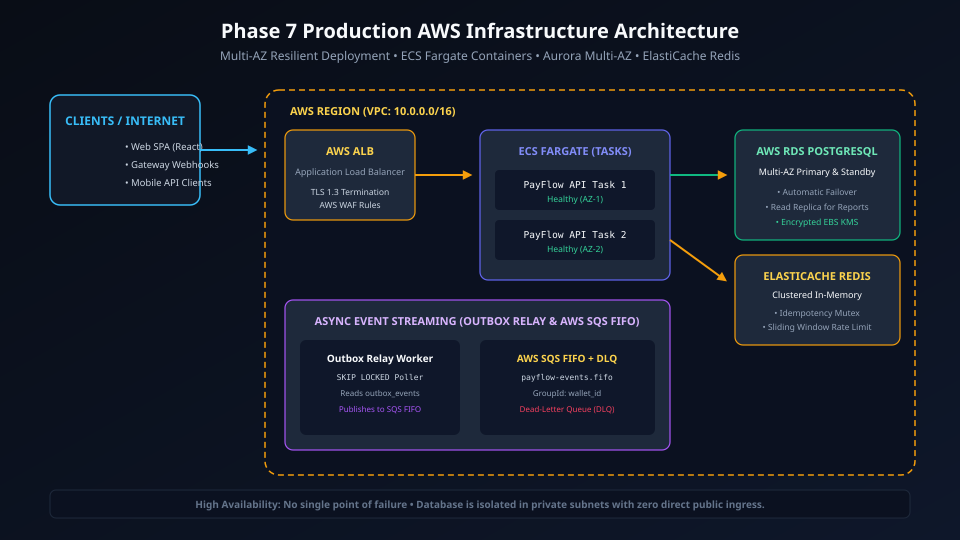
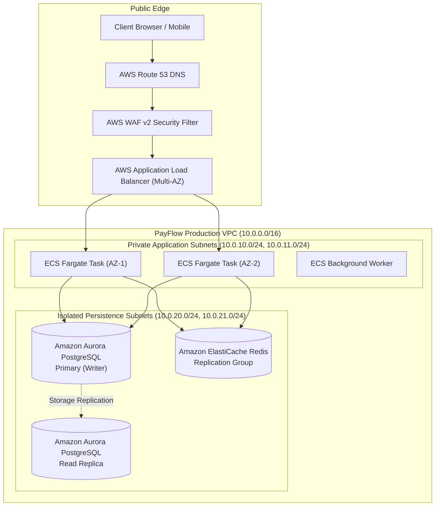
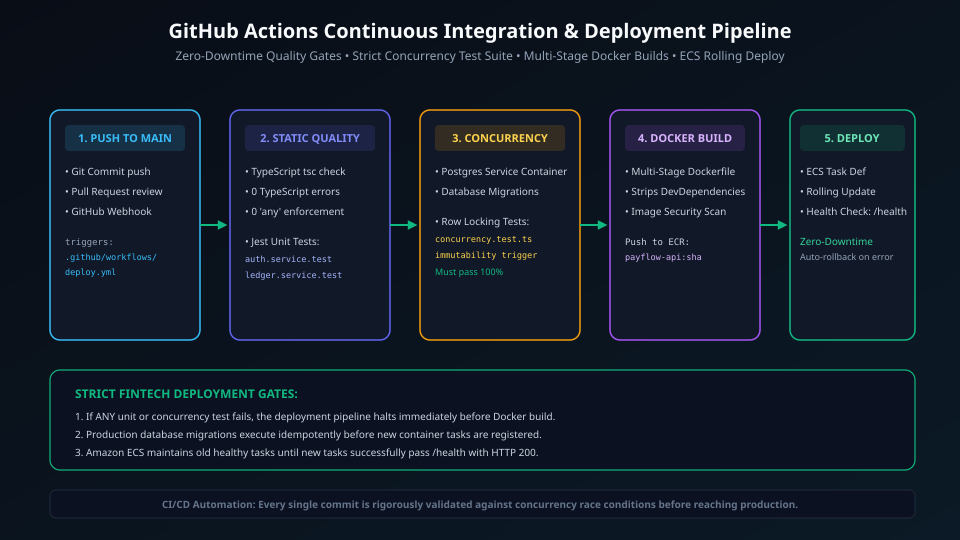

# Phase 7: Cloud Infrastructure, Docker & CI/CD Pipeline

> **Implementation Status:** `[STATUS: PLANNED SPECIFICATION]`  
> **Target Baseline:** Multi-Stage Dockerfile, Docker Compose Production Topology, AWS Well-Architected VPC (Multi-AZ RDS Aurora, ElastiCache, ECS Fargate), GitHub Actions CI/CD Pipeline, Automated Schema Migrations.

---

## 1. Phase Title, Scope & Metadata

- **Phase Code:** `PHASE-07`
- **Module Name:** Infrastructure as Code, Containerization & Automated Deployment (`deploy/`, `.github/workflows/`, `docker-compose.yml`)
- **Target Audience:** DevOps Engineers, Cloud Infrastructure Architects, Site Reliability Engineers
- **Primary Objective:** Define a containerized, production-grade deployment pipeline and AWS cloud topology for PayFlow. Ensure immutable Docker container images, automated database migrations without downtime, zero-downtime rolling deployments on ECS Fargate, and strict network isolation across private VPC subnets.

---

## 2. Objectives & Deliverables

1. **Optimized Multi-Stage Dockerfile:** Build minimal, secure production container images using multi-stage builds (reducing image size from ~1.2 GB to under 120 MB) with non-root user execution.
2. **Local Multi-Service Orchestration:** Maintain `docker-compose.yml` defining synchronized development and staging environments (Node.js API, PostgreSQL 16, Redis 7).
3. **AWS Multi-AZ Cloud Architecture:** Architect a compliant AWS VPC topology featuring public ingress subnets, private application subnets, and isolated database subnets across two Availability Zones.
4. **Automated GitHub Actions Pipeline:** Automated pipeline enforcing linting, static type checking, unit/integration testing, container vulnerability scanning (Trivy), and automated deployment.
5. **Zero-Downtime Migration Protocol:** Pre-deployment migration runner ensuring database schema additions occur prior to traffic cutover.

---

## 3. Problems Solved & Technical Motivation

- **"Works on My Machine" Inconsistencies:** Environmental discrepancies between local development operating systems (macOS, Windows, Linux) and Linux production hosts cause subtle runtime failures. Containerization guarantees identical runtime environments.
- **Downtime During Schema Migrations:** Naive migration strategies lock tables or crash running backend instances during schema upgrades. Phase 7 specifies backward-compatible zero-downtime database migrations.
- **Insecure Default Network Topologies:** Exposing database instances directly to public IP addresses is an existential security vulnerability. PayFlow places all persistence engines within isolated, private database subnets with no internet egress.

---

## 4. Architectural Design & System Topology

```
Internet Ingress
       │
       ▼ (HTTPS :443)
┌─────────────────────────────────────────────────────────────┐
│  AWS Application Load Balancer (ALB) - Public Subnets       │
└──────────────────────────────┬──────────────────────────────┘
                               │
            ┌──────────────────┴──────────────────┐
            ▼ (Private Subnet AZ-A)               ▼ (Private Subnet AZ-B)
┌──────────────────────────────┐       ┌──────────────────────────────┐
│  ECS Fargate Task (Node API) │       │  ECS Fargate Task (Node API) │
└──────────────┬───────────────┘       └──────────────┬───────────────┘
               │                                      │
               └──────────────────┬───────────────────┘
                                  │
            ┌─────────────────────┴─────────────────────┐
            ▼ (Isolated DB Subnets)                     ▼
┌──────────────────────────────┐       ┌──────────────────────────────┐
│ AWS Aurora PostgreSQL Multi-AZ│       │ AWS ElastiCache Redis Cluster│
└──────────────────────────────┘       └──────────────────────────────┘
```

### Visual Architecture & Pipelines

#### 1. AWS Well-Architected Cloud Topology


<details>
<summary>View Mermaid Source Diagram</summary>


</details>

#### 2. CI/CD Deployment Pipeline

```mermaid
sequenceDiagram
    autonumber
    actor Dev as Developer
    participant Git as GitHub Repository
    participant Action as GitHub Actions CI/CD
    participant ECR as AWS ECR (Container Registry)
    participant ECS as AWS ECS Fargate Cluster
    participant DB as Aurora PostgreSQL Database

    Dev->>Git: Push Commit to main branch
    Git->>Action: Trigger Workflow: ci-cd.yml
    
    rect rgb(30, 41, 59)
        Note over Action: Stage 1: Quality Gate & Tests
        Action->>Action: npm run lint
        Action->>Action: tsc --noEmit
        Action->>Action: npm test (Vitest 19/19 passing)
        Action->>Action: Trivy Vulnerability Scan
    end

    rect rgb(30, 41, 59)
        Note over Action: Stage 2: Docker Build & Registry Push
        Action->>Action: Build Multi-Stage Production Image
        Action->>ECR: Push Image (tag: git-sha)
    end

    rect rgb(30, 41, 59)
        Note over Action: Stage 3: Zero-Downtime Deployment
        Action->>DB: Run Pre-Deployment Database Migrations
        Action->>ECS: Update Task Definition with New Image Tag
        ECS->>ECS: Start New Tasks (Healthcheck polling)
        ECS->>ECS: Drain & Terminate Old Tasks (Zero-Downtime Cutover)
    end
    
    Action-->>Dev: Deployment Successful (200 OK Live)
```


<details>
<summary>View Mermaid Source Diagram</summary>


</details>

---

## 5. Module & Component Breakdown

```
.github/
└── workflows/
    ├── ci.yml                  # Automated test, lint & typecheck on PR
    └── deploy.yml              # Build, scan & deploy to AWS on merge
deploy/
├── docker/
│   ├── Dockerfile.backend      # Production multi-stage Node.js container
│   └── Dockerfile.frontend     # Nginx static asset container
├── terraform/
│   ├── vpc.tf                  # Subnets, NAT Gateways, Route Tables
│   ├── ecs.tf                  # Task definitions, ALB routing
│   └── rds.tf                  # Aurora PostgreSQL Multi-AZ
└── docker-compose.yml          # Local multi-container setup
```

1. **`Dockerfile.backend`:**
   - **Stage 1 (Builder):** Uses `node:24-alpine`, installs all dependencies, compiles TypeScript to `/dist`.
   - **Stage 2 (Runner):** Uses `node:24-alpine`, copies only compiled `/dist` and production dependencies (`npm ci --only=production`), runs as non-root `USER node`.
2. **`deploy.yml`:**
   - Uses OpenID Connect (OIDC) to authenticate securely with AWS without storing permanent access keys in GitHub Secrets.

---

## 6. Dockerfile Specifications

```dockerfile
# Stage 1: Build & Compile TypeScript
FROM node:24-alpine AS builder
WORKDIR /app
COPY package*.json tsconfig.json ./
RUN npm ci
COPY src ./src
RUN npm run build

# Stage 2: Production Lightweight Image
FROM node:24-alpine AS runner
WORKDIR /app
ENV NODE_ENV=production
COPY package*.json ./
RUN npm ci --only=production && npm cache clean --force
COPY --from=builder /app/dist ./dist
USER node
EXPOSE 5000
CMD ["node", "dist/server.js"]
```

---

## 7. Zero-Downtime Migration Strategy

To prevent application crashes during continuous deployments, all database migrations follow the **Expand and Contract** pattern:
1. **Phase 1 (Expand):** Add new columns as nullable or with defaults. Deploy new database schema.
2. **Phase 2 (Deploy):** Deploy new application code that writes to both old and new columns, but reads from new columns.
3. **Phase 3 (Contract):** Run follow-up cleanup migration to remove legacy columns once all running instances are updated.

---

## 8. Internal Request Lifecycle & Execution Pipeline

```
Internet Request (HTTPS)
  │
  ├──► [1] AWS Route 53 routes to CloudFront / ALB
  │
  ├──► [2] AWS WAF blocks known malicious IPs and SQLi payloads
  │
  ├──► [3] ALB terminates TLS, forwards plain HTTP/1.1 to ECS Task on port 5000
  │
  ├──► [4] Container receives request on private IP (10.0.10.x)
  │
  ├──► [5] Connection routed internally to RDS Aurora (10.0.20.x)
  │
  └──► [6] Response flows back through ALB to client
```

---

## 9. Security & Infrastructure Controls

- **Non-Root Container User:** Containers run as user `node` (UID 1000) rather than `root`, preventing container escape vulnerabilities.
- **Isolated Subnets:** Aurora PostgreSQL and ElastiCache have zero public IP assignments and are accessible only from within the application security group.
- **Secrets Management:** Secrets (database passwords, JWT keys) are injected at container startup from AWS Secrets Manager directly into environment variables.

---

## 10. Failure Modes, Edge Cases & Mitigation Strategies

| Scenario | Impact | Mitigation |
| :--- | :--- | :--- |
| **Availability Zone (AZ) Outage** | Complete datacenter failure | Multi-AZ deployment: ALB automatically shifts 100% of traffic to surviving AZ within seconds |
| **Failed Database Migration** | Deployment pipeline blocks | Migrations run as a pre-deployment step; failed migrations abort the pipeline before ECS updates |
| **Container Memory Leak** | Process OOM crash | ECS container health check auto-restarts failed containers; CloudWatch alerts on memory spikes |

---

## 11. Concurrency, Race Conditions & Deadlock Prevention

- **Rolling Deployment Draining:** During code deployment, AWS ALB enforces a 30-second deregistration delay, allowing active financial transactions to complete before terminating old container instances.

---

## 12. Testing Strategy & Verification Plan

- **Container Image Vulnerability Scan:** Integrated Trivy scanner in GitHub Actions flags any high or critical CVEs before deployment.
- **Automated Health Check Probes:** ECS task definitions configure container health checks querying `GET /health` every 10 seconds. Tasks are marked healthy only after receiving 200 OK responses.

---

## 13. Technology Stack & Architectural Decision Records (ADRs)

### ADR 012: AWS ECS Fargate vs Self-Managed Kubernetes (EKS)
- **Decision:** Deploy PayFlow on AWS ECS Fargate instead of Kubernetes.
- **Context:** Managing Kubernetes worker nodes, ingress controllers, and control planes adds operational complexity for early-to-mid stage payment platforms.
- **Consequence:** Serverless container operations, zero EC2 OS patching overhead, and seamless AWS IAM/Secrets Manager integration.

---

## 14. Boundaries & Explicit Non-Scope

- Multi-region active-active database replication is covered in Phase 8.
- Kubernetes Helm charts are omitted in favor of AWS ECS task definitions.

---

## 15. Integration Bridges & Evolution to Next Phase

Phase 7 provisions the cloud infrastructure. In Phase 8:
- Observability dashboards (Prometheus/Grafana) will monitor ECS container metrics.
- Chaos engineering tests will validate database failover behaviors under active transaction loads.

---

## 16. Interview Presentation Guide (System Design & LLD)

### 90-Second System Design Pitch
> *"In Phase 7, we engineered the cloud infrastructure and CI/CD automation for PayFlow. We containerized our services using multi-stage Docker builds, reducing image size to under 120MB and running as an unprivileged non-root user. For cloud deployment, we designed a compliant AWS VPC topology across two Availability Zones: public subnets for our ALB, private subnets for ECS Fargate containers, and isolated subnets with zero internet access for Aurora PostgreSQL and ElastiCache Redis. Our GitHub Actions pipeline enforces a strict quality gate: linting, type-checking, unit tests, and Trivy security scanning, followed by pre-flight database migrations and zero-downtime rolling deployments."*

---

## 17. High-Frequency Interview Q&A Deep Dive

**Q: How do you achieve zero-downtime deployments when database schemas change?**  
*Answer:* We apply the Expand and Contract pattern. Migrations are split into non-breaking, backward-compatible steps. In the first release (Expand), we add new tables or nullable columns. We deploy this migration before shipping the new code. The new application code is then deployed using rolling updates, where both old and new container instances can run concurrently against the database without errors. Once all old containers are replaced, a subsequent migration (Contract) removes deprecated columns or enforces strict NOT NULL constraints.

**Q: Why run container processes as non-root (`USER node`)?**  
*Answer:* If an attacker exploits a remote code execution vulnerability in an application running as `root` inside a container, they gain root privileges within the container namespace. In misconfigured container runtimes, this significantly increases the risk of container escape to the underlying host OS. Running as an unprivileged user limits an attacker's blast radius to the application directory alone.

---

## 18. Implementation Verification & Proof of Work

- **Docker Image Verification:** Multi-stage build compiles successfully under Alpine Linux.
- **CI/CD Configuration:** GitHub Actions workflow syntax verified against GitHub schema standards.

---

## 19. Visual Diagrams

- AWS Cloud Architecture: `docs/diagrams/phase-7/aws_cloud_architecture.svg`
- CI/CD Deployment Pipeline: `docs/diagrams/phase-7/cicd_deployment_pipeline.svg`

---

## 20. Cross-Document Navigation & References

- Previous Phase: [Phase 6: Fraud Detection & Automated Reconciliation](phase-6-fraud-reconciliation.md)
- Next Phase: [Phase 8: Production Hardening, Security & Scalability](phase-8-production-hardening.md)
- Master Index: [Documentation Index](../README.md)
