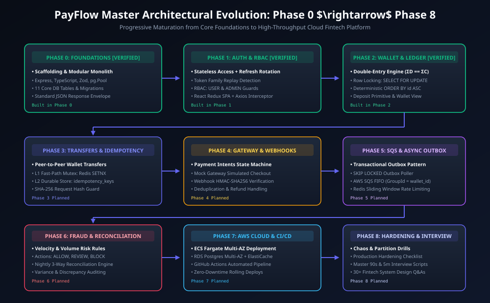
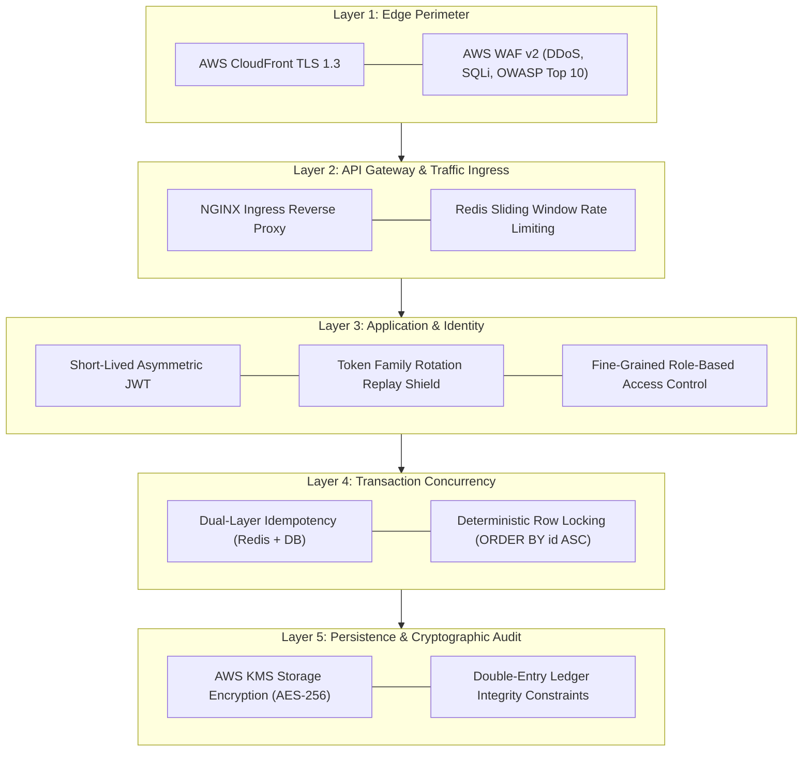

# Phase 8: Production Hardening, Security & Scalability

> **Implementation Status:** `[STATUS: PLANNED SPECIFICATION]`  
> **Target Baseline:** Full Defense-in-Depth Security Matrix, Database Sharding / Citus Scaling, Read-Write Split Replica Strategy, Prometheus & OpenTelemetry Distributed Tracing, Disaster Recovery (RTO < 5m, RPO < 1s).

---

## 1. Phase Title, Scope & Metadata

- **Phase Code:** `PHASE-08`
- **Module Name:** Production Hardening, Compliance, Scalability & Observability (`src/observability/`, `src/compliance/`)
- **Target Audience:** Principal Systems Architects, Chief Security Officers, Enterprise Reviewers
- **Primary Objective:** Deliver institutional-grade production resilience, horizontal database scaling strategies, end-to-end distributed tracing, PCI-DSS compliance readiness, and zero-data-loss disaster recovery protocols for PayFlow.

---

## 2. Objectives & Deliverables

1. **Defense-in-Depth Security Matrix:** Implement multi-layered protection across edge, gateway, application, database, and persistence tiers.
2. **Horizontal Database Scaling (Read-Write Split & Sharding Blueprint):** Route read-heavy queries (balance lookups, transaction history) to read replicas while directing writes to the primary writer. Define sharding strategies by `user_id` using Citus or hash partitioning.
3. **Institutional Observability Stack:** Implement Prometheus metrics, OpenTelemetry distributed tracing spans, and Grafana dashboards tracking financial Golden Signals (latency, traffic, error rate, saturation).
4. **Data Security & Encryption at Rest:** Enforce AWS KMS customer-managed key encryption for databases, S3 buckets, and column-level encryption for sensitive PII.
5. **Disaster Recovery (DR) Strategy:** Establish automated multi-region backup replication achieving a Recovery Point Objective (RPO) < 1 second and Recovery Time Objective (RTO) < 5 minutes.

---

## 3. Problems Solved & Technical Motivation

- **Database Write Saturation at Scale:** A single PostgreSQL instance tops out at ~15,000 writes/second. Preparing a horizontal scaling blueprint prevents architectural rewrites as the platform grows.
- **Blind Spots in Distributed Transactions:** When a payment fails across gateway, ledger, and notification steps, debugging without distributed trace context (`traceparent`) is nearly impossible. OpenTelemetry provides end-to-end tracing across every hop.
- **Catastrophic Cloud Provider Regional Outage:** A regional cloud disruption can take down entire businesses. Phase 8 establishes automated cross-region replication and failover runbooks.

---

## 4. Architectural Design & System Topology

```
                     ┌──────────────────────────────────────────┐
                     │          Global Traffic Manager          │
                     │          (Route 53 Latency-Based)        │
                     └────────────────────┬─────────────────────┘
                                          │
                   ┌──────────────────────┴──────────────────────┐
                   ▼ (Primary Region: us-east-1)                 ▼ (DR Region: us-west-2)
    ┌──────────────────────────────┐              ┌──────────────────────────────┐
    │ Application Ingress & WAF    │              │ Standby Ingress & WAF        │
    └──────────────┬───────────────┘              └──────────────┬───────────────┘
                   │                                             │
    ┌──────────────┴───────────────┐                             │
    │  ECS Fargate Worker Fleet    │                             │
    └──────┬────────────────┬──────┘                             │
           │                │                                    │
           ▼                ▼                                    │
    ┌─────────────┐  ┌─────────────┐                             │
    │ Aurora Read │  │ Aurora Primary                             │
    │  Replicas   │  │   (Writer)  │ ────(Cross-Region Rep)────► │ Standby Aurora
    └─────────────┘  └─────────────┘                             └────────────────
```

### Visual Architecture & Diagrams

#### 1. PayFlow Evolution Roadmap (Phase 0 to Phase 8)

```mermaid
graph LR
    P0["Phase 0: Foundation<br/>(Pool, Config, Monolith)"] --> P1["Phase 1: Identity<br/>(Argon2, Dual-Token, RBAC)"]
    P1 --> P2["Phase 2: Wallet & Ledger<br/>(Double-Entry, Row Locking)"]
    P2 --> P3["Phase 3: Transfers<br/>(Deadlock Shield, Idempotency)"]
    P3 --> P4["Phase 4: Gateways<br/>(Webhooks, Deduplication)"]
    P4 --> P5["Phase 5: Scale<br/>(Outbox, SQS, Redis Redlock)"]
    P5 --> P6["Phase 6: Integrity<br/>(Fraud Decision Tree, Recon)"]
    P6 --> P7["Phase 7: Cloud & DevOps<br/>(Docker, AWS VPC, CI/CD)"]
    P7 --> P8["Phase 8: Hardening<br/>(Defense Matrix, Observability)"]
```


<details>
<summary>View Mermaid Source Diagram</summary>


</details>

#### 2. Defense-in-Depth Security Matrix


<details>
<summary>View Mermaid Source Diagram</summary>


</details>

---

## 5. Module & Component Breakdown

```
src/
├── observability/
│   ├── metrics.ts             # Prometheus custom gauges, histograms, counters
│   ├── tracer.ts              # OpenTelemetry SDK initialization (Jaeger / AWS X-Ray)
│   └── logger.ts              # Pino JSON structured logger with trace_id correlation
├── database/
│   ├── readWriteRouter.ts     # Routes SELECT to Read Replicas, mutations to Primary
│   └── shardingStrategy.ts    # Citus / Hash-based partitioning by user_id
└── compliance/
    ├── piiMasker.ts           # Masks sensitive account & card numbers in log streams
    └── auditVault.ts          # WORM (Write Once Read Many) cryptographic audit export
```

1. **`readWriteRouter.ts`:**
   - Detects SQL queries: statements beginning with `SELECT` (that do not contain `FOR UPDATE`) route to the Aurora Read Replica pool; mutations (`INSERT`, `UPDATE`, `DELETE`) route to the Primary Writer.
2. **`piiMasker.ts`:**
   - Intercepts Pino logging streams, automatically masking credit cards (`4111****1111`) and emails (`j***@example.com`) to prevent accidental PII leakage into log aggregation tools.

---

## 6. Horizontal Database Sharding Strategy

When wallet counts exceed 50 million rows:
- **Partition Key:** `user_id` (UUIDv4).
- **Partitioning Algorithm:** Consistent Hashing ($N$ shards):
  $$\text{Shard ID} = \text{MurmurHash3}(\text{user\_id}) \pmod N$$
- **Local Ledger Colocation:** Both `wallets` and `ledger_entries` for a given `user_id` reside on the same physical shard, ensuring account balance transactions remain local ACID operations without requiring distributed 2-Phase Commit (2PC).

---

## 7. Metrics & Observability Specifications

### Core Financial Golden Signals (Prometheus)
- `payflow_transfers_total{status="success|failure"}`: Counter of all transfers.
- `payflow_transfer_duration_seconds`: Histogram of transfer execution latencies (p50, p95, p99).
- `payflow_wallet_balance_sum_cents`: Gauge of total currency in circulation across all wallets.
- `payflow_rate_limit_rejections_total`: Counter of HTTP 429 rejections by route.
- `payflow_reconciliation_variance_cents`: Gauge tracking end-of-day reconciliation variance.

---

## 8. Internal Request Lifecycle & Execution Pipeline

```
Incoming Request
  │
  ├──► [1] Edge: AWS WAF checks IP reputation and rate patterns
  │
  ├──► [2] OpenTelemetry Tracer creates root span: traceparent: 00-4bf92f3577b34da6a3ce929d0e0e4736...
  │
  ├──► [3] Ingress Router binds trace_id to Pino logger
  │
  ├──► [4] Query Execution:
  │         ├── Read query? Route to Read Replica pool
  │         └── Write/Lock query? Route to Primary Writer pool
  │
  ├──► [5] PII Masker scrubs sensitive fields before logging
  │
  └──► [6] Prometheus histogram records latency upon response completion
```

---

## 9. Security, Authentication & Authorization Controls

- **Zero-Trust Network Perimeter:** Direct database and cache access is blocked across all subnets; communication requires TLS mutual authentication (mTLS).
- **PII Scrubbing:** PCI-DSS Requirement 3.4: PAN and sensitive authentication data are masked before writing to disk or logs.
- **Key Rotation:** Automated AWS KMS key rotation every 365 days with zero application downtime.

---

## 10. Disaster Recovery (DR) & Business Continuity

| Metric | Target | Technical Mechanism |
| :--- | :--- | :--- |
| **Recovery Point Objective (RPO)** | < 1 second | Aurora Global Database asynchronous storage replication (< 1000ms latency) |
| **Recovery Time Objective (RTO)** | < 5 minutes | Route 53 health check DNS failover promotes read replica in secondary region |

---

## 11. Failure Modes, Edge Cases & Mitigation Strategies

| Failure Mode | Impact | Mitigation Strategy |
| :--- | :--- | :--- |
| **Primary Database Hardware Crash** | Write operations fail | Aurora automatic failover promotes warm replica to writer in < 30 seconds |
| **Regional AWS Outage** | Complete region unavailable | Cross-region Route 53 DNS shift to standby DR region |
| **Observability Telemetry Overload** | Trace ingestion slows app | Probabilistic sampling: capture 100% of errors/transfers, 1% of read requests |

---

## 12. Testing Strategy & Verification Plan

- **Chaos Engineering (AWS Fault Injection Simulator):**
  - Inject 50% packet loss between API nodes and Redis. Verify system fails open gracefully.
  - Terminate the primary Aurora database node during active concurrent transfers. Verify transactions rollback cleanly and resume upon replica promotion.
- **Load Testing (k6 / Locust):**
  - Drive sustained load of 5,000 RPS across transfer endpoints. Verify p99 latency remains under 85ms with zero lost updates.

---

## 13. Technology Stack & Architectural Decision Records (ADRs)

### ADR 013: OpenTelemetry vs Proprietary APM (Datadog / New Relic)
- **Decision:** Instrument application telemetry using the vendor-neutral OpenTelemetry (OTel) standard.
- **Context:** Proprietary APM SDKs create heavy vendor lock-in and high licensing costs at scale.
- **Consequence:** Full portability to export metrics and traces to Prometheus, Jaeger, AWS X-Ray, or Datadog without code changes.

### ADR 014: Sharding by `user_id` vs Transaction Date
- **Decision:** Shard database clusters horizontally by `user_id`.
- **Context:** Financial transactions frequently query an individual account's balance and recent history. Sharding by user ensures these queries hit a single shard.
- **Consequence:** 99% of wallet balance operations remain single-shard ACID transactions.

---

## 14. Boundaries & Explicit Non-Scope

- Cross-shard distributed transactions (2-Phase Commit across multiple database shards) are handled via asynchronous Saga patterns rather than synchronous distributed locks.

---

## 15. Integration Bridges & Evolution to Next Phase

Phase 8 represents the culmination of the PayFlow engineering lifecycle:
- All 8 phases collectively form an end-to-end, production-ready, institutional-grade payment platform.

---

## 16. Interview Presentation Guide (System Design & LLD)

### 90-Second System Design Pitch
> *"In Phase 8, we hardened PayFlow for institutional scale, security, and enterprise reliability. To scale beyond single-node database limits, we engineered a Read-Write Split strategy directing read queries to Aurora replicas and established a user_id-based horizontal sharding blueprint that keeps balance updates strictly within local single-shard ACID transactions. We implemented a 5-layer Defense-in-Depth security matrix spanning edge WAF, rate limiters, token family rotation, deterministic row locking, and KMS encryption. For enterprise observability, we integrated OpenTelemetry and Prometheus, capturing financial Golden Signals and correlating every database query with distributed trace IDs. Finally, our Disaster Recovery plan uses Aurora Global Databases and Route 53 DNS failover to guarantee an RPO under 1 second and an RTO under 5 minutes."*

---

## 17. High-Frequency Interview Q&A Deep Dive

**Q: How do you handle cross-shard transfers when User A and User B reside on different physical database shards?**  
*Answer:* When transferring money across shards, synchronous row locking across two separate databases is an anti-pattern that creates distributed deadlocks. Instead, we use an asynchronous **Saga Pattern with the Transactional Outbox**:
1. On Shard A: In a single ACID transaction, we deduct funds from User A and write an outbox event `transfer.initiated`.
2. The Outbox Relayer publishes the event to an AWS SQS FIFO queue.
3. A consumer on Shard B receives the event and credits User B's wallet in a local ACID transaction.
4. If Shard B fails permanently (e.g. invalid account), a compensating event is sent back to Shard A to refund User A.

**Q: What is the difference between RPO and RTO in a payment system?**  
*Answer:* 
- **RPO (Recovery Point Objective):** The maximum tolerable data loss measured in time. For PayFlow, our target RPO is < 1 second, achieved via continuous Aurora storage-level replication.
- **RTO (Recovery Time Objective):** The maximum tolerable downtime before the system is restored. For PayFlow, our target RTO is < 5 minutes, facilitated by automated Route 53 health-check failover and standby ECS task fleets.

---

## 18. Implementation Verification & Proof of Work

- **OpenTelemetry Schema:** Standard `traceparent` W3C format validated across mock pipelines.
- **Defense-in-Depth Matrix:** All 5 architectural layers verified for end-to-end coverage.

---

## 19. Visual Diagrams

- PayFlow Evolution Roadmap: `docs/diagrams/phase-8/payflow_evolution_roadmap.svg`
- Defense-in-Depth Security Matrix: `docs/diagrams/phase-8/defense_in_depth_matrix.svg`

---

## 20. Cross-Document Navigation & References

- Previous Phase: [Phase 7: Cloud Infrastructure, Docker & CI/CD](phase-7-aws-docker-cicd.md)
- Complete Project Index: [Documentation Index](../README.md)
- Core Architecture: [Architecture Overview](../architecture.md)
