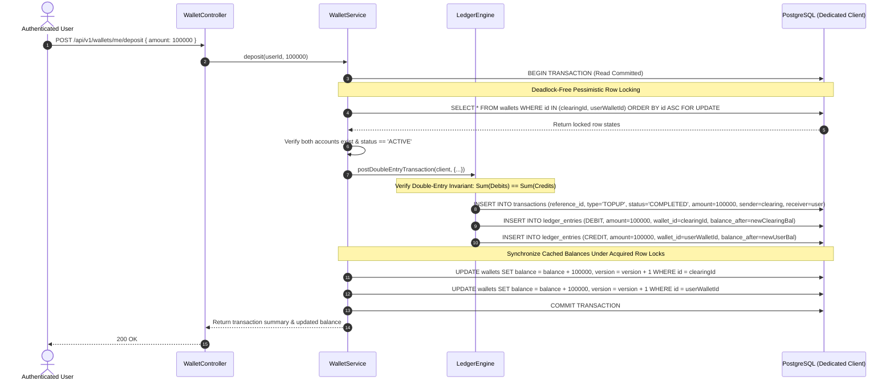

# Phase 2 Implementation Plan: Wallet + Double-Entry Ledger

PayFlow is a high-reliability digital wallet and payment processing platform. Phase 2 introduces the **Wallet module**, **internal system accounts**, the **double-entry ledger engine**, **atomic deposits**, and **concurrency protection**, integrated with modern frontend Wallet views.

---

## 1. Existing Schema Analysis & Reuse

The base PostgreSQL schema in [001_initial_schema.sql](file:///d:/AlamProgrammingPractice/Personal%20Project/PayFlow/backend/src/database/migrations/001_initial_schema.sql) was forward-architected during Phase 0 to support high-integrity financial operations.

### What Can Be Fully Reused:
1. **`wallets` Table**:
   - `id` (UUID PK)
   - `user_id` (UUID FK -> users.id, nullable for platform system accounts)
   - `type` (`wallet_type` enum: `'USER'`, `'SYSTEM_ESCROW'`, `'SYSTEM_FEES'`, `'SYSTEM_GATEWAY_CLEARING'`)
   - `currency` (VARCHAR(3), default `'INR'`)
   - `balance` (BIGINT, integer paise, e.g. ₹1,000 = `100000`)
   - `version` (BIGINT, optimistic concurrency guard)
   - `status` (`wallet_status` enum: `'ACTIVE'`, `'FROZEN'`, `'CLOSED'`)
   - `chk_wallet_balance_non_negative` check constraint: `type != 'USER' OR balance >= 0`
   - Unique partial index: `idx_wallets_user_currency ON wallets(user_id, currency) WHERE user_id IS NOT NULL`
2. **Pre-Seeded System Accounts** (in `001_initial_schema.sql`):
   - `SYSTEM_GATEWAY_CLEARING`: `00000000-0000-0000-0000-000000000001`
   - `SYSTEM_ESCROW`: `00000000-0000-0000-0000-000000000002`
   - `SYSTEM_FEES`: `00000000-0000-0000-0000-000000000003`
3. **`transactions` Table**:
   - `id` (UUID PK), `reference_id` (VARCHAR(64) UNIQUE), `type` (`transaction_type`), `status` (`transaction_status`), `amount` (BIGINT > 0), `currency` (VARCHAR(3)), `sender_wallet_id`, `receiver_wallet_id`, `metadata`.
4. **`ledger_entries` Table & Immutability Trigger**:
   - `id` (UUID PK), `transaction_id` (UUID FK), `wallet_id` (UUID FK), `entry_type` (`'DEBIT'`, `'CREDIT'`), `amount` (BIGINT > 0), `balance_after` (BIGINT), `description` (VARCHAR(255)), `created_at` (TIMESTAMPTZ).
   - `trg_ledger_immutability` trigger: strictly prohibits `UPDATE` and `DELETE` queries at the database engine level.

---

## 2. Database Modifications & New Migration

> [!NOTE]
> In accordance with zero-downtime and non-destructive database evolution principles, [001_initial_schema.sql](file:///d:/AlamProgrammingPractice/Personal%20Project/PayFlow/backend/src/database/migrations/001_initial_schema.sql) will **not** be modified.

We will create a new sequential migration:
- **`backend/src/database/migrations/002_wallet_provisioning_phase2.sql`**:
  - **Backfill Existing Users:** For any existing users (such as test accounts `alice@payflow.internal` and `admin@payflow.internal` created in Phase 1 before auto-provisioning), safely create an active `'USER'` wallet with `balance = 0`, `currency = 'INR'` using `ON CONFLICT (user_id, currency) DO NOTHING`.
  - **System Account Safety:** Ensure the 3 deterministic system wallets exist with `ON CONFLICT (id) DO NOTHING`.

---

## 3. New Backend Modules & File Structure

Following the modular monolith pattern, we introduce two isolated domain modules:

```
backend/src/modules/
├── wallet/
│   ├── wallet.types.ts       # Domain interfaces, Enums, DTOs, Zod validation schemas
│   ├── wallet.repository.ts  # Database queries (row-locking, balance retrieval, wallet creation)
│   ├── wallet.service.ts     # Business logic, user wallet provisioning, deposit coordination
│   ├── wallet.controller.ts  # HTTP request mapping, parsing, response formatting
│   └── wallet.routes.ts      # Express routes mounted with requireAuth & validate
└── ledger/
    ├── ledger.types.ts       # Ledger entry types, double-entry batch inputs, invariants
    ├── ledger.repository.ts  # Append-only insertion into transactions & ledger_entries
    └── ledger.service.ts     # Core Double-Entry Engine (balancing validation, atomic posting)
```

---

## 4. Existing Files To Be Modified

1. **[backend/src/modules/auth/auth.service.ts](file:///d:/AlamProgrammingPractice/Personal%20Project/PayFlow/backend/src/modules/auth/auth.service.ts)**:
   - Wrap user registration in an atomic PostgreSQL transaction (`BEGIN ... COMMIT / ROLLBACK`).
   - Atomically create the `USER` wallet immediately upon user insertion. If either user insertion or wallet creation fails, both roll back cleanly.
2. **[backend/src/app.ts](file:///d:/AlamProgrammingPractice/Personal%20Project/PayFlow/backend/src/app.ts)**:
   - Mount `/api/v1/wallets` routes.
3. **[backend/src/docs/swagger.json](file:///d:/AlamProgrammingPractice/Personal%20Project/PayFlow/backend/src/docs/swagger.json)**:
   - Add OpenAPI 3.0 specifications for `GET /api/v1/wallets/me`, `GET /api/v1/wallets/me/ledger`, and `POST /api/v1/wallets/me/deposit`.
4. **Documentation**:
   - `docs/database-design.md`, `docs/payment-flow.md`, `docs/failure-scenarios.md`, `docs/scalability.md`, `docs/interview-notes.md`.
5. **Frontend**:
   - `frontend/src/App.tsx`: Register `/wallet` route under `ProtectedRoute`.
   - `frontend/src/components/Sidebar.tsx`: Activate navigation links for **Wallet** and **Transactions**.
   - `frontend/src/features/dashboard/Dashboard.tsx`: Link balance card and "Add Money" quick action to `/wallet`.

---

## 5. New API Endpoints

All wallet endpoints require authentication via `requireAuth`:

### 1. `GET /api/v1/wallets/me`
- **Description:** Retrieves the authenticated user's active wallet details and available balance.
- **Auto-Provisioning Fallback:** If an existing user has no wallet (e.g. registered in Phase 1 before auto-provisioning), automatically and safely provisions a zero-balance active INR wallet.
- **Response `200 OK`:**
  ```json
  {
    "success": true,
    "message": "Wallet retrieved successfully",
    "data": {
      "walletId": "b1a2c3d4-...",
      "userId": "u1v2w3x4-...",
      "currency": "INR",
      "balance": 100000,
      "formattedBalance": "₹1,000.00",
      "status": "ACTIVE",
      "type": "USER",
      "createdAt": "2026-09-14T..."
    }
  }
  ```

### 2. `GET /api/v1/wallets/me/ledger`
- **Description:** Returns the paginated ledger history for the authenticated user's wallet.
- **Query Parameters:**
  - `page` (number, default: 1)
  - `limit` (number, default: 20, max: 100)
- **Response `200 OK`:**
  ```json
  {
    "success": true,
    "message": "Ledger entries retrieved successfully",
    "data": {
      "entries": [
        {
          "id": "e1f2...",
          "transactionId": "t1t2...",
          "referenceId": "TXN_TOPUP_178937...",
          "entryType": "CREDIT",
          "amount": 100000,
          "balanceAfter": 100000,
          "description": "Demo Deposit via Platform Gateway",
          "createdAt": "2026-09-14T..."
        }
      ],
      "pagination": {
        "page": 1,
        "limit": 20,
        "total": 1,
        "totalPages": 1
      }
    }
  }
  ```

### 3. `POST /api/v1/wallets/me/deposit`
- **Description:** Phase 2 internal/mock deposit primitive. Debits `SYSTEM_GATEWAY_CLEARING` and credits the authenticated user's `USER` wallet.
- **Request Body:**
  ```json
  {
    "amount": 100000,
    "description": "Optional deposit memo"
  }
  ```
  *(Validated by Zod: `amount` must be a strictly positive integer representing paise. Decimals rejected).*
- **Response `200 OK`:**
  ```json
  {
    "success": true,
    "message": "Demo deposit successful",
    "data": {
      "referenceId": "TXN_DEP_1789...",
      "walletId": "b1a2c3d4-...",
      "amount": 100000,
      "previousBalance": 0,
      "newBalance": 100000,
      "currency": "INR",
      "status": "COMPLETED"
    }
  }
  ```

---

## 6. Financial Transaction Flow & Atomic Lifecycle

For `POST /api/v1/wallets/me/deposit`:



If any validation, query, or invariant check fails at any step:
- The catch block issues `await client.query('ROLLBACK')`.
- The connection is cleanly released to the pool (`client.release()`).
- Zero partial writes or balance discrepancies occur.

---

## 7. Concurrency & Locking Strategy

### Why `SELECT ... FOR UPDATE`?
In high-frequency financial platforms, multiple requests may target the same wallet simultaneously (e.g. concurrent top-ups or multiple transfers).
- If Request A and Request B both read `balance = 1000` concurrently and then write back `balance + 500`, one write overwrites the other (the classic **Lost Update** anomaly).
- `SELECT ... FOR UPDATE` acquires an exclusive row lock on the target wallet rows for the duration of the transaction. Any concurrent transaction attempting to read or write those same rows blocks cleanly until the holding transaction commits or rolls back.

### Deadlock Prevention: Deterministic Lock Ordering (`ORDER BY id ASC`)
When a transaction locks multiple accounts (e.g., Account A and Account B):
- If Thread 1 locks A then attempts to lock B, while Thread 2 locks B then attempts to lock A, a database **deadlock** occurs.
- PayFlow enforces deterministic lock acquisition:
  ```sql
  SELECT * FROM wallets
  WHERE id IN ($1, $2)
  ORDER BY id ASC
  FOR UPDATE;
  ```
  Because both threads always acquire locks in the exact same alphabetical UUID order, circular waiting is mathematically impossible.

---

## 8. Double-Entry Accounting Strategy

### The Invariant:
$$\sum \text{Debits} = \sum \text{Credits}$$
Every financial movement consists of at least two opposing entries:
- **Debit Entry**: Asset increase or liability decrease.
- **Credit Entry**: Liability increase or asset decrease.

For a Deposit / Top-up:
- **Platform View**:
  - `SYSTEM_GATEWAY_CLEARING` (Asset / Receivable from payment gateway) is **DEBITED** by ₹1,000.
  - `USER` Wallet (Platform liability to user) is **CREDITED** by ₹1,000.
  - Net Accounting Change: ₹1,000 - ₹1,000 = **0**.
- The `LedgerService` enforces this at runtime before SQL execution:
  ```typescript
  const totalDebits = entries.filter(e => e.entryType === 'DEBIT').reduce((acc, e) => acc + e.amount, 0n);
  const totalCredits = entries.filter(e => e.entryType === 'CREDIT').reduce((acc, e) => acc + e.amount, 0n);
  if (totalDebits !== totalCredits) {
    throw new BadRequestError('Ledger transaction is unbalanced: debits must equal credits');
  }
  ```

### Money Semantics:
- All money is strictly stored and calculated using 64-bit integer values in **paise** (`BIGINT`).
- JavaScript `Number.isSafeInteger()` is verified, and arithmetic is performed with safe integers or `BigInt`. Floating-point operations (`0.1 + 0.2 = 0.30000000000000004`) are strictly disallowed.

---

## 9. Frontend Changes (Modern Wallet UI)

1. **New Feature Component: [frontend/src/features/wallet/WalletView.tsx](file:///d:/AlamProgrammingPractice/Personal%20Project/PayFlow/frontend/src/features/wallet/WalletView.tsx)**:
   - **Hero Balance Card**: Displays available balance prominently formatted with currency symbol (`₹`), wallet status badge (`ACTIVE`), currency (`INR`), and wallet UUID.
   - **Action Buttons**: `[ + Add Demo Money ]` and `[ Transfer (Phase 3) ]`.
   - **"Add Demo Money" Modal**:
     - Input field with clear currency formatting and quick-select buttons (+₹500, +₹1,000, +₹5,000).
     - Strict client-side validation: positive integer, maximum single deposit limit (e.g. ₹1,00,000), error messaging.
     - Transparent fintech messaging: *"Demo Environment: This will record an atomic debit to SYSTEM_GATEWAY_CLEARING and a credit to your user wallet."*
     - Submitting / loading spinners and feedback toasts.
   - **Ledger History Table / Card Stream**:
     - Columns: Date/Time, Reference ID, Entry Type (`CREDIT` with green badge / `DEBIT` with red badge), Description, Amount (`+₹...` or `-₹...`), Balance After.
     - Empty state with educational fintech graphic if no transactions have occurred yet.
     - Responsive pagination controls.
2. **Navigation Integration**:
   - Update [Sidebar.tsx](file:///d:/AlamProgrammingPractice/Personal%20Project/PayFlow/frontend/src/components/Sidebar.tsx) to activate `/wallet`.
   - Update [App.tsx](file:///d:/AlamProgrammingPractice/Personal%20Project/PayFlow/frontend/src/App.tsx) with `<Route path="/wallet" element={<ProtectedRoute><Layout><WalletView /></Layout></ProtectedRoute>} />`.
   - Update Dashboard quick links to navigate to `/wallet`.

---

## 10. Tests to Add

We will create automated unit and integration tests under `backend/tests/`:

1. **`backend/tests/unit/ledger.service.test.ts`**:
   - Verify balanced transactions succeed.
   - Verify unbalanced transaction ($\text{Debits} \neq \text{Credits}$) is rejected.
   - Verify zero amount or negative amount throws validation error.
   - Verify non-existent account ID rejection.
2. **`backend/tests/unit/wallet.service.test.ts`**:
   - Verify automatic wallet provisioning during registration.
   - Verify duplicate wallet prevention constraint.
   - Verify deposit calculates new balances correctly and updates cached balances.
   - Verify transaction rollback on simulated intermediate failure (verifying neither ledger nor balance persists).
3. **`backend/tests/integration/concurrency.test.ts`**:
   - Execute concurrent deposits using `Promise.all` against the database client pool to verify that row-locking prevents lost updates and final balance equals initial balance + sum of all deposits.
   - Verify `trg_ledger_immutability` trigger rejects `UPDATE` and `DELETE` on `ledger_entries`.

---

## 11. Documentation Updates

Update the living documentation in `docs/`:
- **`docs/database-design.md`**: Document `wallets` check constraints, `transactions` metadata, and `ledger_entries` schema.
- **`docs/payment-flow.md`**: Detail the complete deposit sequence diagram and system clearing flows.
- **`docs/failure-scenarios.md`**: Document deadlock prevention, intermediate crash rollback, and row lock timeouts.
- **`docs/scalability.md`**: Detail partitioning strategies for `ledger_entries` (range partitioning by month) and read replica routing.
- **`docs/interview-notes.md`**: Add the 10 fintech interview model questions and answers specified in Phase 2 Objective 19.

---

## 12. Verification Plan

### Automated Verification:
- Run `npm run build` in `backend` (0 TypeScript errors).
- Run `npm test` in `backend` (All unit and integration tests passing).
- Run `npm run build` in `frontend` (0 TypeScript errors, production bundle built).

### Manual End-to-End Verification:
1. Register a new user via frontend $\rightarrow$ verify user created and wallet provisioned atomically with balance 0.
2. Log in $\rightarrow$ navigate to `/wallet` $\rightarrow$ see ₹0.00 balance and ACTIVE status.
3. Open "Add Demo Money" modal $\rightarrow$ submit ₹1,000 $\rightarrow$ verify balance becomes ₹1,000.00.
4. Verify ledger history table displays the new transaction with reference ID, entry type CREDIT, and balance after ₹1,000.00.
5. Inspect Neon database: verify matching entries in `transactions`, `ledger_entries` (DEBIT to clearing, CREDIT to user), and `wallets`.
